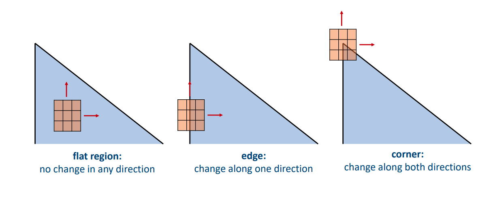
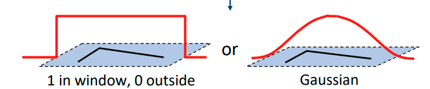
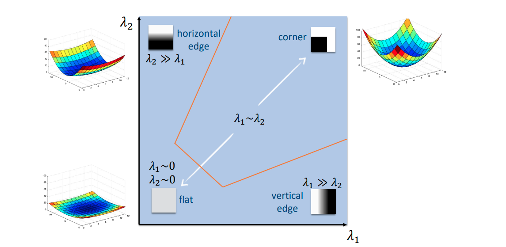

# 05 - Interest Point Detection

## Image Matching

How do we find spatial correspondence between two images? This can be done by comparing pixels, comparing edges, or comparing interest points. We focus on interest point detection.

This involves matching particular points between two images. This is efficient because we only need to deal with some points, not all the image pixels.


## Corner Detection

To detect corners, we look at the **magnitude of the gradient of a small window** of pixels. This allows us to differentiate edge pixels, by shifting the window and calculating the change of intensities for the window. In the case of an edge, we expect change of intensity along one direction. In the case of a corner, we expect change of intensity along *both* directions.



### Harris Detector

The next challenge is describing this mathematically. If the window shifts by $[u, v]$, the change of intensities is given by
$$
E(u, v) = \sum_{(x, y)\in W} w(x, y)[I(x+u, u+v) - I(x,y)]^2
$$
$E(u, v)$ is the **sum of squared difference**. 

$w(x, y)$ is the **window function**.



$I(x + u, y+v)$ is the **shifted intensity**.

$I(x, y)$ is the **original intensity**.

This is approximated by
$$
E(u, v) \approx
[u, v]\sum_{x, y} w(x, y)
\begin{bmatrix}
I_x^2 & I_x I_y \\
I_x I_y & I_y^2
\end{bmatrix}
\begin{bmatrix}
u \\
v
\end{bmatrix}
$$
where $I_x$ denotes the first derivative w.r.t $x$, and $I_y$ denotes the first derivative w.r.t $y$.
$$
E(u, v) \approx [u, v] \cdot M \cdot \begin{bmatrix} u \\ v \end{bmatrix}
$$

To characterise a feature, we need to examine the eigenvalues of $M$.
$$
M = P \Lambda P^T
$$
where $\Lambda = \begin{bmatrix}\lambda_1 & 0 \\ 0 & \lambda_2 \end{bmatrix}$ and the columns of $P$ are the eigenvectors. $\Lambda$ tells you whether it's a corner or edge, $P$ tells you the orientation.

If $\Lambda = \begin{bmatrix}0 & 0 \\ 0 & 0\end{bmatrix}$ then we have a **flat region**.

If $\Lambda = \begin{bmatrix}10 & 0  \\ 0 & 0.1\end{bmatrix}$ then we have an **edge**. This is because there will be a large change if we shift along the first eigenvector, but a small change if we shift along the second eigenvector.

If $\Lambda = \begin{bmatrix}10 & 0 \\ 0 & 10\end{bmatrix}$ then we have a **corner**. This is because there will be a large change whichever way we shift the window.

*Cornerness* can be defined by 
$$
R = \lambda_1\lambda_2 - k(\lambda_1 + \lambda_2)^2
$$
where $k$ is small, $k \in [0.04, 0.06]$. There are also other ways to define this. From this, we can see that we can use the determinant and trace of $M$ instead of eigen decomposition.
$$
\begin{align*}
\det(M) & = \lambda_1 \lambda_2 \\
\text{trace}(M) & = \lambda_1 + \lambda_2
\end{align*}
$$
So we can rewrite the equation as
$$
R = det(M) - k(\text{trace}(M))^2
$$

#### Implementation

1. Compute $x$ and $y$ derivatives, using a Sobel filter for example.
   $$
   I_x = G_x * I \\I_y = G_y * I
   $$

2. At each pixel, compute $M$.
   $$
   M = \sum_{x, y} w(x, y) \begin{bmatrix}I_x^2 & I_x I_y \\ I_x I_y & I_y^2\end{bmatrix}
   $$

3. Compute $R$.
   $$
   R = \lambda_1 \lambda_2 - k(\lambda_1 + \lambda_2)^2
   $$

4. Find local maxima above a threshold for $R$. We can also use NMS so we only have a single response for each corner.

#### Rotation Invariance

The Harris corner is **rotation invariant**. This means that if a corner is rotated, you will still get the same change of intensities when you shift along a rotated direction. The eigenvalues of $M$ will not change, but the eigenvectors will.

#### Scale Invariant Detection

The Harris detector is not scale-invariant. However, we can apply it at multiple scales and find the response at the most suitable scale. We can do this using Gaussian smoothing with varying $\sigma$ and sampling at varying pixel resolutions.

Responses at different scales cannot directly be compared, because the magnitude of the derivatives are inversely proportional to the scale. This means that it's necessary to scale by $\sigma^2$ before comparing responses at different scales.

The scale-adapted Harris detector is given by
$$
M = \sum_{x, y} w(x, y) \begin{bmatrix} \sigma^2 I_x^2 (\sigma) & \sigma^2 I_x(\sigma) I_y (\sigma) \\ \sigma^2I_x(\sigma I_y(\sigma) & \sigma^2 I_y^2 (\sigma)) \end{bmatrix}
$$
where $\sigma^2$ acts as a normaliser. This allows us to compare the responses across scales. Then we can determine the scale which gives the largest response.

### Harris-Laplace Detector

The Laplacian of Gaussian can be good at finding the appropriate scale. Again, we need to normalise using $\sigma^2$.
$$
\text{LoG}_\text{norm}(x, y, \sigma) = \sigma^2(I_{xx}(x, y, \sigma) + I_{yy}(x, y, \sigma))
$$

1. At each pixel, find the optimal scale $\sigma$ using the normalised LoG response.
2. Find the local maximum in space using the Harris detector response.

### Scale Invariant Feature Transform (SIFT)

SIFT uses the Difference of Gaussian, which approximates the normalised Laplacian of Gaussian and is more efficient (can be done in parallel).
$$
\text{DoG}(x, y, \sigma) = I * G(k\sigma) - I * G(\sigma)
$$
where $k = \sqrt{2}$ is suggested. This is the difference between two Gaussian filters at different scales.

1. At each pixel, find the optimal scale $\sigma$ using the DoG response.
2. Find the local extremum in space using the DoG response.

### Implementation of Detectors

We need to find local extrema across both the spcae and scale dimensions.

```
For each scale
	Apply Gaussian smoothing
	Calculate the detector response (Harris or Lapalcian or DoG)
For each scale
	For each spatial location X
		Check if X is a local maximum across both scale and space
		If yes, it is an interest point.
```

