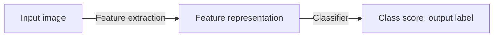

# 07 - Image Classification I

## Pipeline

We first need to perform **feature extraction** to transform input images into low-dimensional vectors so they can be easily compared or matched. Then the classifier is trained with a dataset consisting of images and labels.

## Pre-processing

Before feature extraction we need to perform pre-processing. For example, for MNIST we need to:

- Detect where the digit is in a much bigger image
- Normalise the size of each digit to $28\times28$
- Normalise the location, place the centre of the digit in the centre of the image
- Sometimes slant correction may be performed, which shifts each row in the image so that the principal axis becomes vertical

Pre-processing may take as along as developing the real algorithm.

## Feature Extraction

We can either hand-craft features (pixel intensities, PCA) or learn them using a model.

## Classifiers

### K Nearest Neighbours (KNN)

We look at the neighbours. It is non **parametrics**. We use weighted voting of nearest neighbours.

#### Distance Metric

Typically we use Euclidean distance ($L^2$-norm)
$$
D(\vec{x}, \vec{y}) = \sqrt{(x_1 - y_1)^2 + ... + (x_n-y_n)^2}
$$
The drawback is we assume that each dimension has the same scale, so they can be summed. It is better to normalise the feature vector e.g. normalise each dimension to a Gaussian dimension $N(0, 1)$.

There are other metrics such as cosine distance
$$
D(\vec{x}, \vec{y}) = \frac{\vec{x} \cdot\vec{y}}{\lVert\vec{x}\rVert\lVert\vec{y}\rVert}
$$
Manhattan distance ($L^1$-norm)
$$
D(\vec{x}, \vec{y}) = \sum \lvert x_i - y_i \rvert
$$
and the general $L^p$-norm
$$
D(\vec{x}, \vec{y}) = \left(\sum_{i=1}^n \lvert x_i - y_i\rvert^p\right)^\frac{1}{p}
$$

#### Features

We can simply use the $28\times 28$ pixel values in a 784-dimension vector. There are some issues with pixel intensities which we covered earlier, such as being sensitive to intensity change, rotation, scaling etc. We can assume that pre-processing has taken care of these factors.

#### Hyper-parameters

Even with $K=1$ this works well on MNIST. In general, we need to decide the best value of $K$ and the best distance metric. This is problem-dependent and is often trial and error.

#### Cross-validation

We often use cross-validation for hyper-parameter tuning. Once we know the hyper-parameters, we can train on the full training set.

- Training set: training the model
- Validation set: deciding what type of model and which hyperparameters are best
- Test set: getting a final estimate for model performance

#### Advantages

- No training
- Simple but effective
- Non-linear decision boundary
- Multi-class classification

#### Disadvantages

- Storage and search are expensive
- All the training data needs to be stored and searched which is not practical for million of images

#### Computational Complexity

$N$ training images, $M$ test images: no training time, test time is $O(MN)$. We may want the opposite: slow training, fast classification.