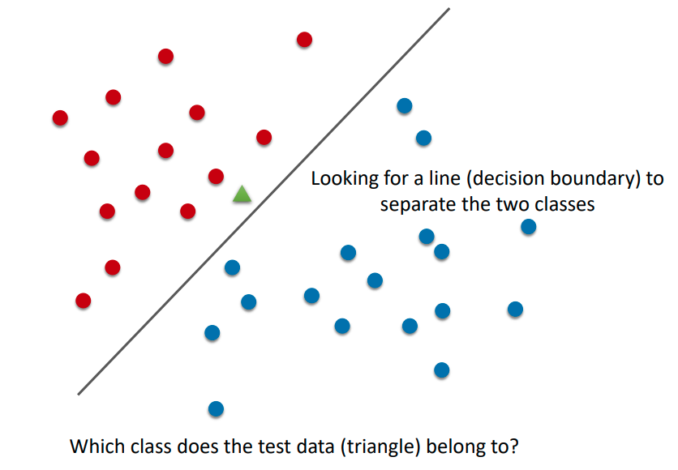
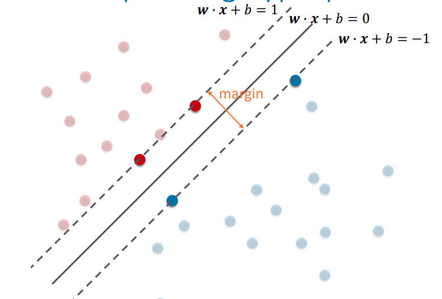
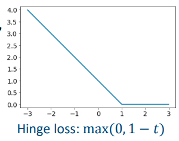
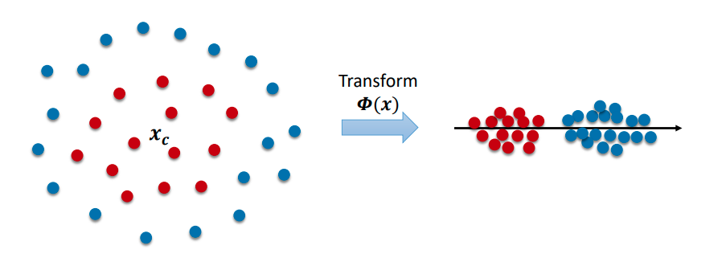

# Image Classification II

## Classifiers

### Support Vector Machine (SVM)

Contrary to KNN, SVM takes some time to train but is fast during test time. It comes in linear and non-linear flavours.

#### Linear Classifier

We are trying to find this decision boundary that separates the two classes. Once we have the line, all we need to do is check which side of the line the new data is for. The line has the form
$$
\vec{w} \cdot \vec{x} + b = 0
$$
where $\vec{w}$ are the weights, $\vec{x}$ are the data, and $b$ is the bias. This is simply the equation for a straight line/plane in $n$ dimensions. The rule of the linear classifier is to assign a class $c$ to data $x$
$$
c = 
\begin{cases}
+1 & \vec{w} \cdot \vec{x} + b \geq 0 \\
-1 & \text{otherwise}
\end{cases}
$$
Unlike for KNN, once we know $w$ and $b$, we can *discard the training data*. To train the classifier we need to find the parameters $\vec{w}$ and $b$ which determines the separating hyperplane. 

Intuitively, we want a line that is far as possible from both classes of points - a **maximum margin** hyperplane. To do this, we only need to innermost points, which are called the **support vectors**. Then we solve for $\vec{w}$ and $b$.

We would also like the support vectors to fulfil $\vec{w}\cdot x + b = 1$ and $\vec{w} + \vec{x} + b = -1$ so that the other points are easily classified. We also want to *maximise the margin*.

To derive the maximum margin, let $\vec{x_1}$ be  a point on $\vec{w} \cdot \vec{x} + b = -1$. The corresponding point on the normal $\vec{n}$ on $\vec{w} \cdot \vec{x} + b$ is $\vec{x_2}$. We have that $\vec{w} \cdot (\vec{x_1} + m\vec{n}) +b=1$, where $m$ is the distance between the two planes, and hence the maximum margin. Subtracting these two equations, we get $m\vec{w}\cdot n = 2$. We know that the normal is $\vec{n} = \frac{\vec{w}}{\lVert \vec{w} \rVert}$. Hence the margin
$$
m = \frac{2}{\lVert \vec{w} \rVert}
$$
We want to maximise this margin, so 
$$
\max_{\vec{w}, b} \frac{2}{\lVert \vec{w} \rVert}
$$
subject to
$$
\vec{w} \cdot \vec{x}_i + b 
\begin{cases}
\geq +1 & y_i = +1 \\
\leq -1 & y_i = -1
\end{cases}
\text{for } i = 1, 2 ... N
$$
which means finding the parameters $\vec{w}$ and $b$ such that all the red points will give $+1$ and all the blue points give $-1$. However, sometimes we will encounter mistakes. So we introduce a **slack variable** for each data point to accommodate for this. The mathematical detail is omitted, but $\xi_i$ represents *how far away a point is from the margin*. $\xi_i = 0$ for points outside the margin, $0 < \xi_1 \leq 1$ for points inside the margin but still on the correct side of the hyperplane.

We also introduce $C$ which is a regularisation term, and another hyper-parameter. Small $C$ allows constraints to be easily fulfilled, and large $C$ makes constraints hard to be ignored. 

The optimisation problem is
$$
\min_{\vec{w}, b} \lVert \vec{w} \rVert^2 + C \sum_{i=1}^N \xi_i
$$
where
$$
\xi_i = \max(0, 1 - y_i(\vec{w} \cdot \vec{x}_i + b))
$$
which is also called **hinge loss**. 0 for a correctly classified point, $>0$ if wrongly classified.

The loss function is not differentiable due to $\max$, but we know that it is **convex** (non-negative weighted sum of two convex functions is also convex) so it's possible to optimise it. For a convex function, any local minimum is also a global minimum. There are two approaches to minimising this.

1. Gradient descent
2. Lagrangian duality (more often used, *not assessed*)

#### Non-linear Classification

We can transform non-linearly separable feature spaces into another feature space, we may more easily separate the two classes. For this example, $\phi(\vec{x}) = (\vec{x} - \vec{x_c})^2$. Instead of finding the transformation $\phi(x)$, a common approach is to find a **kernel** $l(x_i, x_j)$. Common kernels include

- Linear kernel
- Polynomial kernel
- Gaussian kernel (a.k.a Radial Basis Function)

Some kernels will improve your performance, and some will decrease your performance depending on the data.

#### Multi-class Classification

Until now, we've only talked about binary classification.

##### 1 vs. rest

1. Train a classifier for *each class*.
2. During testing, apply all 10 classifiers to the test data.
3. The classifier that produces the highest response determines the result.

##### 1 vs. 1

1. Train a classifier between *each pair of classes*.
2. For $K$ classes we will have $\frac{K(K-1)}{2}$ classifiers.
3. During testing, each classifier votes for a class.
4. The class with the most votes determines the result.

## Human Detection

We can combine a linear SVM and feature descriptors. One application of this is human detection. We can use a **histogram of orientated gradients**. This is similar to SIFT, but instead of being defined around an interest point it is defined for a number of grid cells in a detection window. We move the window across the image for human detection.

To deal with different scales, we use an **image pyramid**. Downsample the image by different factors and perform detection at each scale.