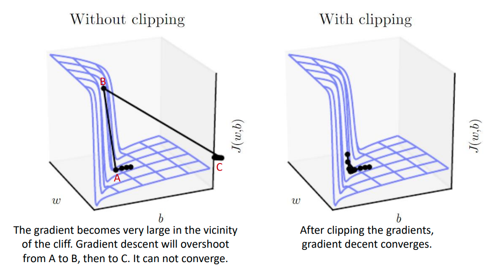

# 09 - Neural Networks I

## Neural Networks

#### Notation

- $W^{(l)}$ : weight matrix at layer $l$.
- $W_{ij}^{(l)}$ : weight between neuron $j$ at layer $l$ and neuron $i$ at layer $l+1$.
- $b^{(l)}$: bias vector at layer $l$.
- $b_i^{(l)}$ : bias at layer $l$ connecting neuron $i$ at layer $l+1$.
- $z_i^{(l)}$ : total input to neuron $i$ at layer $l$.
- $a_i^{(l)}$ : activation of neuron $i$ at layer $l$.
- $a_i^{(1)}$: input $i$ at the first layer, $a_i^{(1)} = x_i$.

### Forward Propagation

Used for calculating the output.

Given fixed parameters $W$ and $b$, the neural network calculates the output given $x$. In the first layer, each neuron has the value of the input $a_i^{1} = x_i$. In each subsequent layer, we apply the activation function to the input to each neuron.
$$
\begin{align*}
z_i^{(l+1)} &= W_{i1}^{(l)}a_1^{(l)} + ... + W_{in}^{(1l)}a_n^{(l)} + b_i^{(l)} \\
a_i^{(l+1)} &= f(z_i^{(l+1)}) 
\end{align*}
$$

which can be written 
$$
\begin{align*}
z^{(l+1)} &= W^{(l)}a^{(1)} + b^{(l)} \\
a^{(l+1)} &= f(z^{(l+1)})
\end{align*}
$$

### Back Propogation

Used for updating parameters given ground truth.

To train a neural network, we give training data 
$$
\{(x_1, y_1), ..., (x_m, y_m), ..., (x_M, y_M)\}
$$
which are paired data and ground truth labels. We want to find $W$ and $b$ such that the error between the output of the network $a_m^{(l)}$ and $y_m$ is as small as possible. To do this, we define a **loss function**.
$$
J(W, b) = \frac{1}{M} \sum_{m=1}^M \frac{1}{2} \lVert a_m^{(l)} - y_m \rVert^2
$$
We want to minimise this. It is differentiable, so we can use gradient descent.

**Backpropagation** is an algorithm to propogate error from the last layer backwards to the previous layers. It's used to evaluate the *gradient of the loss function* with regard to $W$ and $b$. It's based on the chain rule.

#### Chain Rule

If we have $z=g(f(x))$ where
$$
\begin{align*}
y &= f(x) \\
z &= g(y)
\end{align*}
$$
the **chain rule** expresses the derivative of the composition in terms of the derivative of each function
$$
\frac{dz}{dx} = \frac{dz}{dy}\frac{dy}{dx}
$$
We can differentiate with respect to different variables, depending on which variable we are evaluating for its impact on $z$. Given
$$
\begin{align*}
y &= w_1 x \\
z &= w_2 y
\end{align*}
$$
we can differentiate with respect to $x$ and $y$
$$
\begin{align*}
\frac{dz}{dy} &= w_2 \\
\frac{dz}{dx} &= \frac{dz}{dy}\frac{dy}{dx} = w_2 w_1
\end{align*}
$$
and we can differentiate with respect to $w_1$ and $w_2$ 
$$
\begin{align*}
\frac{dz}{dw_2} &= y\\
\frac{dz}{dw_1} &= \frac{dz}{y}\frac{d_y}{w_1} = w_2 x
\end{align*}
$$
Sometimes one variable may have an impact via more than one path.
$$
\begin{align*}
y_1 &= w_1 x \\
y_2 &= w_2 x \\
z &= y_1 + y_2
\end{align*}
$$
so if we want to evaluate how x affects $z$
$$
\frac{dz}{dx} = \frac{dz}{y_1}\frac{y_1}{x} + \frac{z}{y_2}\frac{y_2}{x}
$$
#### Backpropogation

So going back to the loss function, at for a single sample at layer 3 (the output layer in our example) we have
$$
J(W, b; x_m, y_m) = \frac{1}{2} \lVert a_m^{(3)} - y_m \rVert^2
$$
and for this single sample we can calculate the derivative w.r.t $z$ using the chain rule
$$
\begin{align*}
\frac{\partial J}{\partial a^{(3)}} &= a^{(3)} - y_m \\
\frac{\partial J}{\partial z^{(3)}} &= \frac{\partial J}{\partial a^{(3)}}\frac{\partial a^{(3)}}{\partial z^{(3)}} = (a^{(3)}) - y) \circ f'(z^{(3)})
\end{align*}
$$
So for the previous layer (layer 2) we can see how the weights for that layer influence the loss
$$
\frac{\partial J}{\partial W_{ij}^{(2)}} = \frac{\partial J}{\partial z_i^{(3)}} \frac{\partial z_i^{(3)}}{\partial W_{ij}^{(3)}} = \frac{\partial J}{\partial z_i^{(3)}} a_j^{(2)}
$$
and using the matrix formulation
$$
\frac{\partial J}{\partial W^{(2)}} = \frac{\partial J}{\partial z^{(3)}} (a^{(2)})	^T
$$
Now we simply need to calculate these two terms in order to find how $W$ influences $J$, and once we have that we can use gradient descent to optimise $W$. You can repeat this process for $W$, $b$, $a$, and $z$, all the way back to the first layer. However, the only information we need to calculate these derivates for layer 2 is $\frac{\partial J}{\partial z^{(3)}}$. More generally, to calculate the derivates at layer $l$, we only need the derivates at layer $l+1$, $\frac{\partial J}{\partial z^{(l)}}$.

1. Perform forward propogation and caluclate neuron inputs $z^{(l)}$ and activations $a^{(l)}$.

2. At the output layer calculate 
   $$
   \frac{\partial J}{\partial z^{(L)}} = \delta^{(L)} = (a^{(L)}-y)\circ f'(z^{(L)})
   $$

3. For layer $l = L-1, ..., 2$ calculate the propogated derivative
   $$
   \delta^{(l)} = ((W^{(l)})^T\delta^{(l+1)})\circ f'(z^{(l)})
   $$
   and the derivates w.r.t the network parameters
   $$ { \\}
   \begin{align*}
   \frac{\partial J}{\partial W^{(l)}} &= \delta^{(l+1)}(a^{(l)})^T \\
   \frac{\partial J}{\partial b^{(l)}} &= \delta^{(l+1)}
   \end{align*}
   $$

#### Gradient

This was for just one sample. The whole loss function is
$$
J(W, b) = \frac{1}{M} \sum_{m=1}^M J(W, b; x_m, y_m) = \frac{1}{M} \sum_{m=1}^M \frac{1}{2} \lVert a_m^{(3)} - y_m \rVert^2
$$
and the gradient can be straightforwardly calculated by
$$
\begin{align*}
\frac{\partial J}{\partial W} &= \frac{1}{M} \sum_{m=1}^M \frac{\partial J_m}{\partial W} \\
\frac{\partial J}{\partial b} &= \frac{1}{M} \sum_{m=1}^M \frac{\partial J_m}{\partial b}
\end{align*}
$$

#### Regularisation

Sometimes, a **regularisation** term is added to the loss function
$$
J(W, b) = \frac{1}{M} \sum_{m=1}^M J(W, b; x_m, y_m) + \lambda R(W)
$$
The $L^1$- or $L^2$-norm can be used
$$
\begin{align*}
R_{L^1}(W) &= \sum_l \sum_i \sum_j \lvert W_{ij} ^{(l)} \rvert \\
R_{L^2}(W) &= \sum_l \sum_i \sum_j (W_{ij}^{(l)})^2
\end{align*}
$$
The **subgradient** for these can be easily derived.

## Stochastic Gradient Descent

For a large training set, gradient descent is too expensive. For this reason, we use **stochasic gradient descent**. This just means that on each iteration we randomly choose some examples.

1. Initialise $W$, $b$

2. Set batch size $B$, number of iterations, and learning rate $\alpha$

3. For each iteration

   1. Randomly select a mini-batch of $B$ training samples

   2. Calculate the batch gradient
      $$
      \begin{align*}
      \frac{\partial J}{\partial W} &= \frac{1}{B} \sum_{m=1}^B \frac{\partial J_m}{\partial W} \\
      \frac{\partial J}{\partial b} &= \frac{1}{B} \sum_{m=1}^B \frac{\partial J_m}{\partial b}
      \end{align*}
      $$
   
3. Update the parameters
      $$
      \begin{align*}
      W &:= W - \alpha \frac{\partial J}{\partial W} \\
      b &:= b - \alpha \frac{\partial J}{\partial b}
      \end{align*}
      $$

**Epoch** - one pass through the training set. It takes $\frac{N}{B}$ iterations to complete one epoch.

Hyperparmeters:

- **Batch size $B$**: If it's small, training will be quicker, but the gradient may become too sensitive to a single example. If it's too big, computation will be too expensive.
- **Learning rate $\alpha$**: If it's small, optimisation may be slow. If it's too big, optimisation will be faster but may bounce chaotically or even diverge. It may be beneficial to use a **varying learning rate**.

### Vanishing Gradient Problem

The gradient becomes vanishingly small, preventing weights from changing their values. At each neuron, the propogated derivative is
$$
\delta^{(l)} = ((W^{(l)})^T \delta^{(l+1)}) \circ f'(z^{(l)})
$$

The sigmoid function often causes this because $f(z)$ saturates at 0 or 1, $f'(z)$ becomes almost 0, $\delta^{(l)}$ becomes negligible. ReLU works better because the gradient will not vanish for large values of $z$. However, since the gradient becomes 0 for negative $z$, vanishing gradients may still occur. **Leaky ReLU**, **PReLU**, **EReLU** aim to solve this. 

### Exploding Gradient Problem

The gradient becomes very large, preventing the algorithm from converging. We can tackle this with **gradient clipping**.

**Clip by value** - clip by a minimal and maximal value.
$$
g_i = 
\begin{cases}
v_min & g_i < v_min \\
v_max & g_i > v_max \\
g_i & \text{otherwise}
\end{cases}
$$
**Clip by norm** - clip by the $L^2$-norm of $g$
$$
g = 
\begin{cases}
\frac{g}{\lVert g \rVert} v & \lVert g \rVert > v \\
g & \text{otherwise}
\end{cases}
$$

## Loss Function

### Regression

For regression problems (where $y$ is a continuous variable) we use **mean squared error** as our loss function.
$$
J(W, b) = \frac{1}{M}\sum_{m=1}^M \frac{1}{2} \lVert f_m - y_m \rVert ^2
$$
where $y_m$ are the labels and $f_m$ is the output of a neural network.

### Classification

For classification problems ($y$ is categorical), it depends on if we're doing **binary classification** or **multi-class classification**.

#### Binary Classification

The output layer only needs one neuron. We can use the **sigmoid activation function** for this layer, which has a value between 0 and 1.
$$
f(z) = \frac{1}{1 + e^{-z}}
$$
and note that
$$
f'(z) = f(z)(1-f(z))
$$

We want to use the distance between the *predicted* probability and the *true probability* as the loss function. We can use **cross entropy** as this metric.

The cross entropy between a true probability distribution $p$ and an estimated probability $q$ is defined as
$$
H(p, q) = -\sum_i p_i \log(q_i)
$$
where $i$ indicates the number of classes. This is like a **distance metric** between $p$ and $q$ which we want to minimise. The cross entropy loss for a single sample is
$$
J(W, b;x, y) = -(y\log(f(z))) + (1-y) \log(1-f(z))
$$
and for a batch of samples, the loss function is the *average* cross entropy
$$
J(W, b) = -\frac{1}{M}\sum_{m=1}^M \left[ y_m \log(f(z_m)) + 1(-y_m) \log (1-f(z_m)) \right]
$$
and the gradient of $J(W,b;x,y)$ w.r.t $z$ is
$$
\begin{align*}
\frac{\partial J}{\partial z} &= -\left(y\frac{\partial \log (f(z))}{\partial z} + (1-y)\frac{\partial \log(1-f(z))}{\partial z}\right) \\
&= -\left(y \frac{1}{f(z)} f'(z) + (1-y)\frac{1}{1-f(z)}(-f'(z))\right) \\
&= -\left( y\frac{f(z)(1-f(z))}{f(z)} + (1-y)\frac{-f(z)(1-f(z))}{1-f(z)} \right) \\
&= -y y(1-f(z)) - (1-y)(-f(z)) && f'(z) = f(z)(1-f(z)) \\
&=
\begin{cases}
f(z) - 1 & y=1\\
f(z) & y=0
\end{cases} && y \text{ can be 1 or 0} \\
&= f(z) - y 
\end{align*}
$$
Once we know $\frac{\partial J}{\partial z}$ we can backpropogate the gradient to the previous layers.

#### Multi-class Classification

For $K$ classes, we need $K$ output neurons. We can use the **softmax activation function** which transforms the output into a probability distribution (positive and sum to 1).
$$
f(z_i) = e^{z_i}{\sum_{k=1}^N e^{z_k}}
$$
and we have shown in the first tutorial that
$$
\frac{\partial f(z_i)}{\partial z_j} = f(z_i)(\delta_{ij} - f(z_j))
$$
For the true probability we use **one-hot encoding** where only one element in the vector is 1 and all others are 0.
$$
\begin{align*}
p &= [y_1, ..., y_i, ... y_k] = [0, ...,1,...,0] \\
q &= [f(z_1), ..., f(z_i), ...f(z_k)]
\end{align*}
$$
So the cross entropy for each sample is
$$
J(w,b;x,y) = H(p, q) = -\sum_{i=1}^K y_i \log(f(z_i))
$$
and for a batch of samples, we take the average cross entropy
$$
J(W,b) = -\frac{1}{M} \sum_{m=1}^M \sum_{i=1}^K y_{m,i} \log(f(z_{m,i}))
$$
For each sample, the gradient of loss w.r.t $z$ is
$$
\begin{align*}
\frac{\partial J}{\partial z_j} 
&= -\sum_{i=1}^K y_i \frac{\partial \log(f(z_i))}{\partial z_j} \\
&= -\sum_{i=1}^K y_i \frac{1}{f(z_i)} \frac{\partial f(z_i)}{\partial f(z_j)} \\
&= \sum_{i=1}^K y_i f(z_i)(\sigma_{ij} - f(z_j)) \\
&= f(z_j) - \delta_{y_m,j} && \text{only }y_m\text{ is non-zero}
\end{align*}
$$
and in matrix formulation
$$
\frac{\partial J}{\partial z} = f(z) - y
$$

## Data Augmentation

This is technique whereby we can generate more training samples by applying distortion. WE apply affine transformations: translation, scalaing, squeezing, and shearing.