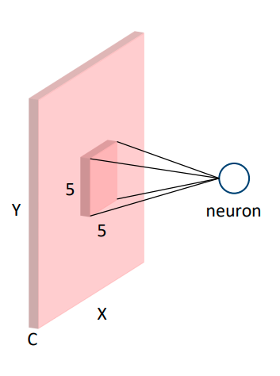
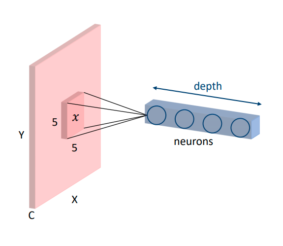
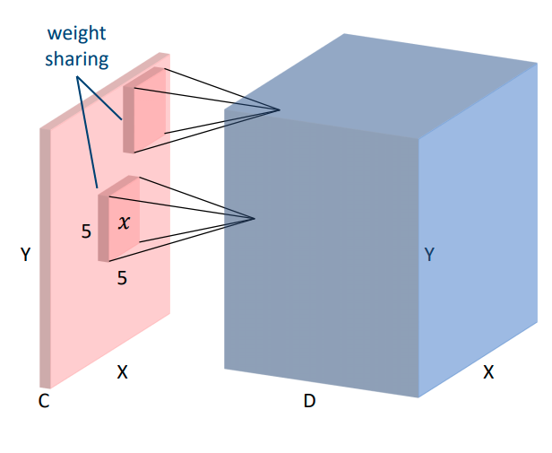
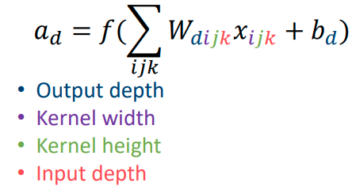
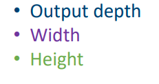
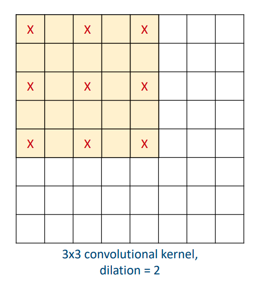
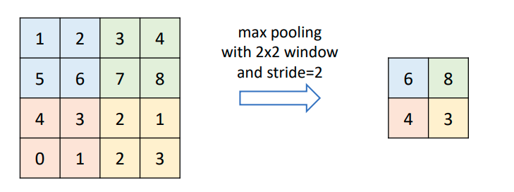

# 10 - Neural Networks II

## Convolutional Layer

In CNNs, each neuron only sees a small local region in the layer before it. This is called the **receptive field**. This is in contrast to a fully connected later, where every neuron depends on all the neurons in the previous layer. To calculate the receptive field
$$
r_{out} = r_{in} + (k-1)\times j_{in}
$$
where $j_{in}$ is the jumo of the previous layer. 

This neuron depends on a $5\times 5\times C$ cub in the input, where $C = 3$ for an RGB image, and $C=1$ for a grayscale image. This property is called **local connectivity**. The number of parameters is $5 \times 5 \times C$ for connected weights, and $1$ for bias. The input and output of the neuron is defined by
$$
\begin{align*}
z&=\sum_{ijk}W_{ijk} x_{ijk} + b \\
a&=f(z)
\end{align*}
$$
where $z$ is the input to the neuron, $W$ are the weights, $b$ is the bias, $a$ is the output, and $f$ is the activation function. We can then add **depth** to the output, to form a $D \times 1 \times 1$ cube of output. Each od the $D$ neurons has its own weights $W_n$ and bias $b_n$.
$$
a_n = f\left(\sum_{ijk} W_{nijk} x_{ijk} + b_{n}\right)
$$

We can then move the small window across the input image and get an output cube of $X \times Y \times D$. Each of the small windows shares the same weights, this is called **weight sharing**. So the number of parameters is only $5 \times 5 \times C \times D$ for weights, and $D$ for bias.

This is called a **convolutional layer**.
$$
a_d = f\left( \sum_{ijk} W_{dijk} x_{ijk} + b_d \right)
$$
where $W$ is the **convolutional kernel**. In total, the convolutional kernel has 4 dimensions.

and the output feature map has 3 dimensions.

### Padding

This is a way to fill in the boundaries of an image. If we don't use padding, the image will shrink.

- Input shape: $X_{in} \times Y_{in}$
- Kernel size: $k \times k$
- Padding: $p \times p$

Then the output shape is
$$
X_{out} = X_{in} + 2p - k + 1
$$

### Stride

This determines by how much we should move the window each time. This will be faster because we do not look at all the pixels, and downsample the grid.

With stride $s \times s$ The output shape is
$$
X_{out} = \left\lfloor \frac{X_{in}+2p-k}{s} \right\rfloor +1
$$
Notice that we are just dividing the previous equation by $s$.

### Dilation

If we want a neuron to look at a large receptive field, we can

- Use a small kernel and apply it to a downsampled image
- Increase the kernel size

However, increasing the kernel size will increase the number of parameters. Dilation aims to increase the receptive field on the *orignal image* without increasing the number of parameters.

With dilation $d \times d$ the output shape is
$$
k_d = k + (k-1)(d-1) \\
X_{out} = \left\lfloor\frac{X_{in} + 2p - k_d}{s}\right\rfloor + 1
$$
Notice that we are just calculating a new kernel size.

### Pooling Layer

The pooling layer makes feature maps or representations smaller. It is similar to image downsampling. After pooling, neurons in the next layer can see a larger region of the image.

