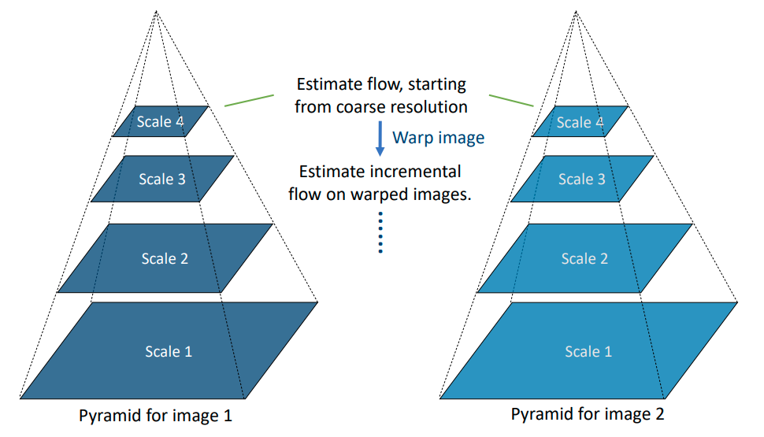

# 13 - Motion I

## Optic Flow

Two meanings:

1. The motion (flow) of brightness patterns (optics) in videos.
2. The method for estimating the motion.

Its output, the **flow field** describes the displacement vector for each pixel in the image. 

The assumptions are

- **Brightness constancy** - a pixel has constant brightness across time.
- **Small motion** - between frames, motion is small.
- **Spatial coherence** - pixels move like their neighbours.

## Lucas-Kanade

Based on the brightness constancy assumption, we have
$$
I(x+u, y+v, t+1) = I(x, y, t)
$$
where $I$ is the intensity, $(x, y, t)$ are the spatial and temporal coordinates, and $(u, v)$ is displacement.

Based on the small motion assumption, we can perform first-order Taylor expansion for the left-hand term.
$$
I(x+u, y+v, t+1) \approx I(x,y, t) + \frac{\partial I}{\partial x} u + \frac{\partial I}{\partial y}v + \frac{\partial I}{\partial t}
$$
Combining the two, we get the **optical flow constraint equation**, where $I_x$ denotes the gradient/partial derivative of $I$ w.r.t $x$ (can be obtained by Sobel or similar filters).
$$
I_xu + I_yv + I_t = 0
$$
We have two unknowns $u, v$ which means we cannot solve them. The Lucas-Kanade method allows use to estimate these two parameters from a single equation.

To address this problem, we use the **spatial coherence** assumption, that flow is constant within a small neighbourhood. We get the least square solution 
$$
\begin{align*}
x = (A^TA)^{-1}A^Tb
\end{align*}
$$
where
$$
\begin{align*}
x = 
\begin{bmatrix}
u \\ v
\end{bmatrix}
&&
A^TA = 
\sum_p
\begin{bmatrix}
I_x^2 & I_xI_y \\
I_x I_y & I_y^2
\end{bmatrix}
&&
A^T b =
-
\sum_p
\begin{bmatrix}
I_x I_t \\
I_y I_t
\end{bmatrix}
\end{align*}
$$
Note that the matrix $A^T A$ also appears in the Harris corner detector. The concepts are related by the fact that it is easier to track the motion of corners. The algorithm is as follows

1. For each pixel

   1. Use a small window and calculate the following matrix
      $$
      \begin{align*}
      A^T A = \sum_p 
      \begin{bmatrix}
      I_x^2 & I_xI_y \\
      I_xI_y& I_y^2
      \end{bmatrix}
      &&
      A^T b = -\sum_p
      \begin{bmatrix}
      I_x I_t \\
      I_y I_t
      \end{bmatrix}
      \end{align*}
      $$

   2. Calculate the optic flow for this pixel
      $$
      \begin{bmatrix}
      u \\ v
      \end{bmatrix}
      =
      (A^TA)^{-1}A^T b
      $$

### Iterative Lucas-Kanade

To improve motion estimation accuracy by running Lucas-Kanade iteratively, to estimate the higher order terms that we ignored earlier. We denote $I(t)$ as $I$ and $I(t+1)$ as $J$.

1. Set initial estimate of the flow field $u^{(0)}, v^{(0)}$ to be all 0.
2. For iteration $k$
   1. For image $I$ and $J$, compute the image gradients $I_x, I_y, I_t$.
      1. $I_x$ and $I_y$ depend only on the static image $I$, so they are always the same.
      2. $I_t$ = $J(x+u^{(k-1)}, y+v^{(k-1)}) - I(x, y)$. $J$ is the warped image according to the flow estimate.
   2. Estimate $A^TA$ and $A^Tb$ 
   3. Estimate the **incremental flow** using $\begin{bmatrix}u^\delta \\ v^\delta\end{bmatrix} = (A^TA)^{-1}A^Tb$
   4. Update the **flow estimate** $u^{(k)} = u^{(k-1)} + u^\delta, v^{(k)} = v^{(k-1)} + v^\delta$.

### Pyramid Lucas-Kanade

**Image pyramid** is another method to improve the flow estimate, which aims to overcome the **small motion assumption**. It may also be called **multi-scale** or **multi-resolution** framework.

By downsampling, a displacement of 8 pixels in the original scale is only 1 pixel at scale 4 and become small motion. At each scale, we use the incremental flow estimate from the previous scale.

1. For scale $l$ from coarse to fine

   1. Upscale the flow estimate from the previous scale
      $$
      \begin{align*}
      u^{(l-1)} = 2u^{(l-1)} && v^{(l-1)} = 2v^{(l-1)}
      \end{align*}
      $$

   2. For image $I^l$ and $J^l$ at this scale, compute the image gradients $I_x, I_y$, and $I_t$.

      1. $I_x, I_y$ are calculated from $I^l$.
      2. $I_t = J^l(x+u^{(l-1)}, y+v^{(l-1)})$. $J$ is the warped image.

   3. Estimate $A^TA$ and $A^Tb$.

   4. Estimate the incremental flow using $\begin{bmatrix}u \\ v\end{bmatrix} = (A^T A)^{-1} A^T b$.

   5. Update the flow *at this scale* $u^{(l)} = u^{(l-1)} + u^\delta, v^{(l)} = v^{(l-1)} + v^\delta$.

### Pyramid Iterative Lucas-Kanade

Both techniques can be combined. At each scale $l$, we replace the one-pass Lucas-Kanade by the iterative method.

## Horn-Schunk

This is another optic flow method. There is some ludricous maths here.

1. Compute the gradients $I_x, I_y, I_t$.

2. Initialise the flow field $u=0, v=0$.

3. For each iteration

   1. Calculate the average flow field
      $$
      \bar{u}^{(k)}, \bar{v}^{(k)}
      $$

   2. Update the flow field q
      $$
      \begin{align*}
      u^{(k+1)} &= \bar{u}^{(k)} - \frac{I_x(I_x\bar{u}^{(k)} + I_y \bar{v}^{(k)} + I_t)}{I_x^2 + I_y^2 + \alpha} \\
      v^{(k+1)} &= \bar{v}^{(k)} - \frac{I_y(I_y\bar{u}^{(k)} + I_y\bar{v}^{(k)}+I_t)}{I_x^2 + I_y^2 + \alpha}
      \end{align*}
      $$

   3. Terminate if the change of value is smaller than a threshold or the maximum number of iterations is exceeded.

## Learning Based Method

Learning the optic flow using a convolutional neural network.

- Input: two frames of images
- Output: flow field

### Flow Evaluation

While for image classification, detection, and segmentation, we can perform manual annotation to establish the ground truth. But for optic flow estimation, we need to generate the ground truth flow field between two time frames. This is done either using external data, or generating synthetic data.

If the ground truth is available, we can use the average and end-point error ($EE$) to evaluate the performance of an optic flow method.
$$
EE = \frac1N \sum_{x, y} \sqrt{(u(x, y) - u_{GT}(x, y))^2 + (v(x, y) - v_{GT}))^2}
$$
We can also evaluate an optic method by intensity difference. If the estimated flow is accurate, when we use it to warp $I$ to $J$, the two images should be almost identical. The MSE between $I$ and $J$ can be evaluated.