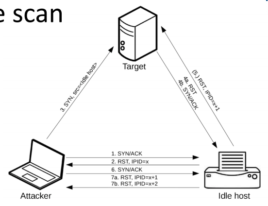
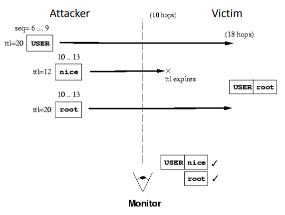

# 07 - Network Security

## Network Capabilities

| Person            | Capabilities                                                 | Example                                    |
| ----------------- | ------------------------------------------------------------ | ------------------------------------------ |
| Participant       | Send. receive legitimate packets that respect the protocol   | Web browser, web application               |
| Eavesdropper      | Read packets sent by others, cannot (or will not) participate | Wiretapper, sniffer on a broadcast network |
| Off-path attacker | Participate, create arbitrary packets                        | Machine connected to WiFi/internet         |
| Man-in-the-middle | Participate, read, modify, create, delete packets            | Proxy, ISP, router, WiFi access point      |

## MAC Flooding

Switches know where to send packets based on a cache of port-MAC associations (stored in a CAM table). Attacker forces the switch to broadcast traffic so he can sniff packets by flooding the switch with many MAC addresses.

This works because MAC addresses can be spoofed.

### Countermeasures

- **Port security** - limit the ability to flood caches

- Keep track of authorised MAC addresses

## ARP Poisoning

-Recall that ARP is for finding IP-MAC associations by broadcasting to machines on the network.

MAC addresses are easy to spoof, so the attacker can *evade MAC-based filtering and access control*. An off-path attacker spoofing a router becomes a MITM.

In ARP poisoning, the switch needs to find the MAC corresponding to an IP. Attacker spoofs MAC of the victim and replies like the victim. The message is forwarded to *both* ports that replied. 

### Countermeasuares

- Static ARP rules.
- Spoofed ARP message detection.

## Traceroute

This uses TTL to identify hosts/routers on path to the target.

- Send packets with increasing TTL until the destination is reached.
- Each ICMP error message should be from a host on the path until the destination.

## IP Security

The source IP is not authenticated and easy to **spoof**. This means an off-path attacekr can send packets with target IP as source. This is used for DDoS since the target will recieve a response.

### BGP Hijacking

BGP routing is based on trust. **BGP Hijacking** is where a malicious AS can advertise false routes, divert traffic, and become a MITM.

### IPSec

Adds security to the IP protocol. Two types: **AH** and **ESP**.

#### Authentication Header (AH)

- Provides authentication and integrity of the whole packet. 
- Does not integrate with NAT.
- Allows packet inspection, not blocked by firewalls.

#### **Encapsulating Security Payload (ESP)**

- Provides confidentiality of the payload, and optionally authentication.
- **Transport Mode**
  - Protects IP payload only.
- **Tunnel Mode**
  - Protects the IP header also.
  - Most used to implement VPNs.
  - Hard to configure correctly.

### IPv6

- Address space is large enough that there is no need for NAT.
- Fewer headers, enabled better routing.
- Fragmentation only at endpoints.
- *Better support for IPSec.*

## Transmission Control Protocol (TCP)

Used to establish a *reliable* connection to a service on the target destination port.

- Source port chosen at random by the OS to recieve responses.
- TCP adds sequence numbers and re-requests for lost packets.
- Used to send HTTP data.

### TCP Security Issues

TCP state is easily accessible and **sequence numbers** are predictable: previous number + bytes exchanged. 

- **TCP Session Hijacking** - A MITM attacker can read current sequence number and *inject new packets*.
- **Blind Spoofing** - An off-path attacker can try and guess the right sequence numbers.

#### Countermeasures

- Look for a time-delay, discard race-condition packets (keep only the first one).
- Use an IDS.
- Use HTTPS.

## Port Scanning

### TCP

With **TCP**, send a `SYN`. 

- **Respond with SYN/ACK** - port is **open**.
- **Respond with RST** - port is **closed**.

TCP port scan is quicker than UDP because you don't need to wait for a timeout.

### UDP

Send a generic UDP header with no payload to target ports.

- If you recieve a UDP response the port is **open**. 
- If you recieve an ICMP error the port is **closed** or **filtered**.
- If you timeout
  - May be **open** and host a service that drops ill-formed packets.
  - May be **filtered** by a firewall.
  - Probe the port again using UDP packets with protocol specific payloads.

## TCP Idle Scan

0. Identify an idle host (printer, FTP server)
1. & 2. Check available IPID on the idle host.

3. Spoof the source IP when connecting to the target.
4. Idle host recieves scan result it is not waiting for: 4a (closed) or 4b (open).
5. Only if scan result was 4b (open) the idle host sends a RST packet, incrementing the IPID.
6. & 7. Check new available IPID on idle host: $x+1$ port closed, $x+2$ port open.

## Key TCP/IP Threats

### Host & Port Scanning

- Used by hackers during active information gathering.
- They will try to hide requests within the normal variance of network traffic.

### Port Sweep

- One attacker looks for a specific service on many machines.
- More sensitive than port scanning because it's likely that service is vulnerable.

### Malicious Traffic

- Targeted attacks via network connections.
- Exploitation of networking stack implementation.
- Exfiltration of data.

### Distributed Denial of Service (DDoS)

- Flood a target with extremely high volume of network traffic.
- Attacker can use a botnet
  - Large volume
  - Diversify behaviour to avoid detection
  - Spread traffic to prevent takedown
- Or IP Spoofing.

## Port Knocking

Technique to hide a service from port scanning.

1. Sequential or random scan only finds closed ports.
2. Client shares a secret with server that identitifes specific ports to probe in a fixed order e.g. 3, 1, 2, 4. The server replies to the last probe with a random port where the service will be provided.
3. Client connects to the service on the random port.

## Firewalls

Firewalls aim to interpose an *all inbound/outbound traffic*. 

### Policies

#### Packet Filters

Make a decision based on an individual packet.

- Protocol header field IP/TCP/UDP/ICMP, in particular source/destination addresses, ports.
- Network interface used.

#### Stateful Filters

Take different notions of state into account.

- Is packet part of an established connection?
- Timeouts, bandwidth usage.
- Test/set variables in FW policy script.

## Instrusion Detection Systems (IDS)

## Deep Packet Inspection

Make decisions based on the *payload* as well as the headers.

- Raise an alert (IDS).
- Drop packet (IPS = Intrustion Protection System).

Can be **signature based**, **anomaly detection based**, **specification based**.

### Performance

Efficieny is key due to large bandwidth network traffic. 

#### On-path (IPS)

- Analysis must be very quick to preserve latency.
- Must prevent false positives (usability).
- Expect many false negatives.

#### Off-path (IDS)

- Too many false positives make IDS unhelpful.

 ### Signature Based IDS

They maintain a database of *signatures*. These are a set of rules on individual or groups of packets aiming to detect an attack. There is a sensitivity/specificity trade-off. 

- Generalised rules match more attack variants but increase false positives.

They are good at detecting familiar attacks with low false positive rates. However

- Not future proof
- Signatures are easy to bypass
- Focus on content rather than intent

## IDS Evasion

**IP fragmentation** can be used to evade IDSs.

1. Fragment a suspicious IP packet in 2.
2. Traceroute to determine distance to the IDS and target.
3. Send fragment 1 to reach the target.
4. Send innocuous replacement of frag 2 so that it's seen by the IDS but expires before reaching the target

5. IDS decided the communication is safe.
6. Send malicious frag 2 so that it reaches the target.
7. IDS does not interpret the messasge from (6) as related to the one in (3).

