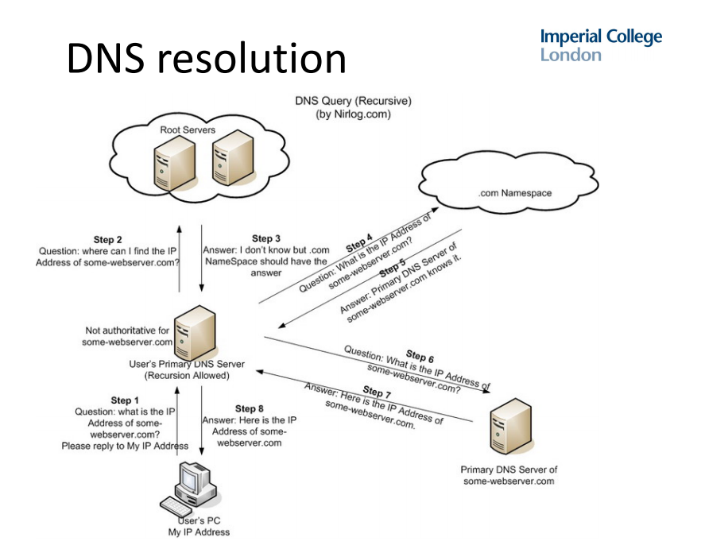

# 08 - DNS

## Overview

Before creating an IP packet, a local DNS client/resolver looks upo the IP address of the target hostname. Hostname-IP responses are valid for a limited amount of time (TTL). Normal DNS traffic is sent over UDP.

DNS resolution happens recursively.

## DNS Security Issues

- DNS requests and responses are *not authenticated*
  - Attackers can map trusted domain names to malicious IPs
    - Trivial for a MITM, and some ISPs do this to display ads
    - Off-path attacker on LAN may be able to
      - Inject **spoofed** DHCP packets, advertising malicious DNS resolver
      - Inject **spoofed** replies to DNS queries, after seeing the query ID
    - LAN router compromise also used to advertise malicious resolvers

### DNS MITM Attack

ISPs can block access to certain websites by responding to DNS queries with a different IP. However, users can switch to a different DNS server e.g. Google public DNS.

### DNS Hijacking 

a.k.a DNS poisoning or DNS redirection is the practice of subverting the resolution of DNS queries by either

- Using malware to override a computer's TCP/IP configuration to point at a rogue DNS server
- Modifying the behaviour of a trusted DNS server 

### DNS Spoofing

a.k.a DNS cache poisoning is where corrupt DNS data is introduced into the DNS resolver's cache, causing the nameserver to return an incorrect record - directing traffic to another computer. These spoofed responses can keep being served up to TTL.

### DNS Rebinding

See *16 - Same Origin Policy.*

## DNSSEC

DNSSEC protects the **authenticity** and **integrity** of DNS records. Each DNS zone has public/private-key pairs. DNSSEC chain of trusts follows the DNS resolution path, starting from the DNS root. Resolvers know the public keys of root nodes, and parent nodes use private keys to sign hashes of chilfren's public keys.

### Weaknesses

- Increased load on DNS servers due to crypto
- Decreased network performance: longer records sent **over TCP** (instead of UDP)

### Zone Enumeration

If a domain does not exist, an NSEC record reveals *alphabetically-closest* neighbours. e.g.

- Failed query: `resolve bob.example.com`
- Response: no records exist between `alic.example.com` and `charlie.example.com`

This is useful to *prove* a domain doesn't exist. This property is useful because no further DNSSEC queries are necessary (DNSSEC queries are relatively expensive). 

However, this leaks imformation to hackers who may be gathering intelligence. **NSEC3** mitigates this by using salted hashes of domain names. e.g.

- Failed query: `resolve bob.example.com`
- Response: no records exist between `4EE23198.example.com` and `D14DEA64.example.com`, the salt is `65BF`.

## DNS Tunelling

This allows an attacker to bypass a firewall or proxy that prevents HTTP communication with the target.

1. Attacker encodes data to be sent in a *DNS query* for a domain which he controls the authoritative DNS.

2. Domain is not found locally, eventually authoriative server is contacted.
3. DNS queries are not filtered.
4. Server replies encoding data in DNS response.
5. Firewall forwards innocent-looking response.
6. Attacker receives and decodes the reply.