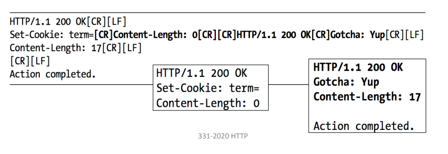

## 10 - HTTP

## HTTP Security Issues

- HTTP is over TCP/IP

  - No confidentiality or integrity of headers or messages against eavesdroppers or MITM.

- Caching

  - If an HTTP proxy cache is poisoned, downstream clients will receive rogue HTTP responses.

- Response splitting

  - Attacker could confuse the client to accept bogus responses over `keepalive` connection.

    

## HTTPS

HTTPS is running HTTP over an encrypted TLS connection. TLS provides **confidentiality** and **integrity** to the HTTP connection. This *prevents DNS spoofing* because

- Attacker-controlled DNS advertises malicious IP for target domain
- Attacker is not able to create fake certificate for target domain

## HTTP Public Key Pinning (HPKP)

### Usability Problems

### Security Problem

- Bootstrapping problem

## SSL Stripping and HSTS

SSL stripping occurs when a website initially uses HTTP and then upgrades the connection to HTTPS.

### Strict Transport Security

### Bootstrapping Problem

## Referer Header

## DoH

