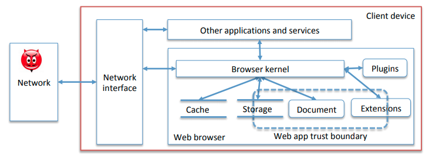

# 15 - Browser Security

The main security concerns of the browser are

- Protect the device hosting the browser from infection
- Protect user data from unauthorised access
- Provide a trustworthy platform to deploy the client-side of a web-application

## Client Architecture



Chrome uses OS **process-based isolation** and **sandboxing** to limit the effects of compromise. Each window/tab has its own process, including renderer, JS engine, and DOM.

The **browser chrome** is the user-interface of a browser. It includes

- Location bar, browser dialogs, settings, bookmarks
- Cannot be tampered by web pages
- Aims to be spoof-resistant 

## HTTPS in the Browser

The UI gives traffic-light warnings on certificate validity:

1. **Public/Insecure** :information_source:
   - HTTP (no HTTPS) 
   - Ok certificate with outdated settings
   - Mixed content - indicates risk of MITM e.g. HTTP form on a HTTPS page
2. **Insecure/Dangerous** :warning:
   - Certificate does not match the domain name
   - Malicious site
3. **Secure** :lock:
   - :thumbsup:
4. **Extended Validation Certificate** :lock: `Citigroup Inc. [US]`
   - More expensive, lawyer-approved certificate

However, this presents some usability issues. For example, certificate error messages are generally not helpful because the only way to see the website is by accepting and in most cases nothing bad happens.

## JavaScript in the Browser

A **browser context (BC)** is a container for a web page and its related resources. Each browser tab is associated with a top-level BC.

1. Load a new page
2. Render content
   - Display HTML
   - Execute scripts
   - Fetch other resources (images, frames, etc.)
   - Navigate nested BCs (frames)
3. Process events
   - User: `onclick`, `onmouseover`, ...
   - Rendering: `onload`, `onfocus`, ...
   - JavaScript timeouts, AJAX responses, postMessage, ...

The DOM is an OOP interface to the page HTML structure. Scripts can access and manipulate the DOM. Each BC has its document, its DOM, and its script execution environment. All scripts embedded in the same document *share the same execution environment* and DOM.


### Execution Order

1. Scripts in `<head>`, then `<body>`
2. Page-loading handlers: `onload`, ...
3. Headers of other asynchronous events
4. Handlers of page-unloading events: `onunload`, ...

## Attacks

### Phishing

The goal of the attacker is to steal user credentials or other sensitive information. 

1. The user visits a page controlled by the attacker that looks like a page from the target. This could take the form of
   - A full page replica of target HTML
   - A screenshot of the target page, plus scripts that simulate interactive behaviour like forms
   - Different page that imitates the target branding
2. The user reveals data to the attack page.
3. The attack page forwards data to the attacker, displays error or short acknowledgement.

Attackers will use domains that look similar to legitimate domains, or contain a legitimate domain within them. e.g.

```
https://www.BankOfTheVVest.com
http://paypal.com.recovery-suspicious.com/
```

Or they will use a compromised site or free hosting service. However, this means that the attacker has less control over the domain.

**Phishing kits** are commonly used by attackers to create phishing sites.

#### Countermeasures

- Prevent spreading of links via spam
- Safe-browsing blacklists of major browsers include phishing sites
- Research: automated detection using machine learning
  - Length/complexity of URL
  - Visual/structural similarity of page to whitelisted page
  - Topological properties of the page
    - Includes remote favicon
    - Does not load ads
    - Ratio of internal/external resources

### Clickjacking - iframes

1. User communicates data and intentions to the browser via clicks and keystrokes
2. The attacker tries to interfere with the *agreement* between the user and the browser

For example, overlaying a transparent Twitter iframe on a website. The user clicks a "Play!" button, but actually deletes their Twitter account.

#### Countermeasures

- X-Frame-Options header

  - `DENY`: page in response body cannot be contained in iframe
  - `SAMEORIGIN`: page can be iframed only by a page in the same origin
  - `ALLOW-FROM`: page can only be iframed by a page in designated origin

- Frame-busting JavaScript code can try to prevent a page from being iframed

  - ```javascript
    if (self != top) top.location = self.location
    ```

### Clickjacking - Fake Cursor

1. User clicks on "skip this ad" with fake cursor
2. User is unaware of allowing attacker to see through the webcam

#### Countermeasures

- Browser could show "trusted confirmation" (annoying to users)

### Drive-by Download

1. User visits malicious page
2. Page exploits vulnerability
   - Browser memory corruption
   - In plugins (Java, Flash, ...)
   - In browser extensions
3. Exploit installs malware on the client machine
   - Or at least saves a dangerous file that can be opened by the user

#### Dissection

- Find and analyse the source code	
  - Likely obfuscated to avoid detection
  - Inspect intermediate variables to save analysis effort
- Identify the real exploit code
  - See if it calls a plugin with a suspicious payload
  - See if it builds large DOM structures, or JavaScript strings
    - May be trying to exploit browser memory corruption
  - Looking for a corresponding CVE

#### Countermeasures

- Disable running plugins, or sandbox them
- Warn the user when visiting blacklisted sites
- Detect suspicious JavaScript
- Harden browser and OS against memory corruption vulnerabilities

## Content Sniffing and Polygots

**Content sniffing** - where a browser renders a resource based on its data instead of the MIME type reported by the Content-Type header. This allows pages with broken MIME types to still work correctly.

**Polyglots** - files that are valid w.r.t different data formats e.g. HTML files are valid text files. GIFs, PNGs, JARs have been crafted to be valid JavaScript or HTML.

- Polyglots can bypass content-based filtering rules
- Polyglots + content sniffing can bypass the Same-Origin-Policy (SOP)
  - `http://example.com/upload.php` accepts any image file
  - Attacker uploads PNG/HTML polyglot `attack.html`
  - Attacker sends victim a link to `http://example.com/images/attack.html`
  - Attacker now controls code in `http://example.com` origin
- X-Content-Type-Options: `nosniff`
  - Response header to prevent content-sniffing