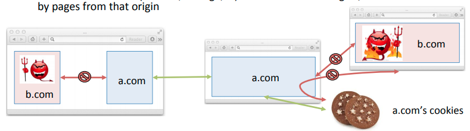
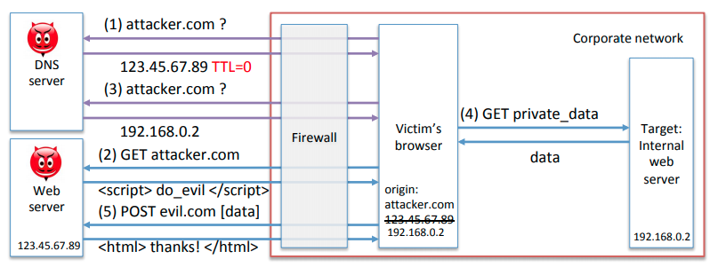
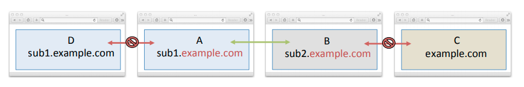

# 16 - Same Origin Policy

The **Same Origin Policy** (SOP) is the key security policy in the browser. Recall that URLS denote origins

```
scheme + host + port
https://www.example.com:443/path?query
```

Most resources are associated with the origin where they were loaded from. *Scripts* are associated with the origin of the browsing context that loaded them. Cookies follow special rules.

## Main Goals

Pages in different browsing contexts can interact with each other *if and only if they have the same origin*. Persistent resources (cookies, storage, etc.) are associated with origins, and can only be accessed by pages from that origin.



The SOP prevents different origins from tampering with each other, and confines resources based on origins. Some accesses are allowed by default:

- Write only: `window.location.href`
- Read only: `window.{frames, parent, top, ...}`
- Call methods: `window.{blur, close, focus, postMessage}`

The SOP does not prevent outbound communication. It's okay to do cross-domain post requests. It's also possible to load scripts form another site. If `https://source.com` adds the tag `<script src="http://target.com/script.js?out_msg">` then the server at `http://target.com` replies with `script.js` the client must trust the server who could inject arbitrary code.

## DNS Rebinding Attack

1. The SOP restricts a page to interact with any other pages from the same origin (1, 2).
2. DNS rebinding gets around the SOP by associating the *attacker's* DNS name to the target's IP address (3).
3. The main use of this is to circumvent firewalls and access corporate networks through the victim's browser (4, 5).



### Countermeasures

- DNS pinning: bindings cannot be changed too quickly
- Prevent external DNS queries to resolve internal addresses

## Domain Relation

A page can change its origin by "relaxing" to a suffix of that domain.

- A can set `document.domain=example.com`
- B can set `document.domain=example.com`
- The SOP now lets A and B communicate.
- A can no longer talk to D.
- C remains isolated.

