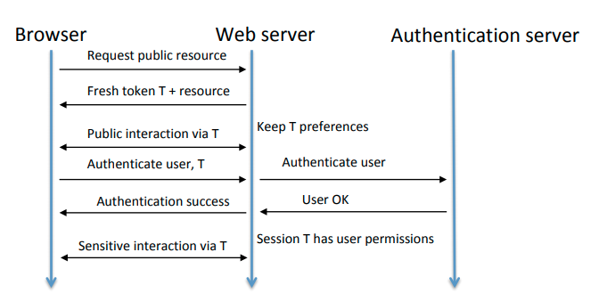
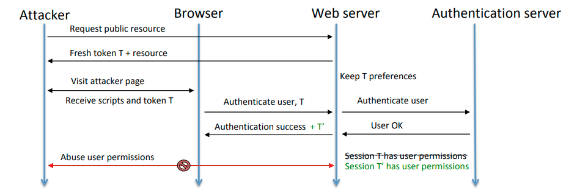
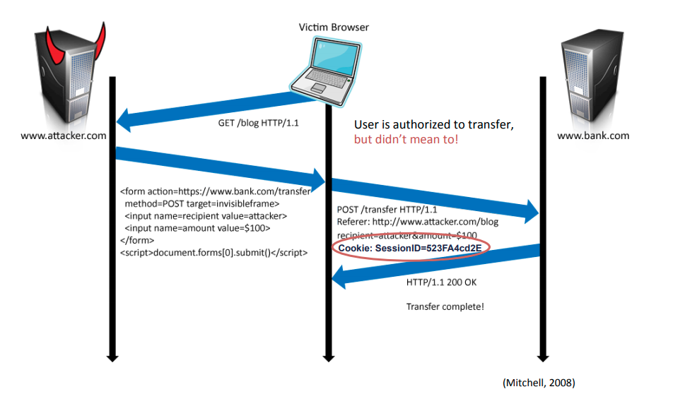
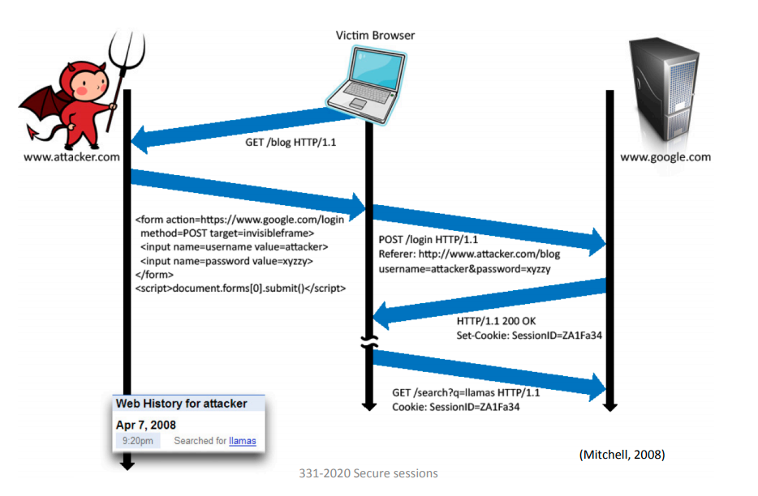

# 	19 - Secure Sessions

## HTTP Authentication

In a **stateless protocol**, each time a user needs to do an action requiring authorisation, its identity needs to be established.

### HTTP Basic Authentication

Sens username and password in *clear text.* Essentially deprecated.

### HTTP Digest Authentication

Sends the *hash* of password and server-generated nonce that may restrict validity e.g. Time stamp, client IP. Does not protect other fields or headers.

### Limitations

- **Inefficient** - need to contact the authentication server at every request.
- **Cumbersome** - user needs to close the browser to sign out.
- **Annoying** - user needs to re-authenticate for each different web asset.

### Security Issues

- Credentials sent on the wire with every request.
- Password dialogue easy to spoof and confusing for user.
- MITM can tamper with Digest nonce and launch an offline dictionary attack.

## Sessions

Adds state so that re-authentication is not required for every request. This is done via **session tokens**, which are typically implemented as cookies. Related attacks: **session fixation**, **session hijacking**, **CSRF**.

### Unauthenticated Sessions

Useful to keep track of web app state on behalf of an anonymous user.

1. Server issues a short-lived token to the client.
2. Client presents the token with requests that affect client state on the server.

### Authenticated Sessions

More flexible and complicated than HTTP authentication.

1. Client authenticates once.
2. Client presents the token when authorisation is needed.

## Secure Tokens

- **Tokens can be spoofed** 
  - Make tokens unpredictable using randomness.
- **Tokens can be stolen**
  - Restrict where attacker can use them by binding session to client-context such as IP address, SSL session ID, browser fingerprint.
  - *However*, this could lead to the user being logged out unexpectedly because IP changes frequently, and SSL session ID changes when user re-opens website with existing session. The attacker can also use the victim's browser.

For example, we could have session `data = (timestamp, random value, user id, status, client-context)`. Then, either

- Server keeps data
  - Small token: `MD5(data)`
  - Overhead of database lookup for each request.
- Server sends data to client
  - Larger token - `Encrypt-then-MAC(data)`
  - Server must still keep track of login status.

## CORS

SOP allows cross-origin communication *when both parties are willing to engage*. SOP prevents cross-origin AJAX requests which prevents the attacker stealing anti-CSRF token by loading target page via AJAX.

**Cross-Origin Resource Sharing (CORS)** relaxes SOP for servers that opt in. 

1. The browser attaches `Origin=<origin>` header to cross-origin AJAX request. 
2. If the server accepts cross-domain requests from `<origin>`, it replies with `Access-Control-Allow-Origin: <origin>` and the browser allows AJAX response to be received by the script.
3. Otherwise, the response still reaches the browser but is discarded.

## Attacks

### Session Fixation

Naive session implementations may be vulnerable.

1. Attacker obtains unauthenticated session token by connecting to the web server.
2. Tricks user to log in using attacker's token e.g. using XSS or MITM.
3. After login, the token is associated to a valid session - escalation of privilege.

#### Countermeasures

- After login issue a new token, instead of escalating the old one.

### Session Hijacking 

Attacker obtains a valid token and performs sensitive actions on behalf of the user. This can be done via guessing, MITM, XSS. MITM is possible when HTTP is used only after logging in over HTTPS.

#### Countermeasures

- Send session tokens only over HTTPS.
- Invalidate session on server after logout to restrict the window of opportunity.
- Use secure tokens.

### CSRF

Exploits trust between browser and target by tricking the user into submitting a web request that they did not intend. The user is in position to issue requests that cause side-effects e.g. logged into a web applications. IP-based access control in LAN.

It's easy to deploy, since all the attacker needs to do is trick the user into issuing a requests that causes undesirable side-effects. It's enough for the user to visit a malicious web page or click on a link crafted by the attacker.

**Countermeasures**

- Use POST and not GET for sensitive, state changing actions.
  - POST body does not leak via `referer` header.
  - POST body not sent in redirections.
- Embed a *second token*  as a hidden field of each form presented on authenticated pages. 
  - Option 1: double cookie
    - Use the same token in the form and in the cookie, server checks if they are the same.
  - Option 2: different tokens in form and in cookie.
    - Server knows which two should correspond.
    - *More secure and flexible* - form token can be different for each form.
    - Could be hash of session ID and intended action to save space on the server.
- Use `SameSite` attribute for session cookie.
  - Restricts functionality - cannot access existing session via external link.

### Session CSRF

Flavour of CSRF which exploits session tokens.

### Login CSRF

Flavour of CSRF which exploits login. We cannot use an anti-CSRF token here because there is no session token to serve as the second factor.

#### Countermeasures

- Validate `referer` or `origin` header of login request.
  - e.g. in the previous example, the referer header 
  - Only partial mitigation, because sometimes `referer` and `origin` headers are stripped by network proxies.
- Embed login form on a dedicated page.
  - Served over HTTPS from a segregated domain that serves no other resources.
  - Does not includes 3rd party scripts or iframes, which minimised risk of XSS.

## Secure Sessions

1. Use HTTPS wherever possible: before + after login.
2. Segregate login in a secure domain.
3. Change session token after login.
4. Protect sensitive actions with anti-CSRF token cryptographically related to session token.
   - Or use `SameSite` cookies.
5. Use specific and short-lived tokens.
   - If the same token is used more than once, MITM can launch replay attacks.
6. Check `referer` where available.
7. Ask for re-authentication for special actions.
8. After pre-determined idle time, the session should expire.