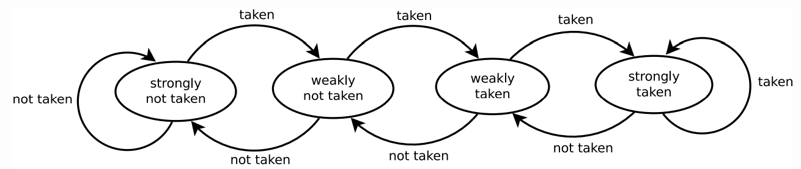

# 04 - Performance Modelling

## Numerical Models

- A series of data points describing the *observed behaviour* of the system.
- Useful to describe the system to behaviour for *humans*.
- Predictive power depends on *interpretation*.

To create a numerical model:

1. Gather data
2. Interpret
   1. Prediction through interpolation

#### Advantages

- Relatively easy to interpret
- Easy to get

#### Disadvantages

- Generalise poorly (cannot be applied to new environments)
- Massive amounts of experimental data needed.
- Limited accuracy for confidence for prediction
- Limited interpretability (contributing factors are implicit)
- Limited insight (how does the system actually work?)

## Analytical Models

- A *formal characterisation* of the relationship between parameters and performance metrics.
- Often *difficult to interpret* for humans.
- Prediction is performed by evaluating the model.

Building analytical models require a very *detailed understanding* of the system including the parameters and effects. They require extensive validation, and often end up with very complicated in order to deal with edge cases.

### Model Fitting

This involves turning an numerical model into an analytical model. To do this, we need 

1. A characteristic equation
2. Values for parameters

## Modelling Memory Access

```C
int* input 1; // uniform random data, 1024 values
int* input 2; // random data, 64 values
for (size_t i = 0; i < inputSize; i++) {
    sum += input2[input1[i]]
}
```

To model a piece of code, we first need to define a number of parameters.

$R.n$ - memory region length (number of tuples).

$R.w$ - memory region width (size of a tuple in processor words).

$||R||$ - memory region size (product of length and width).

$u$ - number of words to read in each access.

For repetitive access we also define

$r$  - number of accesses.

### Modelling Complex Patterns

$\mathcal{P_1} \oplus \mathcal{P_2}$ - the sequential execution of the access patterns $\mathcal{P_1} \oplus \mathcal{P_2}$.

$\mathcal{P_1} \odot \mathcal{P_2}$ - the concurrent execution of access patterns.

Here, "concurrent" is not meant in the sense of parallelism, but rather doing two things in each iteration of a loop. For example the above code has the access pattern description 

$$
s\_trav(R.w=1, u=1, R.n=1024) \odot rr\_acc(R.w, u=1, R.n=64, r=1024)
$$

because we have sequential traversal of an array of size 1024 and concurrent repetitive random accesses of an array of size 64 with 1024 values.  

## Modelling Stateful Systems

Analytical models are stateless, stochastical models allow state to be modelled.

### Markov Chains

Essentially a finite state machine with transition probabilities.

**Markov property** - next state is only dependent on the current state and a random variable.



Branch predictors can be modelled as Markov chains. The **branch misprediction rate** will converge to the **stationary distribution**.
$$
P(pred\_taken) * P(pred\_not\_taken) + P(pred\_not\_taken) * P(actually\_taken)
$$

