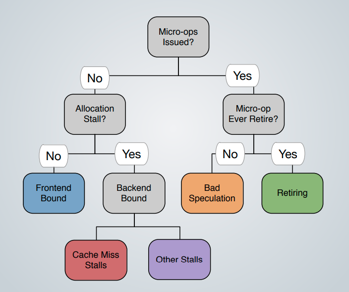
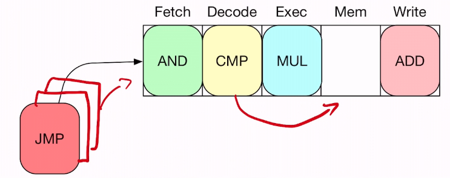

# 05 - CPU Efficient Code

## Bottlenecks

**Bottleneck** - the resource with the highest utilisation.

We want to aim for a system without a bottleneck - one where *all resources are  equally utilised*. This is called a **balanced system**.

However, hardware optimisations have varying impact on code, so there is no such thing as a balanced system. We distinguish **balanced**, **compute-bound**, **latency-bound**, and **bandwidth-bound** code.

High-level techniques:

- Choice of algorithm
- Memoization
- Compression
- ...

Low-level techniques:

- Our focus!

The front-end decodes into micro-ops. If we don't have an allocation stall, the instructions were not allocated in the first place so frontend bound. If backend-bound it was allocated but not executed - cache miss or other. To execute, we need (1) operands and (2) the ALU execution unit to execute on.



**Retiring** denotes slots utilized by “good operations”. Ideally, you want to see all slots attributed here since it correlates with Instructions Per Cycle (IPC). Nevertheless, a high Retiring fraction does not necessary mean there is no room for speedup. 

**Bad Speculation** denotes slots wasted due to all aspects of incorrect speculations. Can be alleviated by predication to remove control flow dependencies.

**Front End Bound** denotes when the pipeline’s front end under-supplies the back end. Front end is the portion of the pipeline responsible for delivering operations to be executed later by the back end. This can cause front end boundness.

**Back End Bound** denotes remaining stalled slots due to lack of required back-end resources to accept new operations. It is split into: Memory Bound which reflects execution stalls due to the memory subsystem, and Core Bound which reflects either pressure on the execution units (compute bound) or lack of Instructions-Level-Parallelism (ILP). Data stalls can be alleviated by rearranging data and/or compression. Lack of ILP can be alleviated by utilising SIMD.

## CPU Efficiency

A program may be CPU inefficient because:

- it is poorly implemented
- operates on small (cache-resident) datasets
- maths-heavy
- apply memory-oriented optimisations

### Target Metric

Our target metric is **wall-clock time**. This is the amount of time taken to perform a job (as opposed to user- or CPU-time).

Cycles-per-instruction is not that useful since the instructions are a parameter.

Stall cycles are a good indicator. These are caused by hazards:

- **Control hazards** - due to data-dependent changes in the control flow
  - e.g. a branching instruction that decides another instruction would be executed at all
- **Structural hazards** - due to lack of resources (execution units)
  - e.g. more eligible floating point instructions in the pipeline than FPU units in the ALU
- **Data hazards** - due to data not being available on time
  - e.g. input operands to one instruction being produced by another instruction
- **False sharing** - due to unecessary cache-coherence traffic

Here, "resources" refers to cache, registers, execution slots, etc.

### Proxy Metrics

**Work efficiency** - don't waste cycles on unnecessary work.

**Simplicity** - fewer instructions occupy less resources.

**Independent instructions** - allows the CPU to fill pipeline bubbles.

**Parallelism** - matters even if you don't write parallel algorithms.

**Predictability** - make your code easy for the CPU to speculate upon.

**Adaptivity** - account for parameters you don't know the value of.

**Specialisation** - use the features of your CPU.

**Separation of concerns** - make the hardware do the heavy-lifting.

## Parallelism vs. Predictability

This optimisation problem has three dimensions: input, code, and the system.

### The System

When designing the system, we have a few fundamental design decisions:

- Is the system executing instructions our of order?
- Is the system executing speculatively?
- Is the system executing work in parallel?

NB: "parallel" does not refer to multi-core parallelism, but superscalar execution (dynamically bundled packages) and SIMD/VLIW (statically bundled packages).

### Out-of-Order Execution

Pipelined execution exploits the independence of stages of different instructions,  filling empty execution ports in the CPU pipeline.



This reduces the effect of all three hazards: control, data, and structural.

### Speculative Execution

This keeps the pipeline filled even if no instructions are eligible. This addresses control hazards, but may have a penalty when you mis-speculate.

This is one of the two types of speculation that a CPU performs, the other being prefetching.

### Instruction-Level Parallelism

#### Superscalar Exececution

A method of parallel computing where the CPU manages multiple pipelines, so different instructions can be in the same pipeline stage. This means that several instructions can be executed per clock cycle.

We term this "dynamically packaged" because you can think of the two instructions that are running in the same stage at the same time as a "package" of instructions, which could be completely unrelated. The compiler does not need to decide how to package them, the CPU decides at runtime.

#### Single Instruction Multiple Data (SIMD)

In a single instruction, the CPU performs the same operation on multiple data items.

#### Very Long Instruction Words

In a single instruction, the CPU performs different operations on multiple or the same data item. It's basically compiler-controlled superscaler execution. This is rarely implemented, so not that important.

## Rule 1: Efficient Code

Write efficient code:

- Do not run code repeatedly 
- Evaluate code as early as possible

### Partial Evaluation

A method to convert a program that contains a lot of redundant work into one which contains less redundant work.

Idea: treat program evaluation as a multi-phased process. In each phase, you learn more about the result. You can create a more specialised program, and the fixpoint you reach is the result.

Examples:

- Function inlining
- JiT compilation
- Symbolic programming
- Constant evaluation

The advantage is that it eliminates the need to repeatedly evaluate common parts of the code. Note that this is not the same as lifting since it does not introduce any new control flow, but only removes control flow.

The key disadvantage is that partial evaluation moves around computation in hard-to-predict ways, which may increase the cost of cheap sections of the program. It may also cause the evaluation of parts of the code that are never actually executed.

### Lifting Expensive Operations

Moving work from a section that is executed often into one that is executed seldomly e.g. moving invariants out of a loop. This concept is generalised to **loop specialisation**.

This is generally done by the compiler, but they sometimes need help to determine the number of special cases that they should have. This is done with **metaprogramming**.

### Metaprogramming

Generate all special cases at compile-time. This allows the compiler to apply optimisations for special cases. This concept is implemented using templates in C++, for example.

Instead of 

```C++
void scaleVector(int* input, size_t inputSize, int scale) {
    for (size_t i = 0; i < inputSize; i++) {
        input[i] *= scale;
    }
}

scaleVector(input, size, 2)
```

we can use a template to write

```C++
template <int scale> void scaleVectorPE(int* input, size_t inputSize) {
    for (size_t i = 0; i < inputSize; i++) {
        input[i] *= scale;
    }
}

scaleVectorPE<2>(input, size)
```

thereby turning a runtime parameter into a compile time parameter. You can take this further by using a map of special cases to function pointers.

## Rule 2: Predictable Code

Control dependencies *can* cause control hazards. Branch elimination *can* eliminate control hazards. Instead of

```C++
for (size_t i = 0; i < inputSize; i++) {
    if (input[i] < high) {
        output[outI++] = input[i];
    }
}
```

we can write

```C++
for (size_t i = 0; i < inputSize; i++) {
    output[outI] = input[i];
    outI += (input[i] < high);
}
```

thereby eliminating any branch mispredictions. This is called **predication** or **if-conversion**.	

However, this *might not* cause a control hazard depending on the input data. For example, in this case if the input is sorted it will not suffer from bad speculation.

## Rule 3: Write Parallel Code

Even if you don't try and parallelise your code, compilers try and auto-vectorise.

### SIMD 

SIMD instructions are generally powers of two. So if you have a loop that iterates 1024 times, this will be easily vectorised. If you have a loop that iterates 999 times, the compiler *may or may not* partially vectorise it. Hence, it may be useful to write a loop that iterates for a power of two, and then a smaller cleanup loop.

### Compiler Intrinsics

If the compiler fails, code can be explicitly vectorised using **compiler intrinsics.** These are C functions that map directly to hardware instructions.

A **union** allows us to view the same memory region in two different ways. This is useful if you want to look up individual elements, vs. actually use the SIMD instruction.

```C
union v8f {
    float floats[8];
    __m256 simdVector;
};
```

However, conversion from SIMD to scalar instructions can cause parallelisation to yield no benefit. You need to try to keep all your data in vector registers.

