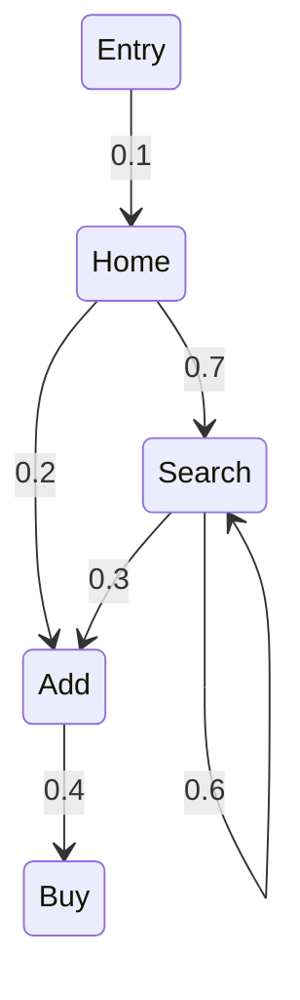
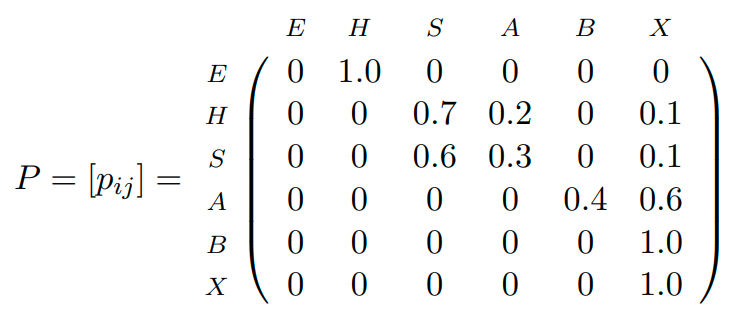
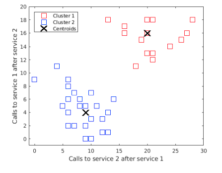

# 08 - User Behaviour Modelling

The aim is to simulate realistic user behaviour.

## Log Files and Traces

Workloads are recorded in **log files**. They record events at the operating system or application level, and their timestamps. Many tools automate log collection, filtering, and analysis. In distributed applications, multiple log files and need to be combined into **workload traces**. A workload trace organises events that pertain to the arrival and service of requests in a **time series**.

Traces can be used to 

- **Understand** how the system is used by customers.
- **Simulate** the system to answer what-if questions.
- **Replay** a sequence of requests using a load-testing tool.

## Why Model Computer Workloads?

One might argue that it's not necessary to model computer workloads because we have these traces instead. Workload traces are essential to understanding system performance, but some issues limit their use:

- **Privacy** - companies don't like to give access to logs tracing customer activities.
- **Inflexibility** - it's difficult to manipulate the parameters of a trace to study the sensitivity of a system to a workload parameter.
- **Noise** - in a trace we do not always know what is noise and what is not.
- **Overfitting** - what we learn may depend too much on a specific trace instance.

### Definitions

**Workload model** - a model that can generate traces similar to the ones observed in the system e.g. statistical distributions (not stateful), Markov chains (stateful), automata etc.

**Workload characterisation** - model parameters are fitted to traces to capture their characteristics.

### Advantages

- **Repetitions** - models can generate similar, but non-identical, traces.
- **Understanding** - modelling increases our understanding and can lead to system optimisations because of it.
- **Availability** - traces are not always available, but can be generated by models.

## User Behaviour Graph

**User session** - the sequence of pages visited by a user.

**UBG** - a probabilistic automaton describing user sessions where

- states = page, session, or service invocations.
- weights = transition probabilities.
- outgoing arcs = end of the session.



UBGs are **discrete-time Markov chains (DTMC)**. 

- Users always start from the **Entry** state.
- $p_{ij}$ is the transition probability from node $i$ to $j$.
- After visiting $i$, the user visits page $j$ with probability $p_{ij}$.
- Upon closing the session, they reach the **Exit** node (not shown in the UBG).

We denote by $\mathcal{S}$ the set of DTMC states.

Every DTMC is described by a **transition probability matrix**. 



All the rows must sum to one. Upon reaching **Exit** ($X$) we never jump to another state. This is called an **absorbing state**. 

## UBGs In Practice

UBGs can be fitted on data from a single or multiple client IPs. $p_{ij}$ values can be extracted from log files using the **HTTP Request** and **referer URL** fields.
$$
p_{ij} = \frac{\text{number of requests for } j \text{ with } i \text{ as referer URL}}{\sum_{k\in\mathcal{S}} \text{number of requests for } k \text{ with } i \text{ as referer URL}}
$$


Care should be taken when parsing log files. 

- Several users may share the same IP.
  - e.g. users behind a proxy.
- A user may navigate with two or more open browsers.
- A user may wait several minutes between sending requests - when does a session terminate?
  - A threshold needs to be defined.

Using UBGs we can perform

- **Simulation** can generate similar but non-identical sessions.
  - e.g. to validate the system under different workload mixes..
- **Analysis** can help understanding user behaviour.
  - e.g. to understand how website topology affects user behaviour.
- **Modification** can help explore the consequences of change.
  - e.g. what if we merge two pages?
- **Clustering** can help group similar users into classes.
  - e.g. helpful for business analytics, pre-fetching, etc.

## Simulating a UBG

This describes how we uses a UBG to perform a simulation. The body of a loop randomly decides what state to transition to, from the set of outgoing states.

```pseudocode
i := E /* Initial state */
while simulation is not over do 
	print i /* The current state */
	r := random number in [0, 1)
	for j in S do
		if r <= \sum_{k <= j} p_{ik} then
			i = j
			break
        end if
    end for
end while
```


## Properties of UBGs

### Visit Ratios

What is the average number of visits $V(i)$ to state $i$? Let's say that in the example, $V(\text{Add}) = 0.725$. Then $V(\text{Buy}) = V(\text{Add}) \times p_{\text{Add}, \text{Buy}} = 0.725 \times 0.4 = 0.29$. In general
$$
\begin{align*}
V(E) = 1 && V(j) = \sum_{i \in \mathcal{S}} V(i)p(_{ij}) && \forall j \in \mathcal{S} \setminus \{E\}
\end{align*}
$$
where $\mathcal{S}$ is the set of states, and $E$ is the Entry.

### Session Lengths

What is the average session length $L$ for a user? it is the sum of the mean session lengths over all the states in the graph except Entry and Exit.
$$
L = \sum_{i \in \mathcal{S} \setminus \{E, X\}} V(i)
$$

### Session Length Distribution	

How often does the user reach state $i$ after $n$ page visits?

- $\pi^{(n)}(i) :$ probability of being in state $i$ after $n$ page visits.
- $\pi^{(n)} = [\pi^{(n)}_i \vert i \in \mathcal{S}] :$ state probability vector.
- And in particular $\pi^{(0)} = [\pi_E^{(0)}, \pi_H^{(0)}, ..., \pi_X^{(0)}] = [1, 0, ...,0]$

So similarly to visits, we need to solve the linear system
$$
\pi_j^{(n)} = \sum_{i \in \mathcal{S}} \pi_i^{(n-1)}p_{ij} \quad j\in \mathcal{S}
$$
or in matrix form
$$
\pi^{(n)} = \pi^{(n-1)}P \implies \pi^{(n)} = \pi^{(0)}P^n
$$
So if $\pi_X^{(n)}$ is the probability of leaving the system in $n$ page visits or less, $\pi_X^{(n)} - \pi_X^{(n-1)}$  is the probability of completing the session after exactly $n$ page requests.

## Fitting UBGs From Log Data

This is more general than using the referer URL to find transition probabilities. It's about finding the *typical* user interactions, and capturing *groups* of users. From the logs we are trying to create a *cloud of points* that represent the different sessions that we have seen in our log file. 

UBGs can be fitted automatically from website logs. Define for a user $u$ the following matrix:

- $C_u$ : entry $(i, j)$ counts the visits to page $j$ right after visiting $i$.
- After normalising rows to sum to one, $C_u$ becomes a UBG.

If there are $n$ pages, $C_u$ maps to a point in the Euclidean space with $n^2$ dimensions. Each point in this space represents a possible UBG, not necessarily one observed in the logs, but one that can be easily created in load tests or other applications. Then we can run a **clustering algorithm** to find centroids that represent a class of user.



## $k$-means Algorithm

**Input** - points in Euclidean space, number of clusters $k$.

 **Output** - coordinates of $k$ centroids.

```
1. Initialise centroid positions randomly
2. Repeat until convergence of the centroid positions:
	2.1 For every point, assign it to the cluster with the nearest centroid
	2.2 For every cluster, recalculate the position of the centroid
```

Distances are calculated using Euclidean distance.
$$
d(C_u, C_v) = \sqrt{\sum_{i=1}^n \sum_{j=1}^n (C_u(i, j) - C_v(i, j))^2}
$$
and for every cluster centroid positions are recalculated by averaging the positions of the points within the cluster.
$$
c(i, j) = \frac{1}{n_c} \sum_{u\in \text{cluster}} C_u(i, j)
$$
where $c(i, j)$ is the centroid coordinate on dimension $(i, j)$ and $n_c$ counts the number of points currently assigned to the cluster.

## Limitations of UBGs

- UBGs do not fully specify interactions.
  - e.g. what to search?
- UBGs are agnostic of resource usage.
  - e.g. CPU, memory, ...
- Some paths may be invalid in a real system.
  - e.g. Home --> Search  --> Logout without a Login.

