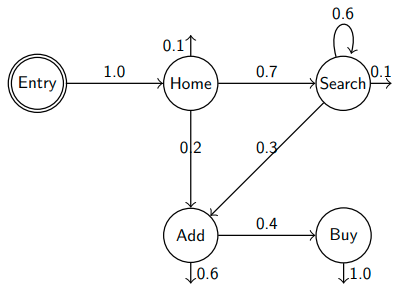
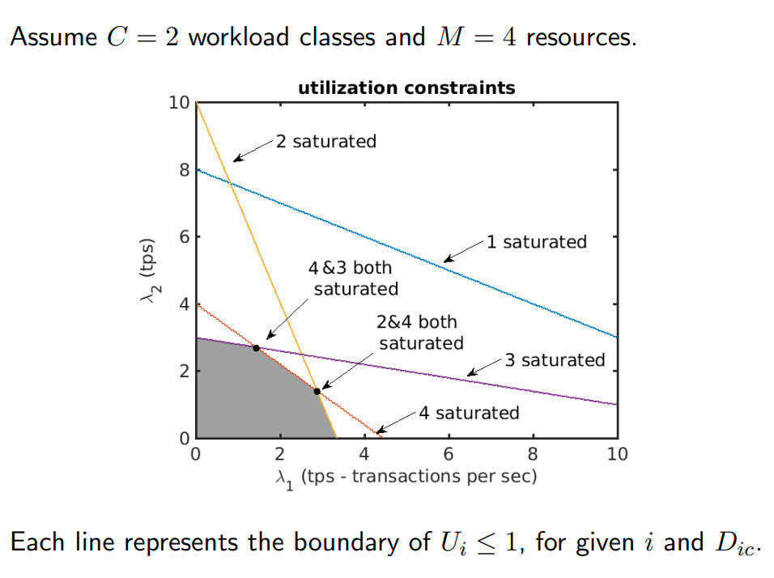

# 09 - Bottlenecks in Distributed Systems

Typical questions involving computational analysis include;

- **Bottleneck analysis** - which resources limit the scalability of a given distributed application?
- **What-if analysis** - how ill changes in user request rates or resource speed impact performance?

Performance of individual resources (e.g. CPUs) are affected by:

- **Arrival rate** of requests
- **Service time** of the request as the resource
- **Contention** at the resource

We're interested in how to predict and analyse resource utilisation.

## Service Classes

We assume that the system 

- Offers $C$ types of services (**service classes**), e.g. $C$ web pages
- Processes requests using $M$ resources e.g. $M$ servers

In order to complete, a request of class $c$

- Makes on average $k_{ic}$ calls to resource $i$
- Requires a mean service time of $S_{ic}$ seconds for each call to $i$

The **demand** $D_{ic} = k_{ic} S_{ic}$ is the total processing time by class-$c$ requests at $i$. If there is contention or queuing, the demand reflects only the effective processing time received at the resource, neglecting overheads due to other jobs.

## Operational Analysis

The goal is to investigate the relationship between demands and resource utilisation. Suppose to monitor a resource for an **observation period** of $T$ seconds collecting

- $A_c$ : total *number of arrived* requests of class $c$
- $B_{ic}$ : total *time a resource is busy* processing requests of class $c$

averaging over the observation period we obtain

- $\lambda_c = A_c/T$  : the average **arrival rate** of requests of class $c$
- $U_{ic} = B_{ic}/T$ : the **utilisation** of resource $i$ due to requests of class $c$

If requests *never fail* and the pending requests are always bounded in number, then $\lambda_c$ is also equal to the class-$c$ **throughput** $X_c$, as $T$ grows large because
$$
\lambda_c = \lim_{T\to\infty} \frac{A_c}{T} = \lim_{T\to\infty} \frac{\text{completed}(c) + \text{pending}(c)}{T} = \lim_{T \to \infty} \frac{\text{completed}(c)}{T} = X_c
$$
since the number of pending requests is *finite* (whereas the number of completed grows), if the system is *stable*. An *unstable* system cannot cope with the rate of arrivals, so that eventually its backlog grows *unbounded*. 

Throughout, we assume that the system is **stable**. So, if $T$ is large enough, arrival rate and throughput become the same (as long as you look at the system for long enough).

## Utilisation Law

We now observe that
$$
D_{ic} = B_{ic}/A_c
$$
since $B_{ic}/A_c$ averages the total processing time by $c$ at $i$ - which is the definition of $D_{ic}$. The relationship between utilisation and demands is
$$
U_{ic} = \frac{B_{ic}}{T} = \frac{A_c}{T}\frac{B_{ic}}{A_c} = \lambda_c D_{ic}
$$
For a system with $C$ workload classes, the total resource utilisation $U_i$ is given by the **utilisation law**
$$
U_i = \sum_{c=1}^C U_{ic} = \sum_{c=1}^C \lambda_c D_{ic} = \sum_{c=1}^C X_c D_{ic}
$$
which tells you that the utilisation is the average visit time per arrival.  

## Example: Utilisation from UBG

Users arrive at $\lambda=1$ sessions/second. Then we can write the **UBG visit ratios**
$$
\begin{align*}
V_H = 1 && V_A = 0.2V_H + 0.3V_S && V_S = 0.7V_H + 0.6V_S && V_B = 0.4V_A
\end{align*}
$$
yielding
$$
\begin{align*}
V_H = 1 && V_A = 0.725 && V_S = 1.75 && V_B = 0.29
\end{align*}
$$
Then we can find the **request rates**
$$
\begin{align*}
\lambda_H = \lambda V_H && \lambda_A = \lambda V_A && \lambda_S = \lambda V_S && \lambda_B = \lambda V_B
\end{align*}
$$
and hence **utilisation** for the web server $U_W$ is 
$$
U_W = \lambda_H D_{WH} + \lambda A D_{WA} + \lambda_S D_{WS} + \lambda_B D_{WB} = 0.974
$$

## Demand Estimation from Utilisation Samples

In the previous example, $D_{ic}$ was given to us. How can we estimate these values in practice? The utilisation law describes a hyperplane with sloped $D_{ic}$, and we can use **multivariate linear regression** to fit hyperplanes to samples of $U_i$ and $\lambda_c$ (or $X_c$), returning the demands $D_{ic}$. 

## Bottleneck Analysis

How can we use the utilisations to determine which resources will become bottlenecks? For our purposes, we define the bottleneck as the station with the highest utilisation. In **bottleneck analysis**, we are aiming to answer the questions

- As arrival rate increases, which resource(s) will **saturate** (reach 100% utilisation) first?
- What is the **maximum arrival rate** that a system can sustain for a given mix of requests?

One way to do this is **linear programming**.

### Linear Programming

As we have seen, for a system with $M$ resources, we can describe resource usage in terms of the system of linear equations
$$
U_i = \sum_{c=1}^C \lambda_c D_{ic} i = 1,...,M
$$
where we require $U_i \leq 1$ and $\lambda_c \geq 0$. Resource $j$ can saturate *if and only if* there exists a combination of arrival rates $\lambda_1,...,\lambda_C$ such that $U_j = 1$. Whether a resource can saturate may be verified using the **linear program (LP)** defined over the variables $\lambda_c$
$$
\begin{align*}
U_j^{\max} = \text{maximise } &\sum_{c=1}^C \lambda_c D_{jc} \\
           \text{subject to } &\sum_{c=1}^C \lambda_c D_{jc} \leq 1, i = 1,...,M \\
                              & \quad \quad \quad \lambda_c \geq 0, c = 1,...,C
\end{align*}
$$
If the LP has an optimal value $U_j^{\max} = 1$, then $j$ can saturate. 

Key points:

- Each point $(\lambda_1, \lambda_2)$ is a possible arrival rate into the system.
- The shaded region indicates **sustainable arrival rates**.
- Server 1 can never become a bottleneck.
- Server 2 is the **class 1 bottleneck** (largest demand in class 1).
- Server 3 is the **class 2 bottleneck** (largest demand in class 2).
- Server 4 is only a bottleneck for some arrival rates.
- Servers 2, 3, 4 are the **potential bottlenecks** of this system.
- Some mixes lead multiple resources to become bottlenecks simulatenously.

## Bottleneck Mitigation

If the system has a *single bottleneck*, we can remove it by upgrading its hardware, or scaling up its VM. However, *arrival rates change over time*, and therefore so do the active bottlenecks. So, **adaptive resource management** is required to cope with transient need of capacity at a certain resource.

## Bottleneck Switches

If there are multiple potential bottlenecks, rapid changes in the transaction mix can lead to **bottleneck switches**. If bottleneck switches occur at the $ms$ scale, they can be invisible to monitoring, which aggregates data at the $s$ or $min$ resolution.

A symptom of these is that throughput grows slowly, even if the system is slightly utilised.

