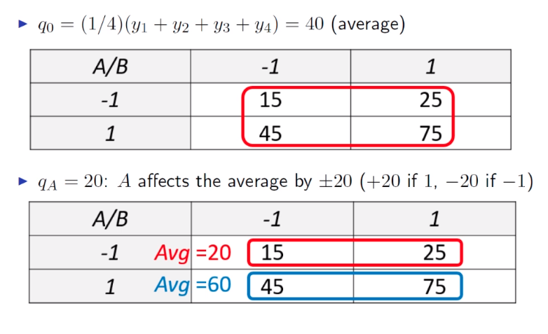
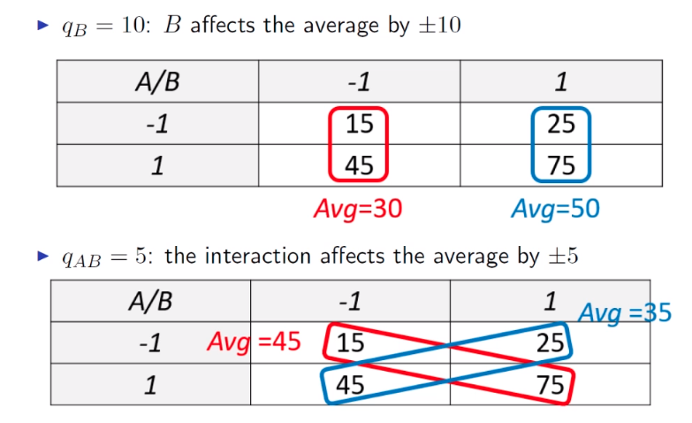
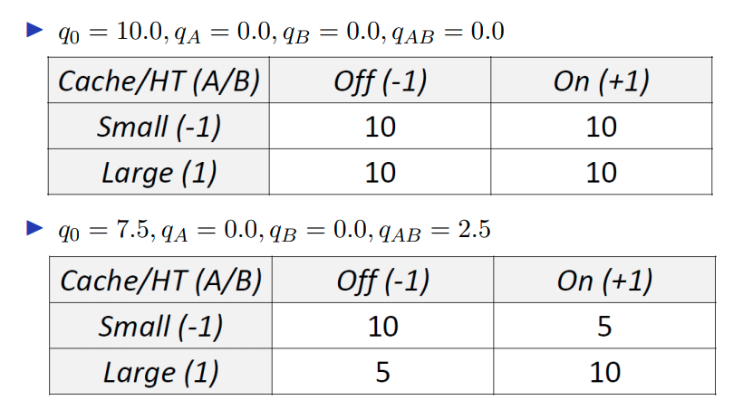
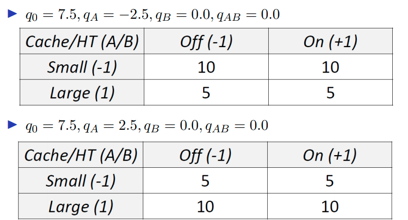

# 11 - Design of Experiments

## Terminology

- **Response variable** - a measurement representing the outcome of a test.
  - e.g. response time, throughput, ...
- **Factor** - a configuration option that affects the output of a variable.
  - e.g. Hyper Threading (HT)
- **Level** - a feasible value of a factor.
  - e.g. On/Off
- **Design** - an experiment plan specifying 1. the number of experiments to run and 2. for each experiment, the level assigned to each factor.
- **Interaction** - two factors interact if their levels *jointly* affect the response variable. If two factors interact, results depend on the levels of both factors.

## Blackbox Modelling

How do we find the most promising configurations quickly? We can build a model to guide this decision. For example, we may only want to test configurations where the model predicts the best performance. Simulation or analytical models become error-prone as the system's internal complexity grows, so instead we can use measurements to build **blackbox** models which are agnostic of the internals. We will focus on models based on **multivariate polynomials**.

## Screening Response Models

Consider a simple example with factors $A$ and $B$. The simplest polynomial that can *also capture interactions* is 
$$
y = q_0 + q_A x_A + q_B x_B + q_{AB} x_A x_B + \epsilon
$$
here

- $y$ - response variable
- $x_A, x_B$ - levels of $A$ and $B$ (encoded)
- $x_A x_B$ - interaction of $A$ and $B$
- $q_0, q_A, q_B, q_AB$ - **effects**, coefficients explaining the influence of the factors on the response $y$ and the interactions among them
- $q_0$ - captures the constant response (i.e. baseline level), also takes the meaning as the "average response"
- $\epsilon$ term capturing experimental noise

We call the above a **screening response model**, because we are screening the factors to see which are most important. With $k$ factors, we can use terms of order up to $k$, e.g. for $k=3$
$$
y = q_0 + \sum_{j} q_jx_j + \sum_{j, k \\ j\neq k} q_{jk}x_j x_k + \sum{j, k, h}
$$
We will focus on the case without noise ($\epsilon = 0$). The idea of this is that from the experimental data, we can fit these coefficient. And then from these we can say something about the relative importance of each effect and the strength of their interactions.

## Design Methods

Which experiments should we run to provide the model with informative data?

- **Full factorial design**
  - Run *every possible combination* of levels.
  - The study delivers *maximal information*.
  - Useful to identify the most important factors (screening).
  - Limited applicability outside of screening because it's expensive.
- **Fractorial factorial design**
  - A fraction of the experiments of a full factorial design.
  - Only some interactions may be captured.
  - Optimal results if some interactions are negligible.
  - Applicable in many areas.

### $2^k$ Factorial Design

In $2^k$ designs (aka screening design), there are $k$ factors, each having 2 levels. Hence there are $2^k$ possible combinations of levels. This is an important special case because the results are easy to analyse. For factors with more than two levels, pick min and max.

More notation:

- $y_i$ - response variable in the $i$-th experiment ($1\leq i \leq 2^k$)
- $x_{A, i}$ - level of factor $A$ in the $i$-th experiment
- $x_{B,i}$ - level of factor $B$ in the $i$-th experiment

We encode the levels are $-1$ or $+1$. This gives a system of equations that can be solved for the $q_i$s.

#### Sign Table 

Used to easily solve the linear set of equations obtained from $2^k$ factorial design experiments.

- $I$ column entries always set to 1.
- Other columns represent assignment of $x_A, x_B, x_{AB}$.
- $A$ and $B$ columns enumerate all combinations of levels.
- $AB$ obtained by multiplying $A$ and $B$ columns.
- Multiply the responses by column $i$ and scale by $2^k$ to get $q_i$.

Example:

| $I$    | $A$    | $B$    | $AB$      | $y$                         |
| ------ | ------ | ------ | --------- | --------------------------- |
| 1      | -1     | -1     | 1         | 15                          |
| 1      | 1      | -1     | -1        | 45                          |
| 1      | -1     | 1      | -1        | 25                          |
| 1      | 1      | 1      | 1         | 75                          |
| **40** | **20** | **10** | **5**     | $y \times \text{col} / 2^2$ |
| $=q_0$ | $=q_A$ | $=q_B$ | $=q_{AB}$ |                             |

#### Interpretation of Effects

#### Null Effects

If all the experiments gave the same answer (response is identical) then the average captures exactly the system response. You don't need the other terms.

#### Sign of Effects

#### Allocation of Variation

Now we want to study the influence of the factors on the response. This method explains the **variance** of the $y_i$ values. A factor is *more important* if it contributes more to the **scaled variance/variation SST**.
$$
\begin{align*}
SST &= \text{Sum of Squares Total} \\
&= \sum_{1\leq i\leq 2^k} (y_i - \bar{y})^2 \\
&= \sum_{1\leq i\leq 2^k} (q_Ax_{A, i} + q_Bx_{B,i} + q_{AB}x_{A, i}x_{B,i})^2 \\
&= \sum_{1\leq i\leq 2^k} (q_Ax_{A,i})^2 + \sum_{i \leq i\leq 2^k} (q_Bx_{B,i})^2 + \sum_{1\leq i\leq2^k} (q_{AB}x_{A,i}x_{B,i}) + \text{product terms}
\end{align*}
$$
where $\bar{y}$ is the average response across experiments - hence $\bar{y} = q_0$. The product terms are actually 0 (due to orthogonality and some stuff). So we get
$$
SST = q_A^2\sum_{1\leq i \leq 2^k} x_{A,i} + q_B^2 \sum_{1\leq i\leq 2^k} x_{B,i} + q_{AB}^2\sum_{1\leq i\leq 2^k} (x_{A,i}x_{B,i})^2
$$
and in the case where $k=2$ we have
$$
SST = 4(q_A^2 + q_B^2 + q_{AB}^2)
$$
This is easy to interpret

- $SSA =$  variation explained by $A = 4q_A^2$

- $SSB =$  variation explained by $B = 4q_B^2$

- $SSAB =$ variation explain by $AB = 4q_{AB}^2$

- $SST = SSA + SSB + SSAB$

The ratios of each of these to $SST$ show the *percentage of the variation explained by each factor and by their interaction*. Factors or interactions with a higher percentage are considered more important.

This method can be easily generalised to larger values of $k$. Factors with low explained variation can be removed from follow up experiments.

In the case that $k=3$ use
$$
SST = 2^3(q_A^2 + q_B^2 + q_C^2 + q_{AB}^2 + q_{AC}^2 + q_{BC}^2 + q_{ABC}^2)
$$

### Fractional Factorial Designs

$2^k$ screening require too many experiments. After using an initial $2^k$ screening design, we know which factors strongly interact with each other. We can then decompose the problem into smaller subproblems, with just a few interacting factors.

Another simplification involves adopting a $2^{k-p}$ design. We analyse $k$ two-level factors using only $k-p$ experiments, where $p$ is a parameter which controls precision. The fewer experiments you run, the more difficult your results will be to interpret reliably.

The key idea is as follows

- **Goal** - keep simplicity of a $2^k$ design.
- **Assumption** - interactions are sparse, and we can guess which they are. This means we can sacrifice some of the interactions in the model.
- **Problem** - ignoring interactions can bias the $q_i$ values (**confounding**).

We can generate the full list of **confoundings** algorithmically. If the sum of the orders of the confoundings is $r$ or more, we say that the desing has resolution $r$. The higher the $r$, the less severe the confounding.

