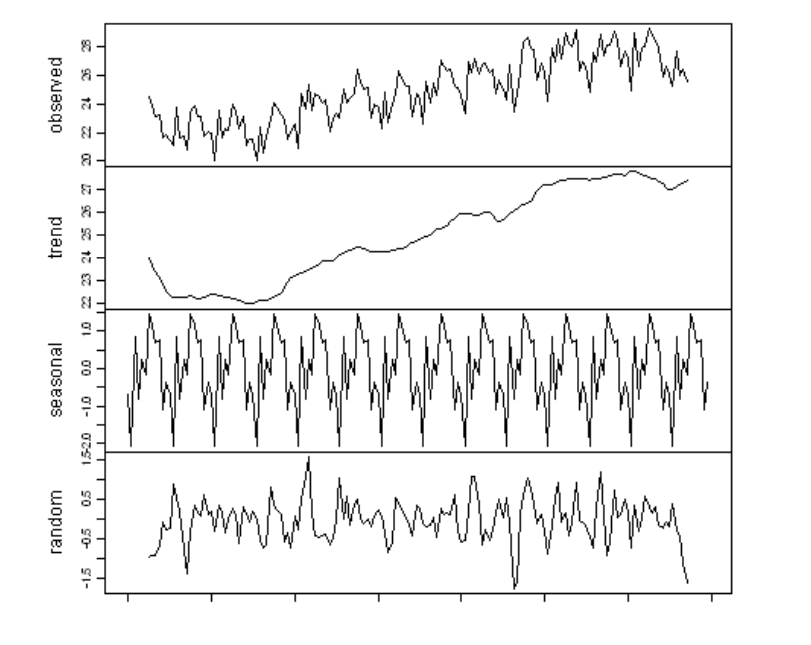

# 12 - Forecasting

## Autoscaling System Architecture

**Proactive autoscaling** is often based on a **MAPE-K control loop**.

- **Monitor** - collect sensor data to determine symptoms
- **Analyse** - analyse symptoms and request a change
- **Planning** - plan action worklow to apply change
- **Execute** - enact change on the resources
- **Knowledge** - data shared across the control functions

## Workload Forecasting

MAPE uses **workload forecasting** in the Analysis stage. 

Given an arbitrary time series $A_t$ (e.g. number of jobs arrived in the last period) we may decompose it as
$$
A_t = T_t + S_t + I_t \quad t=0,1,...
$$
where

- $T_t$ (**trend component**) - long-term trend (deterministic)
- $S_t$ (**seasonal component**) - periodic changes (deterministic)
- $I_t$ (**random component**) - irregular component (stochastic)

The main challenge for forecasting is predicting the random component. **Detrending** and **deseasonalisation** techniques exist to expose this component from the data for model fitting.

## Autoregressive Models

It's popular to forecast the random component of the time series. An **autoregressive model** of order 1 (AR(1)) characterises a time-series as a stochastic difference equation. Order 1 means that it depends on only one previous timestep.
$$
A_t = c + \phi_1 A_{t-1} + \epsilon_t \quad t=1,...
$$
where 

- $A_t$ is a random variable for the value at time $t$, $A_0$ is given
- $\phi_1$ and $c$ are deterministic model parameters
- $\epsilon_t$ is white noise i.e. uncorrelated random variables with zero mean and finite variance

The $\phi_1 A_{t-1}$ term gives **serial correlation** to the process. Serial correlation, in essence, gives "memory" to the process.

### Fitting

We can fit an AR(1) using **moment matching** on three statistics:

- $E[A_t] = \mu_t$ - mean of the time series at time $t$
- $Var[A_t] = E[(A_t-\mu_t)(A_t-\mu_t)]$ - variance at time $t$
- $K_{1,t} = E[(A_t - \mu_t)(A_{t-1}-\mu_{t-1})]$  - lag-1 autocovariance at time $t$ (a measure of serial correlation)

AR(1) fitting assumes that the time-series is **stationay**, meaning that the moments do not depend on $t$ i.e. $E[A_t] = \mu, Var(A_t) = V, K_{1,t}=K_1$ for all $t$. The model parameters $(c, \phi_1, \sigma_\epsilon^2)$  are then obtained by solving the system of equations
$$
\mu=\frac{c}{1-\phi_1} \quad V=\frac{\sigma_\epsilon^2}{1-\phi_1^2} \quad K_1 = V\phi
$$
