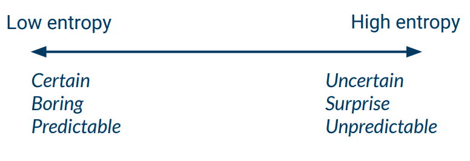

# 02 - Instance Based Learning & Decision Trees

| Lazy Learning                                                | Eager Learner                                                |
| ------------------------------------------------------------ | ------------------------------------------------------------ |
| Stores the training examples and postpones generalising beyond the dataset until an explicit request is made at test time. | Construct a general, explicit description of the target function based on the provided training examples. |

## k-NN

### Distance Metrics

**Manhattan Distance ($L^1$-norm)**
$$
d(x^{(i)}, x^{(q)}) = \sum_{k=1}^K \lvert x_k^{(i)} - x_k^{(q)} \rvert
$$
**Euclidean Distance ($L^2$-norm)**
$$
d(x^{(i)}, x^{(q)}) = \sqrt{\sum_{k=1}^K \left(x_k^{(i)} - x_k^{(q)}\right)^2}
$$
**Chebyshev Distance ($L^\infty$-norm)**
$$
d(x^{(i)}, x^{(q)}) = \max_{k=1}^K \lvert x_k^{(i)} - x_k^{(q)} \rvert
$$
We can also use **distance weighting**.

**Inverse weighting**
$$
w^{(i)} = \frac{1}{d(x^{(i)}, x^{(q)})}
$$
**Gaussian distribution**
$$
w^{(i)} = \frac{1}{\sqrt{2\pi}} \exp\left( -\frac{(x^{(i)} - x^{(q)})^2}{2} \right)
$$

## Decision Trees

1. Search for an optimal splitting rule on training data
2. Split your dataset according to the chosen splitting rule
3. Repeat 1. and 2. on each generated subset

### Entropy

**Entropy** is a measure of *uncertainy* of a random variable, or the average amount of information required to fully determine the state of a random variable.

$$
H(X) = -\sum_k^K P(x_k) \log_2(P(x_k))
$$
and for a pdf $f(x)$ we can define **continuous entropy**
$$
H(X) = -\int_x f(x) \log_2 (f(x))
$$

### Information Gain

**Information gain** is the difference between the initial entropy, and the weighted average entropy of produced subsets.
$$
IG(dataset, subsets) = H(dataset) - \sum_{S\in subsets} \frac{\lvert S \rvert}{\lvert dataset \rvert} H(S)
$$
and we select a split rule that maximises $IG(dataset, subsets)$.