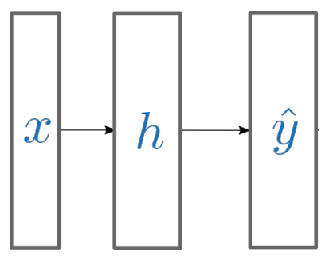
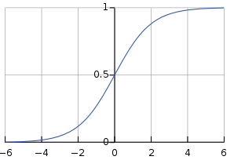
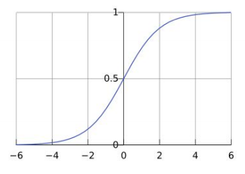
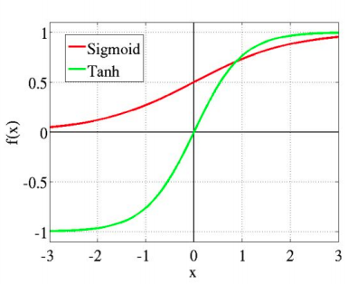

# 04 - Neural Networks 1

## Linear Regression

**Dataset** $\{\langle x^{(1)}, y^{(1)}\rangle, ..., \langle x^{(N)}, y^{(N)}\rangle\}$

**Input features** $x^{(1)}, ..., x^{(N)}$

**Known outputs** $y^{(1)}, .., y^{(N)}$

Our goal is to learn the mapping $f:X\rightarrow Y$ such that $y^{(i)} = f(x^{(i)})$ for all $i = 1, 2, 3, ..., N$.

### Simple Linear Regression

In **simple linear regression** we use a single input variable.
$$
\hat{y}=ax+b
$$
where $\hat{y}$ indicates our predicted value. The slope $a$ controls the angle, $b$ controls the intercept. We need to find the "best" values for $a$ and $b$. To define what "best" is, we use a **loss function**. 

### Loss Function

Here, we use the **sum of squares**.
$$
E = \frac{1}{2} \sum_{i=1}^N (\hat{y}^{(i)} - y^{(i)})^2
$$
Smaller values of $E$ means that our predictions are close to the real values. The fact that the error is squared means that *large errors incur an exponential penalty*, and are therefore punished more than small error. It is also *easily differentiable*, which is important for gradient descent.

Derivatives show us how to change each parameter value to get a smaller loss. The derivative shows the *direction of the slope*, and intuitively $\frac{\partial f}{\partial \theta}$ tells us how $f$ changes when $\theta$ does.

### Gradient Descent

In gradient descent, we repeatedly update parameters $a$ and $b$ by taking small steps in the negative direction of the partial derivative for that parameters.
$$
a := a-\alpha \frac{\partial E}{\partial a} 
$$
where $\alpha$ is the **learning rate** hyperparameter which controls how large of step we take on each iteration. 

Gradient descent finds the closest local minimum. It should be noted that it is possible to derive an analytical solution which finds the *gloabal* minimum, but this is not practical for large datasets or neural networks due to matrix inversion being cubic in complexity. 

This is done for several **epochs**, which refers to one pass over the whole dataset. This is another hyperparamter, and later on we will see how to tune this. After enough epochs, the parameters should converge to a single value.

In vector notation, we use the term **gradient** to refer to the vector of all partial derivatives. For a function $f:\mathbb{R}^K \rightarrow \mathbb{R}$, the gradient is
$$
\nabla_\theta f(\theta) = 
\begin{bmatrix}
\frac{\partial f(\theta)}{\partial \theta_1} \\
\vdots \\
\frac{\partial f(\theta)}{\partial \theta_K}
\end{bmatrix}
$$

### Multiple Linear Regression

In simple linear regression we had a single input feature. In multiple linear regression, we now have many input features.
$$
y^{(i)} = \theta_1x_1^{(i)} + ... + \theta_K x_K^{(i)} + \theta_{K+1}
$$

	

This can result in a better model, but there is a greater risk of overfitting.

## A Single Neuron

For each artificial neuron, we have a number of features 
$$
\begin{bmatrix}
x_1 \\ x_2 \\ x_3
\end{bmatrix}
$$
and parameters
$$
\begin{bmatrix}
\theta_1 \\ \theta_2 \\ \theta_3
\end{bmatrix}
$$
and the output 
$$
\hat{y} = g(\theta_1 x_1 + \theta_2 x_2 + \theta_3 x_3 + b)
$$
where $g$ is the **activation function** and the term inside is just linear regression. The bias term $b$ is often implicit - we can add an extra input feature with value $1$ instead. This can be represented equivalently with a sum
$$
\hat{y} = g(\sum_k \theta_k x_k)
$$
or a vector operation
$$
W =
\begin{bmatrix}
\theta_1 \\ \theta_2 \\ \theta_3
\end{bmatrix}
\quad
\hat{y}
= g(W^T x) \\
W \in \mathbb{R}^{K \times 1} \quad x \in \mathbb{R}^{K \times 1} \quad \hat{y} \in \mathbb{R}^{1\times 1}
$$
Note that this is just a dot product between the two vectors.

### Logistic Activation Function

Also known as the **sigmoid function**, ensures that the output is between 0 and 1.
$$
g(z) = \frac{1}{1+e^{-z}} \\
z \in [-\infty, \infty] \quad \hat{y} \in [0, 1]
$$

### Perceptron

A **perceptron** is an algorithm for supervised binary classification. This is an early version of an artificial neuron. It uses the **threshold function** as the activation function.
$$
h(x) = 
\begin{cases}
1 & W^T x \geq 0 \\
0 & \text{otherwise}
\end{cases}
$$
and has the update rule
$$
\theta_i := \theta_i + \alpha(y - h(x))x_i
$$
If the desired output $y$ is equal to our prediction $h(x)$ then the right hand side of the summation becomes 0, and the weight $\theta_i$ stays the same.

If $y = 1; h(x) = 0$ then weight $\theta_i$ is increased when the input $x_i$ is positive and decreased when it is negative.

If $y=0; h(x) = 1$ then we want to decrease the summation, and do the update in the opposite direction.

A perceptron can learn any linearly separable function. However, an individual neuron cannot learn a function that is not linearly separable.  To do this, we need multi-layer neural networks.

The activation function is not differentiable, so we do not use it in more complex neural networks.

## Multi-Layer Networks

If we connect the neurons in parallel, each one will learn something different. We can then connect neurons in sequence to learn higher-order features. The first layer will be learning features of the data, the second layer will be learning features of the features, and etc. A multi-layer perceptron with a sufficient number of neurons can theoretically model an arbitrary function over an input.

Our equations now become
$$
\begin{align*}
h &= g_h(W_h^T x + b_h) \\
\hat{y} &= g_{\hat{y}} = (W_h^T h + b_{\hat{y}})
\end{align*}
$$

## Activation Functions

Activation functions become more important with multi-layer networks. A multi-layer linear network is equivalent to a single-layer linear network.

### Sigmoid Activation

Compress the output smoothly into the range 0 and 1. It is a soft version of the threshold function.
$$
f(x) = \sigma(x) = \frac{1}{1+e^{-x}}
$$

### Tanh Activation

Similar shape to the sigmoid, but ranges between 1 and -1. Input 0 corresponds to output 0.
$$
f(x) = \tanh(x) = \frac{e^x - e^{-x}}{e^x + e^{-x}}
$$

### ReLU Activation

Rectified Linear Unit. Linear in the positive part, but still non-linear overall.
$$
f(x) = ReLU(x) = 
\begin{cases}
0 & x \leq 0 \\
x & x \geq 0
\end{cases}
$$

### Softmax Activation

Scales the inputs into a probability distribution. The largest input will be large the rest will be small.
$$
f(x) = softmax(z_i) = \frac{e^{z_i}}{\sum_k e^{z_k}}
$$
Most function are applied *element-wise*, but softmax is the exception.

For hidden layers, ReLU is often used for very deep networks. For the output layer, it depends on the task.