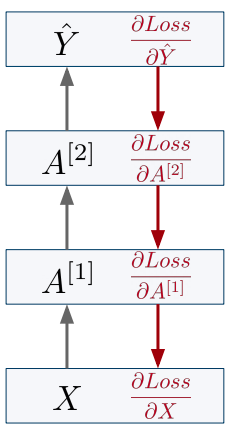
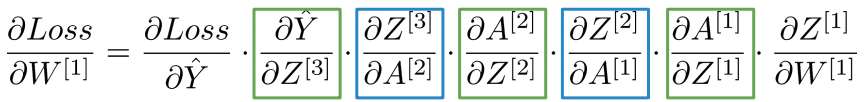
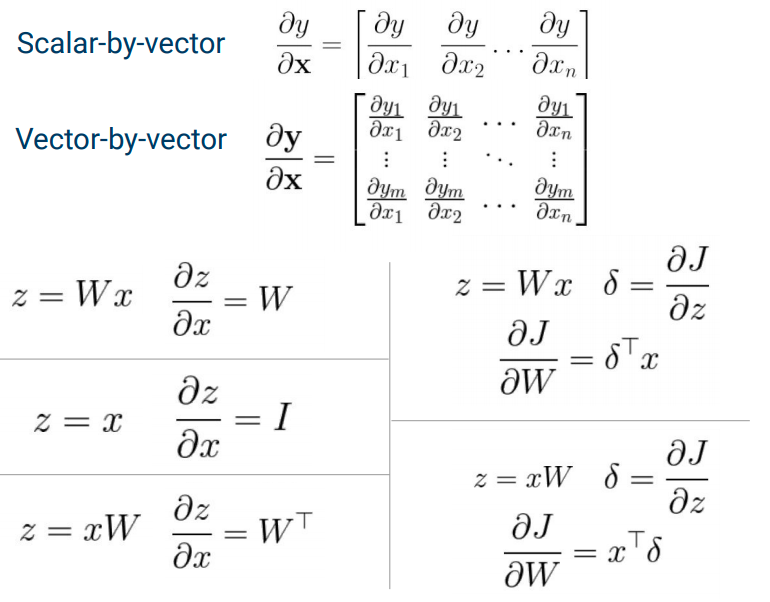
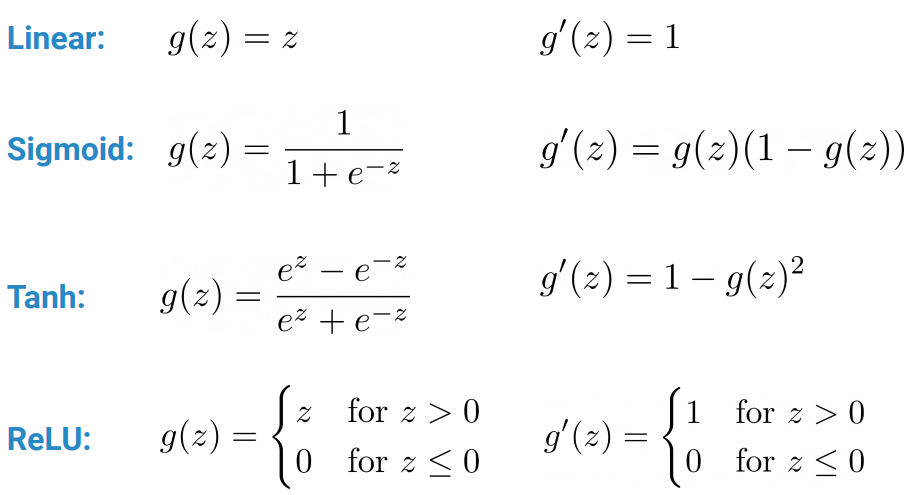
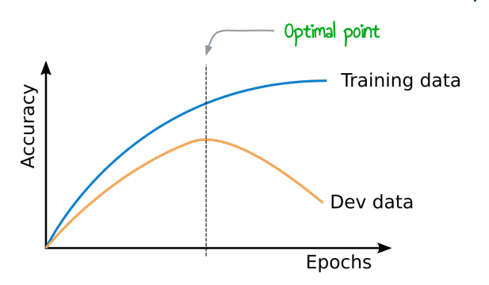

# 05 - Neural Networks II

## Loss Functions

To optimise a neural network, we define a **loss function**, and then update the parameters using **gradient descent**

### Regression

In regression, we are trying to predict a continuous variable. We often use **linear activation** in the output layer, and optimise the network with **mean squared error**. It's good because it doesn't assume any boundary on the output.
$$
MSE = \frac{1}{N} \sum_{i=1}^N (y-\hat{y})^2
$$
MSE will be 0 when our predictions equal the true values.

### Classification

We have different types of classification.

- **Binary classification** - only two possible cases.
- **Multi-class classification** - more than one possible class, but *every input belongs to exactly one class*.
- **Multi-label classification** - each input can belong to more than one class.

We use a loss-function called **cross-entropy**. We want to maximise the likelihood of the network assigning the correct labels to all the inputs in the dataset.
$$
\prod_{i=1}^N p(y^{(i)}|x^{(i)}, \theta)
$$
assuming all example are i.i.d.

In binary classification, we can regard the output of the network as a parameter of a *Bernoulli distribution*. The probability of success, given an input is
$$
\mathcal{L} = \sum_{i=1}^N (\hat{y}^{(i)})^{y^{(i)}} (1-\hat{y}^{(i)})^{(1-y^{(i)})}
$$
as the probability of one class is 1 minus the other. Notice that if we correctly predict every datapoint, the total is 1, and 0 if we get every datapoint wrong. To maximise the likelihood function, we can maximise the log-likelihood function.
$$
\ell =\sum_{i=1}^N y^{(i)}\log(\hat{y}) + (1-y^{(i)})\log(1-\hat{y}^{(i)})
$$
Then we turn it into a loss function by putting a minus in front of it.
$$
L =- \sum_{i=1}^N y^{(i)}\log(\hat{y}) + (1-y^{(i)})\log(1-\hat{y}^{(i)})
$$
This is for  **binary cross-entropy** for *binary classification*, but it can be generalised to multi-class classification
$$
L = - \sum_{i=1}^N \sum_{c=1}^C y_c^{(i)} \log(\hat{y}_{c}^{(i)})
$$
where $C$ is the set of possible classes and $\hat{y}_c^{(i)}$ is the predicated probability of class $c$ for datapoint $i$.

For multi-class classification it's common to use **softmax** activation with **categorical cross-entropy loss**.

| Problem             | Type        | Output Activation | Loss                      |
| ------------------- | ----------- | ----------------- | ------------------------- |
| future stock prices | regression  | linear            | MSE                       |
| stock up or down    | binary      | sigmoid           | binary cross-entropy      |
| speech recognition  | multi-class | softmax           | categorical cross-entropy |
| chemical properties | multi-label | sigmoid           | binary cross-entropy      |

## **Backpropogation**

**Batching** - combine the vectors of several datapoints into one matrix to improve speed and reduce noise. This allows us to parallelise better, and makes our optimisation more stable.

**Backpropogation** iteratively calculates all the necessary partial derivatives, moving from the output backwards through the layers.

To do this, we use the **chain rule** to calculate the derivative of composite functions.
$$
\begin{align*}
z = f(x) && y = g(z) && \frac{dy}{dx} = \frac{dy}{dz}\frac{dz}{dx}
\end{align*}
$$
So if we want to calculate the partial derivative of the loss w.r.t the weight in the first layer, we can break it down into two parts using the output of the linear layer. Note that the square brackets denote layer number.
$$
\frac{\partial L}{\partial W^{[1]}} = \frac{\partial L}{\partial Z^{[1]}} \frac{\partial Z^{[1]}}{\partial W^{(1)}}
$$
Then this can be further broken down
$$
\frac{\partial L}{\partial Z^{[1]}} = \frac{\partial L}{\partial A^{[1]}} \frac{\partial A^{[1]}}{\partial Z^{[1]}}
$$
Then we can break this all the way down, and we can see a pattern of the derivative of the linear activation w.r.t the non-linear activation of the previous layer, and the derivative of the non-linear activation w.r.t the linear activation of the current layer.

Note that we are now using $Z = XW$ to represent batches, and our data vectors are now **row vectors**.

### Linear Layer Inputs

Let's assume that through backpropogation we already receive
$$
\frac{\partial L}{\partial Z} = 
\begin{bmatrix}
\frac{\partial{L}}{{\partial z_{1,1}}} & \frac{\partial{L}}{{\partial z_{1,2}}} & \frac{\partial{L}}{{\partial z_{1,3}}} \\
\frac{\partial{L}}{{\partial z_{2,1}}} & \frac{\partial{L}}{{\partial z_{2,2}}} & \frac{\partial{L}}{{\partial z_{2,3}}} \\
\frac{\partial{L}}{{\partial z_{3,1}}} & \frac{\partial{L}}{{\partial z_{3,2}}} & \frac{\partial{L}}{{\partial z_{3,3}}}

\end{bmatrix}
$$
where $L$ is a scalar, the loss, and $Z$ is a matrix of the output of a linear function.

> Tip: the derivative of a scalar w.r.t a matrix has the same shape as the matrix.

To update the weights and biases, we need to calculate
$$
\begin{align*}
\frac{\partial L}{\partial W} = \frac{\partial L}{\partial Z}\frac{\partial Z}{\partial W} && \frac{\partial L}{\partial b} = \frac{\partial L}{\partial Z}\frac{\partial Z}{\partial b}
\end{align*}
$$
To pass the gradient onto the lower layer, we need to calculate
$$
\frac{\partial L}{\partial X} = \frac{\partial L}{\partial Z} \frac{\partial Z}{\partial X}
$$
Looking at a single element in $X$
$$
\frac{\partial L}{\partial x_{1,1}} = \frac{\partial L}{\partial z_{1, 1}} w_{1,1} + \frac{\partial L}{\partial z_{1, 2}} w_{1,2} + \frac{\partial L}{\partial z_{1, 3}} w_{1,3}
$$
The sum accounts for all pathways. Intuitively, how $x_{1,1}$ affects the loss is determined by the weight it multiplies with, and then whatever uses that output upstream. Then we do this for each element in $X$. This can be written as a dot product.
$$
\frac{\partial L}{\partial X} = 
\begin{bmatrix}
\frac{\partial L}{\partial z_{1, 1}} & \frac{\partial L}{\partial z_{1, 2}} & \frac{\partial L}{\partial z_{1, 3}} \\
\frac{\partial L}{\partial z_{2, 1}} & \frac{\partial L}{\partial z_{2, 2}} & \frac{\partial L}{\partial z_{2, 3}} \\
\frac{\partial L}{\partial z_{3, 1}} & \frac{\partial L}{\partial z_{3, 2}} & \frac{\partial L}{\partial z_{3, 3}} 
\end{bmatrix}
\begin{bmatrix}
w_{1,1} & w_{2,1} \\
w_{1,2} & w_{2,2} \\
w_{1,3} & w_{2,3}
\end{bmatrix}
$$
which is actually just
$$
\frac{\partial L}{\partial X} = \frac{\partial L}{\partial Z}W^T
$$
Doing the same thing with our derivatives w.r.t $W$ (considering a single weight and extending this to the matrix) we get
$$
\frac{\partial L}{\partial W} = 
X^T \frac{\partial L}{\partial Z}
$$
And finally for the bias
$$
\frac{\partial L}{\partial b} = \mathbf{1}^T \frac{\partial L}{\partial Z}
$$
where $\mathbf{1}$ is a column vector of ones.

### Partial Derivatives for Vectors and Matrices

### Activation Functions

Most of the time, activation functions are applied **element wise**.
$$
A = g(Z) = 
\begin{bmatrix}
g(z_{1, 1}) & g(z_{1, 2}) \\ 
g(z_{2, 1}) & g(z_{2, 2})
\end{bmatrix}
=
\begin{bmatrix}
a_{1, 1} & a_{1, 2} \\
a_{2, 1} & a_{2, 2} \\
\end{bmatrix}
$$
This time, we need to find
$$
\frac{\partial L}{\partial Z} = \frac{\partial L}{\partial A}\frac{\partial A}{\partial Z}
$$
doing this, we get
$$
\frac{\partial L}{\partial Z} = \frac{\partial L}{\partial A} \circ g'(Z)
$$
Note that $\circ$ is **element-wise multiplication**, not the dot product. This works for all activation functions that are applied element wise, so *not softmax*.

### Derivatives of Activation Functions

and for softmax $\hat{y}_i = softmax(z_i)$
$$
\frac{\partial L}{\partial z_i} = \hat{y_i} - y_i
$$

## Gradient Descent

Now that we have a way of calculating all the partial derivatives, we need a way of optimising out weights.

**Training** - the process of adjusting the model parameters to fit the given data.

**Gradient descent** - repeatedly updating parameters, by taking small steps in the negative direction of the partial derivative.
$$
W = W - \alpha \frac{\partial L}{\partial W}
$$
We need network and loss functions that are differentiable for this to work.

1. Initialise weights randomly
2. Loop until convergence
   1. Compute gradient based on the **whole dataset**
   2. Update weights

> Tip: compute all gradients **before** updating weights. Otherwise, you might end up updating a weight before you're done using. Then you're backpropogating based on the new weight, which doesn't match the old loss function.

In practice datasets are too large to perform gradient descent.

### Stochastic Gradient Descent

1. Initialise weights randomly
2. Loop until convergence
   1. Loop over each *datapoint*
      1. Compute gradient based on the datapoint
      2. Update weights

Each iteration of the inner loop is very quick, but it's very noisy to take steps based on a single datapoint.

### Mini-batched Gradient Descent

1. Initialise weights randomly
2. Loop until convergence
   1. Loop over *batches of datapoints*:
      1. Compute gradient based on the batch
      2. Update weights

> Tip: shuffle your data and create new batches at each epoch. This reduces error.

This reduces noise, and is what is used most commonly in practice. 

### Adaptive Learning Rates

- If the learning rate is too low, the model will take forever to converge.

- If the learning rate is too high, we will keep stepping over the optimal values, and even diverge.

With **adaptive learning rates**, we have a different learning for *each parameter*. This gets calculated dynamically based on how your parameter behaves.

- Take bigger steps if a parameter has not been updated much recently.
- Take smaller steps if a parameter has been getting many big updates.

### Learning Rate Decay

A simpler version of adaptive learning rates. We reduce the learning rate by a factor (e.g. 0.9) over time, to take smaller steps as we approach the minimum so we don't overshoot.
$$
\alpha := \alpha d \quad d\in [0, 1]
$$
Strategies for performing the update:

- On every epoch
- After a certain number of epochs
- When performance on the validation set hasn't improved for several epochs

### Weight Initialisation

We don't want all neurons to start with the same weight, or they will all learn the same thing.

- **Zeroes** - we often set the bias to 0 because we do not want the neuron to start out with bias.
- **Normal** - this is a common strategy. Draw randomly from a normal distribution.
- **Xavier Glorot** - use a particular version of the uniform distribution.

### Randomness

Random initialisations lead to different results. We can use a **seed** to get deterministic seeds. *However*, the order in which GPU threads adds randomness. The solution is to run with different seeds, and report the average.

## Overfitting

### Capacity

Neural networks with enough **capacity** (enough neurons and layers) will overfit the training set quite easily. The network can just memorise the data instead of learning patterns.

- If the network is **underfitting** we can try *increasing* the capacity.
- If the network is **overfitting** we can try reducing its capacity by lowering the capacity.

The best solution is to *get more data* .

### Early Stopping

We use the validation data to choose when to stop training, before the model has a chance to overfit.

### Regularisation

Adding some information or constraints to prevent overfitting.

For example, penalising how large the model weights can be effectively reduces the model capacity and makes it smoother.

**L2 regularisation** - add the sum of all the *squared weights* to the loss function. Pushes the weights towards 0, larger weights get penalised more. Encourages sharing between features as small weights are not penalised much. The sum in the regularisation term denotes the sum over all the weights in the network (loose notation). Note that there is no sum in the update rule since you are differentiating w.r.t a single weight $w$.
$$
\begin{align*}
J(\theta) &= Loss(y, \hat{y}) + \lambda \sum_w w^2 \\
w &\leftarrow w - \alpha\left( \frac{\partial Loss}{\partial w} + 2\lambda w \right)
\end{align*}
$$

**L1 regularisation** - add the *absolute weights* to the loss function. Encourages feature sparsity, the model will only keep the most important features. I think the $\text{sign}$ function is applied element-wise. It's all a bit confusing.
$$
\begin{align*}
J(\theta) &= Loss(y, \hat{y}) + \lambda \sum_w \lvert w \rvert \\
w &\leftarrow w - \alpha \left( \frac{\partial Loss}{\partial w} + \lambda \ \text{sign}(w) \right)
\end{align*}
$$

### Dropout

During training, randomly set some neural activations to 0. Typically, it is set to 50% in a layer. This is a form of regularisation. It prevents the network from relying on any one node.

The resulting activations will now be 50% smaller, so we need to scale them back up during testing.

### Data Normalisation

It's hard for the network to learn if there is no scale.

**Min-max normalisation** - scaling the smallest value to $a$ and largest value to $b$. e.g. [0, 1] or [-1, 1]

**Standardisation (z-normalisation)** - scaling the data to have mean 0 and standard deviation 1.

This helps because weight updates are proportional to the input. The scaling values $X, \mu, \sigma$ need to be calculated on the *training set only*. It should be done *per-feature*.