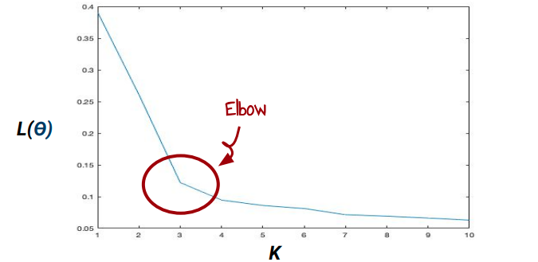
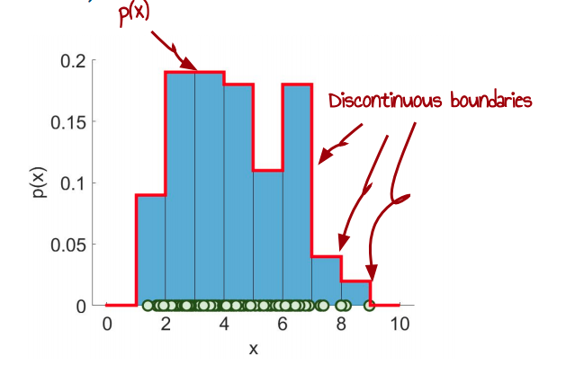
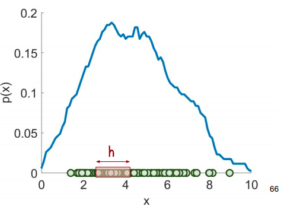
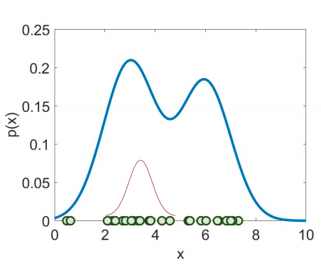
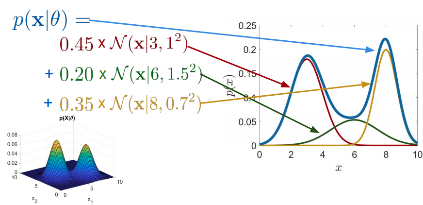

# 06 - Unsupervised Learning

In unsupervised learning your data does not have labels. Training data has the form
$$
\{X^{(1)}, ..., X^{(n)}\}
$$
**Clustering**, **density estimation**, **dimensionality reduction** are examples of unsupervised learning.

## Bias-variance Tradeoff

- **Bias error** - caused by erroneous assumptions in the learning algorithm. High bias can lead to the model missing relevant relations between the features and outputs (underfitting).
- **Variance error** - caused by sensitivity due to small fluctuations in the training set. High variance can lead to modelling random noise (overfitting).

## Clustering

A **cluster** is a set of instances that are "similar" to each other, and "dissimilar" to instances in other groups/clusters.

**Clustering** is the task of grouping instances together such that instances in the same group are more similar to each other than to other instances in other groups.

Applications include **vector quantisation** where continuous features can be grouped into prototypes ("bag of visual words"), **image segmentation**, **market segmentation**, and **social network analysis**.

### k-means

#### Intuition

1. **Initialisation**
   - Select $k$ clusters.
   - Generate $k$ random cluster centroids (or select instances to avoid empty clusters).
2. **Assignment**
   - Assign each training example to the nearest centroid, using some distance metric (Euclidean distance for example).
3. **Update**
   - Update the position of each centroid by computing the mean position of all examples assigned to it.
4. **Convergence check**
   - Stop if the position of centroids did not change. Otherwise, go back to **step 2**.

#### Formally

1. **Initialisation**

2. **Assignment**

   For each $i \in \{ 1, ..., N\}$

   ​	$c^{(i)} = \arg\min_{k \in \{1, ..., K\}} \lVert x^{(i)} - \mu_k \rVert$

   where $c^{(i)}$ denotes which cluster that example $x^{(i)}$ is assigned, and $\lVert x^{(i)} - \mu_k \rVert^2$ is the distance between training example $i$ and the cluster mean $\mu_k$.

3. **Update**

   For each $k \in \{ 1,...,K \}$

   ​	$$\mu_k = \frac{ \sum^N 1(c^{(i)} = k) \cdot x^{(i)}}{\sum^N 1(c^{(i)}=k)}$$
   
   where $1(c^{(i)} = k)$ is the indicator function: $1(a)$ returns $1$ if $a$ is true, else returns $0$.
   
4. **Convergence check**

   If $\forall \lVert \mu_k^t - \mu_k^{(t-1)} \rVert < 0$ stop, else go to **step 2**.

#### As a Model

We want to minimise 
$$
L (c^{(1)}, ..., c^{(N)}, \mu_1, ...,\mu_k) = \frac{1}{N} \sum_{i=1}^N \lVert x^{(i)} - \mu_{c^{(i)}} \rVert ^2
$$
where $c^{(i)}$ are the cluster assignments, and $\mu_i$ are the cluster means. This has the meaning

> Minimise the **average distance** between each training sample to the mean of its assigned cluster.

1. **Initialisation**

2. **Assignment**

   Fix $\mu$, minimise $L$ w.r.t $c$.

3. **Update**

   Fix $c$, minimise $L$ w.r.t $\mu$.

4. **Convergence check**

#### Strengths 

- **Simple** - easy to understand and implement
- **Popular** - often used for clustering
- **Efficient** - linear complexity, $O(TKN)$ for $T$ iterations, $K$ clusters, $N$ example, $K << N$, $T<<N$.

#### Weaknesses

- **$k$ needs to be defined.**

  - This can be done with the **elbow method**

    

- **Finds a local optimum**
- **Sensitive to initial centroid positions**
  - Run multiple times, and choose the one with the lowest cost
  - Use better initialisation, e.g. K-means++
- **Sensitive to outliers**
  
  - Use an algorithm that is less sensitive to outliers, e.g. K-medoid.
- **Not suitable for discovering clusters that are not hyper-ellipsoids**.

## Density Estimation

A **probability density function** $p(x)$ models how likely a continuous variable is to be observed within a particular interval. 
$$
p(x) \geq 0 \\
\int_a^b p(x) dx = 1
$$

**The aim is to estimate** $p(x)$ **from data.**

Applications include **anomaly detection** and **generative models**.

### Non-parametric

**Non-parametric** methods *do not make assumptions about the form*; you just follow the data - **low bias**. This means that the number of parameters grows with data. However, they have **high variance** because they are sensitive to the dataset.

#### Histograms

**Histograms** group data into contiguous bins. Count the number of occurrences in each bin and normalise to get your PDF. However, this gives many **discontinuous boundaries.**

Having too few bins will smooth out $p(x)$, but having to many may make it too sensitive to peaking.

#### Kernel Density Estimation

This solves the problem of having discontinuous boundaries. We compute $\hat{p}(x)$ by looking at training examples within a **kernel function** $H$.
$$
\hat{p}(x) = \frac{1}{N} \sum_{i=1}^N \frac{1}{h^D} H \left( \frac{x - x^{(i)}}{h} \right)
$$
The window size is determined by the **bandwidth** $h$, and $h^D$ is the **volume of window** ($D$ is the number of dimensions). This acts as a normalisation factor. An example of a simple kernel function is:
$$
H(u) = 
\begin{cases}
1 & \lvert u_j \rvert < \frac{1}{2}; j = 1, ..., D && x^{(i)}\text{ inside the window} \\
0 & \text{otherwise}
\end{cases}
$$
which works similarly to a histogram. It yields the following result:

But this is not very smooth. We replace the kernel function with a Gaussian function. This gives high weights to things that are close, and lower weights to things that are far.

Increasing $h$ smooths out $\hat{p}(x)$. This is similar to the concept of **locally-weighted regression** from $k$-nearest neighbours.

### Parametric

**Parametric methods** *make assumptions about the form of the data*; this means that they have **high bias**. However, the number of parameters is *fixed* and does not grow with data, so they have **low variance**.

#### Multivariate Gaussian Distributions

One example is a plain Gaussian distribution. This can be scaled to an arbitrary number of dimensions - **multivariate Gaussian distributions**.
$$
N(\mathbf{x} | \mu, \Sigma) = \frac{1}{\sqrt{(2\pi)^D \lvert \Sigma \rvert}} \exp{\left(-\frac{1}{2} (\mathbf{x} - \mu)^T \Sigma^{-1} (\mathbf{x} - \mu) \right)}
$$
This is a generalised form, and note that instead of the variance $\sigma^2$, we use the **covariance** $\Sigma$. We compute $\hat{p}(\mathbf{x})$ by fitting the parameters $\hat{\mu}$ and $\hat{\Sigma}$ to the training examples.
$$
\begin{align*}
\hat{\mu} &= \frac{1}{N} \sum_{i=1}^N \mathbf{x}^{(i)} \\
\hat{\Sigma} &= \frac{1}{N} \sum_{i=1}^N (\mathbf{x}^{(i)} - \hat{\mu})(\mathbf{x}^{(i)} - \hat{\mu})^T \\
\hat{p}(\mathbf{x}) &= N(\mathbf{x}|\hat{\mu}, \hat{\Sigma}) \\
\end{align*}
$$

##### Likelihood

How do we quantify that we have fitted a good model? The goal is that the model *captures the probability of generating or observing data $x$ within an interval*.

**Likelihood** measures the probability of observing $x$ from a dataset, assuming i.i.d data.
$$
\mathcal{L} = p(X|\theta) = \prod_{i=1}^N p(x^{(i)}|\theta)​
$$

where $\theta$ are the parameters of the model (e.g. mean, covariance). **Negative log-likelihood** is often used.
$$
\ell = -\log p(X|\theta) = -\sum_{i=1}^N \log p(x^{(i)}|\theta)
$$
The negative turns it into a *minimisation* problem, and the $\log$ is for numerical stability, because the multiplication of small probabilities is bad so we can sum instead. 

So Gaussian fitting is *minimising the negative log likelihood* (proof omitted).

#### Gaussian Mixture Models (GMM)

Parametric models have high bias and low variance, and non-parametric models have low variance and high bias. To get the best of both worlds, we use **mixture models**. A mixture model is a sum of weighted PDFs. You have $k$ different models, and **mixing proportions** (weights) $0 \leq \pi_k \leq 1$, where $\sum^K \pi_k = 1$.
$$
p(x) = \sum_{k=1}^K \pi_k p_k (x)
$$
A **Gaussian mixture model** used the Gaussian PDF, and is the most popular mixture model.

where $\theta = \{\pi_k, \mu_k, \Sigma_k : k=1, ..., K\}$

##### Expectation-maximisation

To fit a Gaussian, we can maximise likelihood. We *can't* do that here, because parameters depend on each other. Instead, we use an iterative approach called **expectation-maximisation**.

1. **Initialisation**

   Choose $K$, randomly initialise parameters.

2. **E-Step** (Expectation step)

   We compute the **responsibilities** for each training example $x^{(i)}$, and each mixture component $k$. This gives you the contribution of this component to this data. This is a kind of "soft clustering" because every point belongs to several clusters in certain degrees.
   $$
   r_{ik} = \frac{\pi_k N(\mathbf{x}^{(i)} | \mu_k, \Sigma_k)}{\sum_j^K \pi_j N(\mathbf{x^{(i)}} | \mu_j, \Sigma_j)}
   $$

3. **M-Step** (Maximisation step)

   1. Update the **mean** of all mixture components, using $r_{ik}$ (proportion of contribution) as a weight.

   $$
   \hat{\mu}_k = \frac{1}{N_k} \sum_{i=1}^N r_{ik} \mathbf{x}^{(i)} \quad N_k = \sum_{i=1}^N r_{ik}
   $$

   2. Update the **covariance** of all mixture components.
      $$
      \Sigma_k = \frac{1}{N_k} \sum_{i=1}^N r_{ik} (\mathbf{x}^{(i)} - \hat{\mu}_k)(\mathbf{x}^{(i)} - \hat{\mu}_k)^T \quad N_k = \sum_{i=1}^N r_{ik}
      $$

   3. Update the **mixing proportion** of all mixture components (sum of responsibilities over number of data points).
      $$
      \pi_k = \frac{N_k}{N}
      $$

4. **Convergence check**

   Based on either change in parameters or stagnation of the likelihood.

##### Selecting K

We *minimise* the **Bayesian Information Criterion (BIC)**. This iteratively picks the simplest model that fits.
$$
BIC_K = \ell(K) + \frac{P_K}{2} \log(N)
$$
where $P_K$  is the number of parameters. $\ell(K)$ encourages fitting of data, but $\frac{P_k}{2} \log(N)$ penalises complex models.

We can also use cross-validation with different $K$s.

## GMM-EM vs K-means