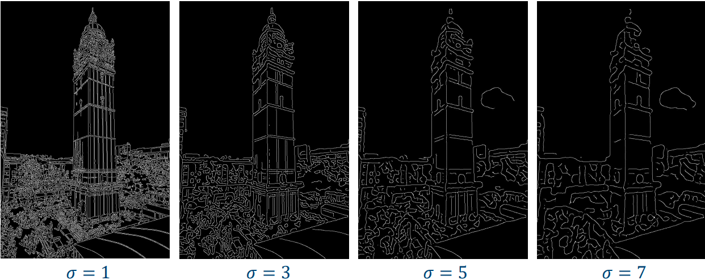
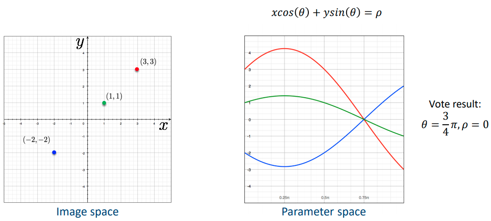

# 04 - Edge Detection II

## Canny Edge Detection

1. Perform Gaussian filtering to reduce noise.
2. Calculate gradient magnitude and direction.
3. Apply non-maximum suppression to get a single response for each edge.
4. Perform hysteresis thresholding to find potential edges.

### Non-Maximum Suppression

Centre of the edge occurs where the *gradient magnitude reaches the maximum*. We look for the local maximum along the direction of the gradient.


Check whether pixel $q$ is a local maximum may require some interpolation, as $p$ and $q$ do not lie on the pixel grid.


Alternatively, if better performance is required, you can quantise the gradient direction into 8 different directions (0, 45, ... 270, 315) and check pixels along those 4 directions (horizontal, vertical, diagonal, anti-diagonal). No interpolation is necessary.

Then perform suppression for each pixel, so the width of each edge is only one pixel.
$$
M(x, y) = \begin{cases}
(x, y) & \text{if local maximum} \\
0      & \text{otherwise}
\end{cases}
$$

### Hysteresis Thresholding

We need to convert the floating point values from the magnitude map into a binary image. In hysteresis thresholding, two thresholds are defined: $t_{low}$ and $t_{high}$. For a pixel magnitude $m$:

1.  If $m \geq t_{high}$ it is an **edge pixel**.
2. If $m < t_{low}$ it is **rejected**.
3. If $t_{high} \geq m < t_{low}$ then it is a **weak edge pixel**.
   1. Check its neighbouring pixels, if it is connected to an edge pixel then accept it.
   2. Repeat until all pixels are accepted or rejected.

Choosing $t_{high}$ and $t_{low}$ is very empirical. Often percentile will be used e.g. 50% for $t_{high}$ and 25% for $t_{low}$.  

### Effect of the Gaussian Smoothing Parameter

A larger $\sigma$ detects large scale features, a lower $\sigma$ detects fine features.



### Results

**Good detection** - low false positive and low false negative rate.

- Gaussian smoothing to reduce noise (reduces false positives)
- Hysteresis thresholding to find weak edges (reduces false negatives)

**Good localisation** - marked edge points should be as close to the centre of the edge as possible.

- NMS based on magnitude and orientation.

**Single response** - only a single response to an edge.

- NMS produces a single response.

## Data-driven Edge Detection

These methods attempt to learn the mapping from image to edge directly from data, using a neural network. It integrates information at *multiple scales*, where Canny edge detector only works on one scale (controlled by $\sigma$). However, it requires annotated images as training data.

## Line Representation

**Slope intercept form**
$$
y = mx + b
$$
where $m$ is the slope and $b$ is the $y$-intercept.

**Double intercept form**
$$
\frac{x}{b} + \frac{y}{b} = 1
$$
where $a$ is the $x$-intercept and $b$ is the $y$-intercept.

**Normal form**
$$
x\cos(\theta) + y\sin(\theta) = \rho
$$
where $\theta$ is the angle from the origin to the normal and $\rho$ is the distance from the origin. Derive by setting $a = \frac{\rho}{\cos(\theta)}$, $b = \frac{\rho}{\sin(\theta)}$ and plugging into $\frac{x}{b} + \frac{y}{b} = 1$.

## Hough Transform

Hough transform is a transform from image space (edge map) to parametric space. Each edge point votes for possible models in the parameter space.



We use the normal form instead of the slope-intercept form because the parameter space is much smaller ($m \in [-\infty, +\infty], b\in [-\infty, +\infty]$ vs. $\rho \in [-\infty, +\infty], \theta \in [0, \pi)$).

```
Initialise all bins H to 0
For each point (x, y) in the edge map
	For theta θ to π
		Calculate ρ = x cos θ + y sin θ
		Accumulate H(ρ, θ) = H(ρ, θ) + 1 
Find (ρ, θ) where H(ρ, θ) is the maxium
Detected lines are given by ρ = x cos θ + y sin θ
```

The Hough transform can also be used for detecting circles. A circle can be parameterised by 
$$
(x - a)^2 + (y - b)^2 = r^2
$$
This is a very large parameter search in the parameter space $(a, b, r )$.

## Model Fitting

Alternatively, the line parameters can be estimated by model fitting. We estimate the parameters by minimising the fitting error
$$
\min_{m, b} \sum_i [y_i - (m_x + b)]^2
$$
