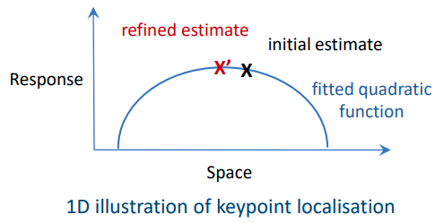
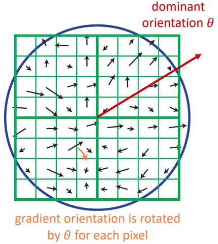
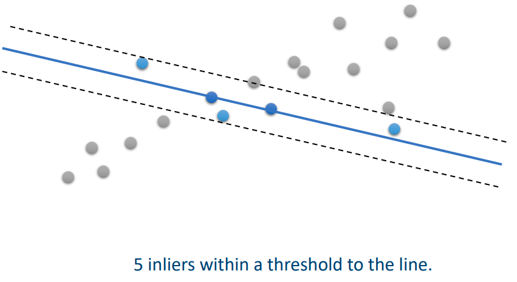
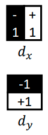

# 06 - Feature Descriptors

We're able to detect interest points, but now we need to identify when an interest point in an image corresponds to an interest point in another image. We need to describe the features for the interest points.

## Simple Descriptors

### Pixel Intensity

This involves using the intensity of a single pixel. This does not work well because it is sensitive to absolute intensity value (couldn't compare daytime and nighttime pictures for example) and is not very discriminative. There are thousands of pixels with the same intensity value, and a single pixel does not represent any local pattern (edge, blob, peak of mountain, etc.).

### Image Patch Intensities

This is better than using a single pixel because it represents a local pattern. It performs well if the images are of *similar intensities* and are roughly *aligned*. However, it is still sensitive to absolute intensity value and is not rotation-invariant.

### Image Gradient

This involves taking the gradients of an image patch. This is still sensitive to absolute intensity values, but if we only account for gradient orientation, it is more robust to intensity changes. However, it is still not rotation-invariant.

### Histogram

Taking the intensity histogram of a patch is *robust to rotation and scaling*. However, it is still sensitive to intensity changes. 

## Scale Invariant Feature Transform (SIFT)

SIFT combines the advantages of both gradient orientation (robustness to *change of absolute intensity values*) and histograms (robustness to *rotation* and *scaling*).

**Robustness to intensity changes** - use gradient orientations.

**Scale Invariance** - estimate the scale using scale-space extrema detection, calculate the gradient after Gaussian smoothing with this scale.

**Orientation Invariance** - rotate the gradient orientations using the dominant orientation in a neighbourhood.

1. Detection of scale-space extrema
2. Accurate interest point localisation
3. Orientation assignment
4. Local image descriptor
5. Image matching

### 1. Detection of Scale-space Extrema

This is the same as described previously. $X$ is selected as an interest point if it is a local extremum both along the scale dimension and in space. A threshold may also be applied.

### 2. Accurate Keypoint Localisation

This refines the location estimate for keypoint $X$. The initial location estimate is done with integer coordinates, but its possible that the true position does not lie exactly on the grid. To do this, we fit a quadratic function to the detector response for each pixel near $X$ and estimate a refined optimal point $X'$. Then we threshold the keypoint response.

### 3. Orientation Assignment

A small neighbourhood is taken around the keypoint location, depending on the scale. The gradient magnitude and orientation are calculated in this window.

An orientation histogram is calculated with 36 bins which cover 360 degrees. Each pixel votes for an orientation bin, *weighted by the gradient magnitude*. The keypoint is assigned the orientation which is the peak of this histogram (the **dominant orientation**). 

The purpose of this is the make the SIFT algorithm invariant to orientation. 

### 4. Local Image Descriptor

Now, each keypoint has an image location, a scale, and an orientation. We are going to calculate a **descriptor** for this keypoint.

We do this by first taking a small window centred around the keypoint. Then we divide this into sub-regions. Inside each sub-region, each pixel has a gradient magnitude and orientation (calculated after applying a Gaussian filter with the **keypoint scale** $\sigma$). Then rotate the gradient orientations relative to the **dominant orientation** $\theta$. The blue circle is a window function to assign more weight to pixels near to the centre.

For each sub-region, create a histogram of gradient orientations. The figure below depicts $4\times 4$ sub-regions. This is represented by a 128-dimensional vector (16 sub-regions $\times$ 8 bins). So now we have a **SIFT feature descriptor** for each interest point in one or more images. It is robust to rotation and scaling.

### 5. Keypoint Matching

The final step is finding which feature descriptors correspond to each other in two images. Keypoints in two images are matched by identifying the nearest neighbours. The distance is defined by the Euclidean distance of SIFT descriptors.  For efficiency, we can fast algorithms which are approximate.

Suppose that we find a keypoint $(x, y)$ in image A, that corresponds to keypoint $(u, v)$ in image B. The next step is to find the spatial transformation that relates these. Assume they are related by an affine transformation.
$$
\begin{bmatrix} u \\ v \end{bmatrix}
=
\begin{bmatrix}
m_1 & m_2 \\
m_3 & m_4
\end{bmatrix}
\cdot
\begin{bmatrix} x \\ y \end{bmatrix}
+
\begin{bmatrix} t_x \\ t_y \end{bmatrix}
$$
where $\begin{bmatrix}m_1 & m_2 \\ m_3 & m_4\end{bmatrix}$ represents rotation and scaling, and $\begin{bmatrix}t_x \\ t_y \end{bmatrix}$ represents translation. This contains six unknown which we need to estimate, so we need more equations. For many pairs of keypoints, this can be written as
$$
\begin{bmatrix} 
x_1 & y_2 & 0 & 0 & 1 & 0 \\
0 & 0 & x_1 & y_1 & 0 & 1 \\
x_2 & y_2 & 0 & 0 & 1 & 0 \\
0 & 0 & x_2 & y_2 & 0 & 1 \\
& & \vdots
\end{bmatrix}
\cdot
\begin{bmatrix}
m_1 \\
m_2 \\
m_3 \\
m_4 \\
t_x \\
t_y
\end{bmatrix}
=
\begin{bmatrix}
u_1 \\
v_1 \\ 
u_2 \\ 
v_2 \\
\vdots
\end{bmatrix}
$$
which can be written as the linear system 
$$
Am = b
$$
where $m$ contains the unknown affine parameters. Now we have enough equations to estimate $m$ using least-square error. The least-square solution to the problem is given by 
$$
m = (A^TA)^{-1}A^Tb
$$
Once the affine parameters $m$ are known, we know the spatial transformation between the two images.

### RANSAC

The squared difference $||Am - b||^2$ is very sensitive to outliers. Some matching algorithms such as Random Sample Consensus consider outliers in model fitting.

We first randomly sample two points, fit a line, and count the number of inliers within a margin.

We repeat this for a certain number of iterations, or enough inliers have been found.

## Speeded Up Robust Features (SURF)

In SIFT, gradient orientation histograms need to be calculated for each sub-region. Calculating gradient magnitudes and orientations can be slow. SURF accelerates the feature description by considering the gradient only along horizontal and vertical directions, and using the **Haar wavelets**.

Haar wavelets simply sum the pixel intensities with weight +1 or -1 which is very fast. For each sub-region, we sum the Haar wavelet responses over the sample points. The descriptor for this sub-region is defined by four elements.
$$
(\sum d_x, \sum d_y, \sum |d_x|, \sum |d_y|)
$$
Each descriptor can be represented by a 64-dimensional feature descriptor (16 sub-regions $\times$ 4 elements). SURF is much faster than SIFT, without sacrificing too much performance.

## Binary Robust Independent Elementary Features (BRIEF)

SIFT and SURF use floating point numbers. Binary descriptors take up much less memory and can be much faster to evaluate Euclidean distance. In BRIEF, a randomly sampled pair of points $p$ and $q$ are compared.
$$
\tau(p, q) = \begin{cases}1 & I(p)<I(q) \\ 0 & \text{otherwise}\end{cases}
$$
After doing $n_d$ of these comparisons, we get an $n_d$-dimensional bitstring which is our feature descriptor. This is much smaller than with SIFT or SURF.

Another advantage is that whereas only vertical or horizontal directions can be sampled with Haar wavelets, arbitrary patterns can be tested with BRIEF.

The distance between two descriptors can be measured using Hamming distance. This can be very computed very efficiently with bitwise XOR, followed by a bit count.