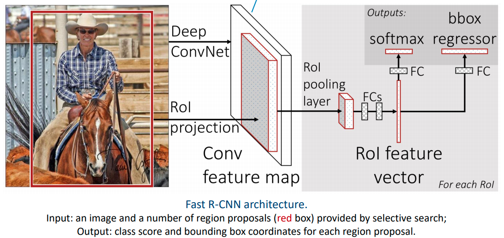
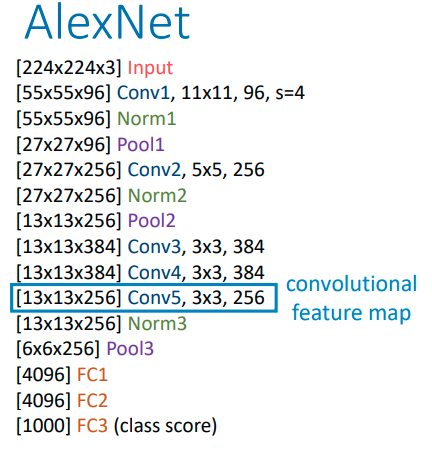

# 11 - Object Detection

We have been able to perform classification for a given image. Now, we focus on locating objects within an image.

Previously, we have used a sliding window + linear SVM for human detection. Now we can replace the SVM with a neural network.

## Detection Ideas

At each sliding window, we perform two tasks:

1. **Classification**: is this a cat or not?
2. **Localisation**: create bounding box coordinates - a regression problem.

The sliding window provides *rough localisation*, but a CNN can provide *refined localisation*.

## Two-stage Object Detection

It's too expensive to apply a convolutional network to each pixel of the image. Instead, we can separate detection into two stages.

1. **Region proposal**
2. **Classification** and **Localisation**

Different techniques for this have been proposed over time.

|              | 1.  Region proposal | 2. Classification and localisation                           | 3. Segmentation |
| ------------ | ------------------- | ------------------------------------------------------------ | --------------- |
| R-CNN        | Selective search    | SVM for classification, linear regression for localisation, both using CNN features | -               |
| Fast R-CNN   | Selective search    | CNN                                                          | -               |
| Faster R-CNN | CNN                 | CNN                                                          | -               |
| Mask R-CNN   | CNN                 | CNN                                                          | CNN             |

**Selective search** is an algorithm for generating region proposals. The details of the algorithm are not covered. After generating the region proposals, we feed the image and thge proposed regions into a detection network.

We use RoI projected onto the **convolution feature map**, and feed this into a detection CNN. To get the convolutional feature map, we use a **backbone network** (image classification networks such as AlexNet or VGG-16, and take the last convolutional layer).

The region proposals can be of any size; *how do we feed the convolutional feature map into the classification and regression network which require a fixed-size input*? We use a **ROI pooling layer** to convert feature maps of arbitrary sized regions into a fixed spatial extent.

Fast R-CNN has two output layers, **classification layer** and **localisation layer**.

1. Classification layer
   - $K+1$ outputs: a probability vector for $K$ classes and background, $p=[p_0,...,p_k]$ computed from softmax.
   - Uses cross entropy loss.
2. Localisation layer
   - $4K$ outputs: bounding box offsets for each of the $K$ classes: $t^k = (t_x^k, t_y^k, t_w^k, t_h^k), k=1,...,K$.
   - $L^1$ or $L^2$ loss.

Each training sample (ROI) has a ground truth class label $y$ and a ground truth bounding box $b$. For *one sample*, the loss is defined as
$$
L(p, y, t^y, b) = L_{cls}(p, y) + \lambda \cdot1_{y\geq 1} L_{loc}(t^y, b)
$$
The first term is cross entropy loss for classifying the object, and the second term is localisation loss to get the bounding box. This is for foreground classes only, hence the $1_{y\geq 1}$.  $\lambda$ is the weight between the two tasks.

## Region Proposal Network

Currently, the network relies on an external region proposal algorithm to provide input of initial proposals. However, this algorithm can be slow. We already have a neural net, so we can use it for region proposal also.

>Faster R-CNN = Fast R-CNN + **Region Proposal Network** (RPN)

For proposing regions, we can slide a 3x3 window across the convolutional feature map of the input image. However, how does the fixed size window handles images of different scales and aspect ratios? We construct a network with different branches, that handle different scales. At each sliding window, it proposes a number of bounding boxes of different scales and aspect ratios, called "anchors". 

For the RPN, the loss is defined as
$$
L(p, y, t, b) = \sum_{i=1}^{n_{anchor}} L_{cls}(p_i, y_i) + \lambda\sum_{i=1}^{n_{anchor}} 1_{y=1}L_{loc}(t_i, b_i)
$$
The first term is for binary classification (foreground or background), where $p_i$ is the "objectness score" and $y_i$ is ground truth. The second term is a localisation term which tries to improve the localisation for the bounding box.

If all of the anchors are used, training will bias towards the negative samples (since images are generally mostly background). Therefore, RPN randomly samples 256 anchors per image, with 1:1 positive to negative ratios.

At test time, the network will generate an objectness score for each anchor at each position in the feature map. Only anchors with the highest scores will be kept.

In this way, ROIs are proposed. The detection network will then perform classification and refine the localisation.