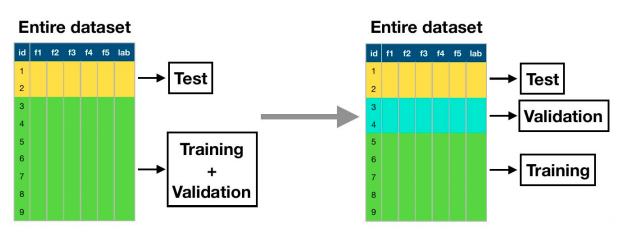
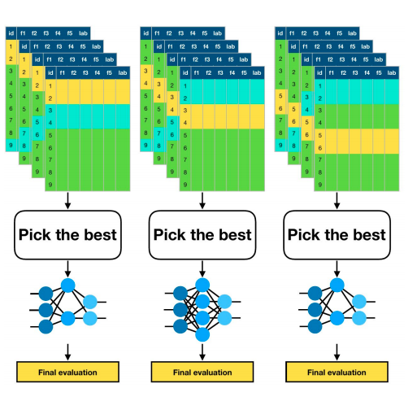

# 03 - Evaluation 

To evaluate a model or algorithm we use a **test dataset** that is *not used for training*.

## Hyperparameter Tuning

Hyperparameters are model parameters that are chosen before training. Tuning involves finding the best hyperparameter values that lead to the best performance.

To do this, we split our dataset into *three*:

- Training (~60%)
- Validation (~20%)
- Test (~20%)

We test hyperparameter values on the *training dataset* and select the best according to their performance on the *validation dataset*. The final evaluation is performed on the *test dataset*. This means that your hyperparameter choice takes into account how the model would generalise, and the final evaluation only uses previously unseen data. 

Hence, the validation dataset helps prevent overfitting because hyperparameter tuning is not done on the training dataset. We *don't* use the test dataset for hyperparameter tuning because the test dataset should not be part of the training process, and therefore you cannot evaluate how well it generalises to unknown data. The model would **overfit** on the training data.

Once the hyperparameters are fixed, for the final evaluation the model is sometimes re-trained on both the training and validation datasets *combined*, and then evaluate it on the test dataset. This is not always done.

##  Cross Validation

When we have a large dataset, training/validation/test dataset splitting is sufficient. When we have a *small dataset*, a good alternative is cross-validation. It is not done with large datasets because it is computationally expensive.

We split the dataset into $k$ (usually 10) equal folds/splits. Use $k-1$ folds for training + validation, and use $1$ for testing. We do this $k$ times, each time testing on a different fold. Performance on all $k$ held-out sets can then be averaged.

### Parameter Tuning

#### Option 1

- Use 1 fold for testing, use 1 fold for validation, use $k-2$ for training .
- An issue with approach is that you're still faced with the issue of data sparsity because you're separating the validation dataset.



#### Option 2

- At each step, fix 1 fold for testing.
- Run internal cross-validation over the remaining $k-1$ folds to find the optimal hyperparameters. 
- Then select the best model to test on the test fold.
- An issue with this approach is that you need to run a lot of experiments - so it's not feasible for models that take a long time to train.



Every fold will still have different hyperparameters, just chosen based on more data. Whenever we are using multiple training sets, we are evaluating the *algorithm* and not a specific model.

## Going into Production

When all the experimentation and evaluation is done, you can retrain the model on *all* the data. This means that the model can use **all available data** for training the model, but we no longer have a way of **estimating the performance** of the model.

## Classification Metrics

### Confusion Matrix

Visualisation of the performance of an algorithm, and allows for easy identification of confusion between classes. Most performance metrics can be computed via the confusion matrix.

|                | Class 1 Predicted | Class 2 Predicted |
| -------------- | ----------------- | ----------------- |
| Class 1 Actual | TP                | FN                |
| Class 2 Actual | FP                | TN                |

and for multiple classes

|                | Class 1 Predication | Class 2 Predication | Class 3 Prediction |
| -------------- | ------------------- | ------------------- | ------------------ |
| Class 1 Actual | TP                  | FN                  | FN                 |
| Class 2 Actual | FP                  | TN                  | ?                  |
| Class 3 Actual | FP                  | ?                   | TN                 |

### Accuracy 

The number of *correctly classified* examples divided by the *total number* of examples.
$$
A = \frac{TP + TN}{TP + TN + FP+ FN}
$$

```python
		confusion.trace() / confusion.sum
```

$$
1 - \text{error rate}
$$


### Precision

The number of *correctly classified positive* examples divided by the total number of *predicted positive* examples. Computed per class. Macro-averaged precision is the mean of precision across all classes.
$$
P = \frac{TP}{TP + FP} 
$$

```
confusion.diagonal() / confusion.sum(axis=0)
```

High precision indicates a low false-positive rate.

### Recall

The number of *correctly classified positive* examples divided by the *total number of positive* examples. Computed per class. Macro-averaged recall is the mean of recall across all classes.
$$
R = \frac{TP}{TP + FN}
$$

```
confusion.T.diagonal() / confusion.T.sum(axis=0)
```

High recall indicates a low false-negative rate.

### Precision/Recall

Precision and recall are considered two sides of the same coin. It depends on the application which you prefer.

**High recall, low precision** - most positive examples are correctly recognised, but there are many false-positives. (Low FN, high FP)

**Low recall, high precision** - we miss a lot of positive examples, but the ones that we do predict as positive are indeed positive. (Low FP, high FN)

### F-score

Balances precision and recall into a single metric. $F_1$ is the most common.
$$
F_1 = 2\frac{P\times R}{P + R} \\
F_\alpha = (1+\alpha^2)\frac{P\times R}{\alpha^2 \times P + R}
$$
This is an $\alpha$-weighted harmonic mean. For example, in $F_{0.5}$ precision is twice as important as recall.

## Imbalanced Data Distribution

In a **balanced dataset**, there are a similar number of examples in each class. All measures result in similar performance.

In an **imbalanced dataset**, classes are not equally represented. Accuracy, precision, recall, and F1 are significantly affected.

Accuracy can be misleading because it simply follows the performance of the majority class. F1 score is useful, but can also be affected - we are not sure if a low score is caused by mis-classification or class imbalance. We should look at several metrics, along with the confusion matrix.

### Solutions

#### Normalise the rows in the confusion matrix

This gives the results if we had the same number of examples and the performance of the classifier remained the same. However, doesn't give the "real picture".

#### Downsampling and Upsampling

Randomly select the same number of examples as the minority class.

This will help balance the dataset, but the results will not reflect how well this model will generalise, since the real data is still imbalanced. It's best to look at several metrics and choose ones that reflect the real intended behaviour of the model.

## Regression Metrics

$$
\text{MSE} = \frac{1}{N} \sum_{i=1}^N (Y_i - \hat{Y}_i)^2
$$

$$
\text{RMSE} = \sqrt{\text{MSE}}
$$

where $Y_i$ is the sample from the dataset, and $\hat{Y}_i$ is the prediction from the model.

## It's Not All About Accuracy

1. **Accurate** - correct predictions
2. **Fast** - quick training and predictions
3. **Scalable** - works on large datasets
4. **Simple** - understandable and robust
5. **Interpretable** - can explain its predictions

## Overfitting

**Overfitting** - Good performance on training set, poor generalisation.

**Underfitting** - Poor performance on training set, poor generalisation.


Overfitting occurs when:

- \Learning is performed for too long
- Training set is not representative of all possible situations
- The model is too complex

To fight overfitting:

- Stopping the training earlier (using the validation dataset to know when)
- Getting more data
- Using the right level of complexity (using the validation dataset)

## Confidence Intervals

### Error

**True error** - the probability that model $h$ will misclassify a randomly drawn example $x$ from a distribution $D$.
$$
\text{error}_D(h) \equiv \text{P}[f(x) \neq h(x)]
$$
**Sample error** - error rate based on a data set, estimation of true error.
$$
\text{error}_D(h) \equiv \frac{1}{N} \sum_{x\in S}\sigma(f(x), h(x))
$$
where $n$ is the number of samples and
$$
\sigma(f(x), h(x)) = 
\begin{cases}
1 & f(x) \neq h(x) \\
0 & f(x) = h(x)
\end{cases}
$$

### Calculation

**$N\%$ confidence interval for $q$** - there is probability $N\%$ that the interval contains $q$.
$$
\text{error}_S(h) \pm Z_N \sqrt{\frac{\text{error}_S(h)\times (1-\text{error}_S(h))}{n}}
$$
where $Z_N$ is scaling for the desired confidence interval (from the standard normal distribution), and the rest is the estimated standard deviation of the sample error, $n$ is the number of samples.

## Testing for Statistical Significance

### Comparing Two Algorithms

To compare two algorithms we need to look at how the distributions of the classification errors differ. This is because multiple classifiers can have the same error rate, but difference distributions. So we need to perform a statistical test.

### Randomisation Test

Randomly switch some predictions from both models and measure how often the new performance difference is greater than or equal to the original difference. If we still get the same performance difference, then there might not be a significant difference between the two distributions

### Two-sample T-test

Estimates the likelihood that two metrics from different populations are actually different. 

### Paired T-test

For cases where you have multiple outputs for both systems. For example, classification error over the same folds in cross-validation.

### Significance

Statistical tests return a $p$-value. A test is considered to be statistically significant if $p<0.05$. A $p$-value > 0.05 does not mean two algorithms are similar, just that a statistical difference cannot be observed.

#### P-hacking

Misusing data analysis to find patterns in data that can be presented as statistically significant when in fact there is no underlying effect.