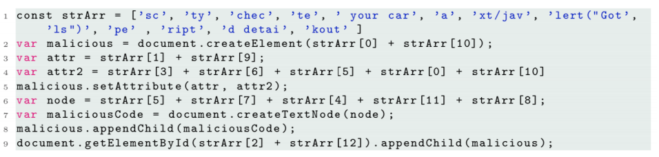
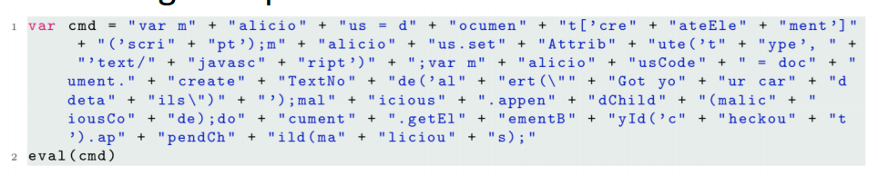
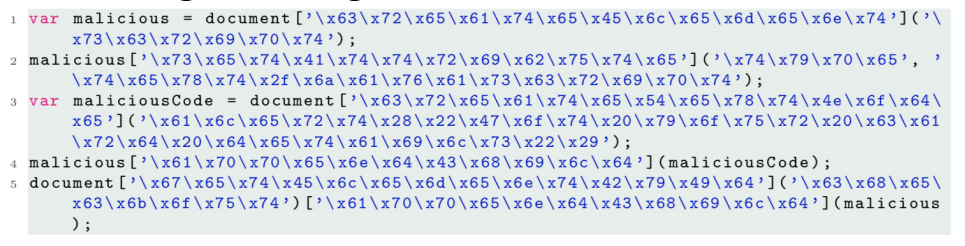
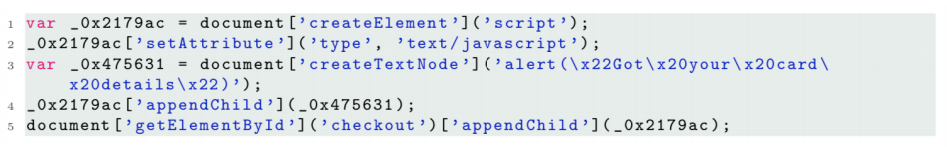
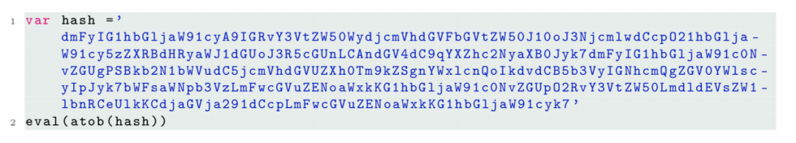

# 14 - JavaScript

## JavaScript Transformations

### Minification

The source code of scripts is sent over the internet. The length of a script affects latency of page load times and consumes network bandwidth. Hence, scripts can be **minified** by removing comments, spaces, newlines, shortening identifiers, sharing constants, etc.

### Inspection

The source code of scripts is available for inspection. The algorithm may be *intellectual property*. If the script is malicious, it may contain pointers to attacker-controlled *assets* (domains, IPs, keys). Scripts can be **obfuscated** to hinder analysis, reverse-engineering, and detection.

## Obfuscation

Obfuscated code should be hard or impossible to deobfuscate, but preserve the behaviour of the script nor make it too slow. 

### Joining a String Array

### String Manipulation

### String Encoding

### Identifier Mangling

### Encryption

