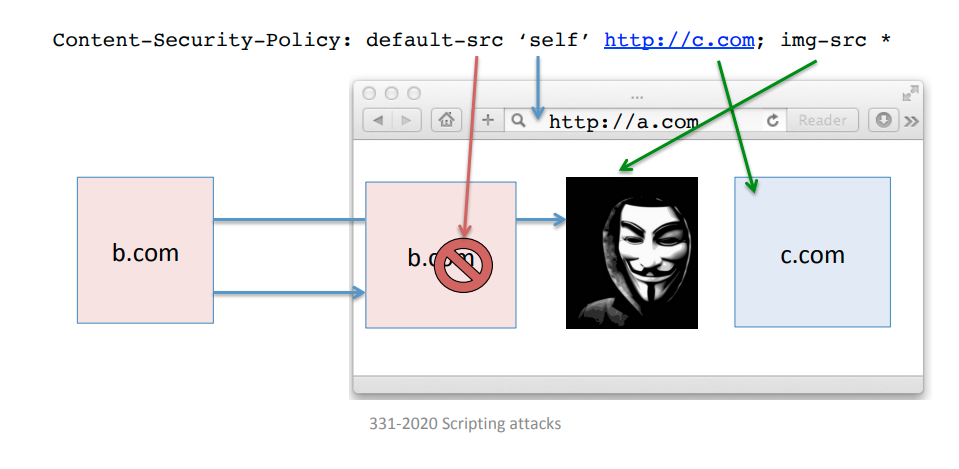
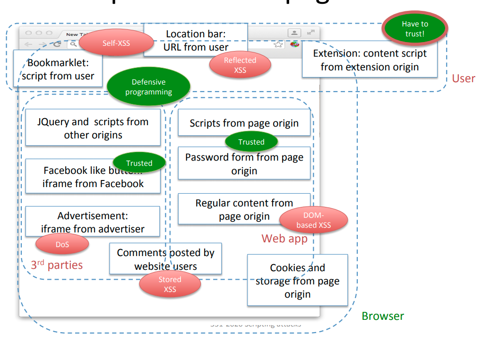

# 17 - Scripting Attacks

## Attacks

### XSS

Attack where an attacker injects client-side scripts into web pages viewed by other users, where it is executed as a script. Can be used to bypass the same-origin policy. Other pages from the same origin are affected, and can access page resources such as cookies and storage, and send data to the attacker.

#### DOM-based XSS

A trusted script reads an attacker-controlled parameter and embeds it into the page. Vectors can include

- URL
- `window.name`
- `document.referrer`
- `postMessage`
- a form field

Example:

```
http://example.com/welcome.html?name=<script>alert(document.cookie)</script>
```

```html
<html>
	<body>
    	Welcome user:
        <script>
            var from = document.URL.indexOf("name=") + 5;
            var to = document.URL.length;
            document.write(document.URL.substring(from, to));
        </script>
    </body>
</html>
```

#### Reflected XSS

An attacker controlled URL parameter is embedded in the page by the server, in a regular response or error message.

Example:

```
http://example.com/welcome.php?name=<script>alert(document.cookie)</script>
```

```php
<?
    $name = $_GET["name"];
	echo "<html>
		  <body>
		  Welcome user: $name
		  </body>
		  </html>";
?>
```

#### Stored XSS

An attacker stores malicious data on a server, which later embeds into user pages, such as comments in a blog, user profile information, or description of items for sale.

Example:

In `store.php`:

```php
<?
    $conn = mysqli_connect("localhost","username","password","StoreDB");
    $name = mysql_real_escape_string($_GET["name"]);
    $desc = mysql_real_escape_string($_GET["desc"]);
    $query = "INSERT INTO ItemsTable (name,desc) VALUES ($name,$desc)";
    $result = mysqli_query($conn,$query);
?>
```

In `retrieve.php`:

```php
<?
    $conn = mysqli_connect("localhost","username","password","StoreDB");
    $name = mysql_real_escape_string($_GET["name"]);
    $query = "SELECT desc FROM ItemsTable WHERE name=$name";
    $result = mysqli_query($conn,$query);
    echo "<html>… Item description: $result …</html>";
?>
```

And the payload can be injected like

```
http://www.example.com/store.php?name=MacBookPro&desc=<script>alert(document.cookie)</script>
```

which will be delivered to the client like

```
http://www.example.com/retrieve.php?name=MacBookPro
```

#### Countermeasures

- Validate inputs
- XSS filters
  - `htmlspecialchars()` in PHP
  - Sanitisation needs to be context-dependent (URL encoding, SQL context, JavaScript context)
- Use **templates** or frameworks to validate inputs consistently
  - Similar to prepared statements for SQLi.
- Browser-enforced defenses: `X-XSS-Protection: {0, 1}` header
  - If a URL parameter is reflected in the body as a script, the script is blocked.
  - Currently being deprecated because it leads to leaks, prone to false-positives, and Content Security Policy does it better.

#### Self-XSS

Tricking users into injecting malicious JavaScript in the page.

- Pasting in the location bar
- Pasting in the JavaScript console

#### Cross-channel Scripting (XCS)

Attacks against embedded and IoT devices. XSS payload is injected using a non-HTTP channel, such as the admin visiting the admin console using the browser.

Example:

- SMB protocol to upload files on network attached storage (NAS).
- Filename is an XSS attack vector.

#### Other XSS Variants

- Universal XSS
  - Attacker exploits XSS in browser extension.
- Scriptless attacks
  - Attacker injects CSS, fonts, SVGs in the target page to read data.
  - Works even when JavaScript is disabled.
- Resident XSS
  - Discussed in module 18.

### Source Code Snooping

Example:

Code

```html
<script id="id">
var keyed_MAC = function(msg){
 var secret_key="A34E3FF12289E";
 … compute MAC using secret_key …
};
</script>
```

Attacks

```html
<script>
alert(keyed_MAC.toString().substring(49,63));
</script>
```

```html
<script>
alert(document.getElementById("id").innerHTML.substring(49,63));
</script>
```

Defence: hide the state inside closures and remove the script node.

```html
<script id="id">
    var keyed_MAC =
        (function(){
            var secret_key="A34E3FF12289E";
            return function(msg){… compute MAC using secret_key …}
        })();
    (e=document.getElementById("id")).parentNode.removeChild(e);
</script>
```

### Prototype Poisoning 

Example:

Code

```html
<script>
    function safe_div(x,y){
        // x must be different from 0
        if (x!=0) return y/x;}
</script>
```

Attack

> `Object.prototype.valueOf(arg)` is called when an object needs to be converted into a primitive type.

When this is done, the first time `valueOf()` is called it return 1, and on subsequent calls the object is set to return 0, which causes the infinite division.

```html
<script>
    Object.prototype.valueOf =
        function() {
        	this.valueOf = function() { return 0 };
        	return 1;
    	};
    
    safe_div({},2); // returns Infinity (division by 0)
</script> 
```

Defence

1. Check types.

```javascript
function safe_div(x,y) {
    // x must be a different from 0
    if (typeof x !== 'number') throw "Type error!";
    if (x!=0) return y/x;
}
```

2. Avoid relying on inheritance when outside your control.

```javascript
Object.prototype.a = 42; // controlled by attacker
b = {}; b.a // returns 42
c = {a:undefined}; c.a // returns undefined
```

## HTML5 Sandbox

The SOP can be seen as too permissive for modern web applications.

- **Same-origin iframe**
  - May contain user-supplied content that is exposed to XSS attacks.
  - Web app needs to restrict iframe access towards other more trusted iframes.
- **Cross-origin iframe**
  - May display advertising from a malicious provider with DoS attack on the whole page.
  - Web app needs to restrict iframe ability to run JavaScript.

The **HTML5** `sanbox` attribute for iframes tells the browser to create a new unique origin and associate it to the iframe. Then all active behaviour is prevented by default in the sanboxed frame. The SOP will prevent cross-origin access.

The `allow-same-origin` option does not segregate it to a new origin, and `allow-{script/popups/forms/pointer-lock/top-navigation}` selectively reintroduces the behaviour.

## Content Security Policy (CSP)

The server can send a response header that gives the browser a whitelist of what resources can be loaded and what scripts can be executed and from where. This is intended to mitigate XSS, but also DoS. It controls

- Scripts
- Fonts
- Images
- iframes
- Media
- Objects
- Stylesheets
- AJAX
- ...

It can be used to control the `sanbox` attribute of loaded iframes.



## Defensive JS to Withstand Rootkits

Trusted code must not be subverted after running untrusted code. To do this

- Hide secrets within closures
- Do not trigger native functions
- Do not traverse the prototype chain
- Manage own strings, arrays, objects

## Principals Behind a Page

