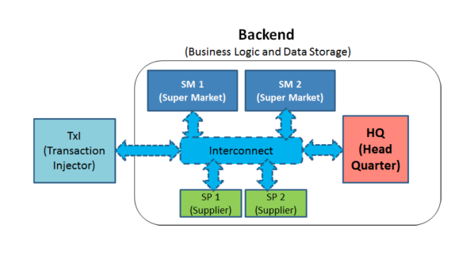
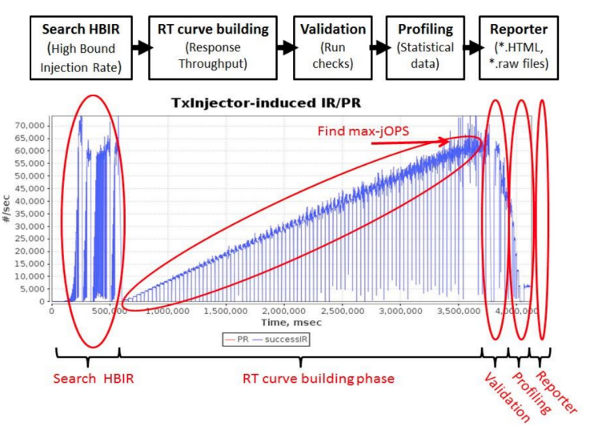
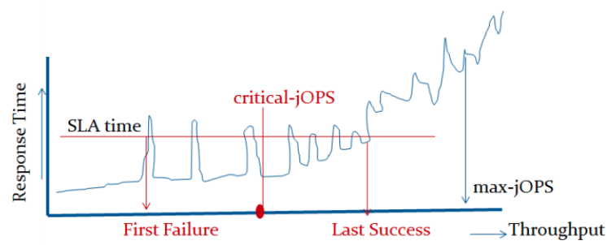

# 07 - Load Testing

## Benchmarks vs Micro-benchmarks

A benchmark *tests the response of the system against a reference workload*. We focus on benchmarks that use *realistic workloads*, as opposed to micro-benchmarks. 

Micro-benchmarks are used to test a *critical part* of the system to help optimise it. Benchmarks are better suited to assess if a system is fit for its business purpose.

A good benchmark should ensure that the workload is:

- **Repeatable** - if run twice on the same system, it will give similar results.
- **Interpretable** - easy to tell what the results mean and how well the system performed.
- **Comparable** - we can compare results on two systems and draw meaningful conclusions.
- **Vendor-neutral** - avoid systematically favouring systems from a certain company.
- **Transparent** - what the benchmark does is well-documented.

## SPECjbb2015

We will focus on the case-study of SPEC Java Business Benchmark 2015. 

**Goal of SPECjbb2015** - evaluate performance and scalability of environments for Java business applications. It helps you decide if you have a properly sized IT infrastructure in terms of servers, networks, JVMs etc.

It simulates a supermarket company IT infrastructure.

SPECjbb2015 provides:

- An implementation of the supermarket application based on the latest Java technologies.
- Monitoring, collection, filtering of the results.
- Generation of reports, including summary metrics.

### Controller

A **Controller** agent sets up the initial environment according to a user-specified configuration. The benchmark uses a *single* controller. It has the following responsibilities:

- Synchronise start/stop of the load injectors.
- Coordinate the system through benchmarking phases.
- Dispatch work to the load injectors.
- Send heartbeats to stop/restart in case of node failure.
- Collect/aggregate/score the test results.
- Control backend agents that start/stop/configure the application.

### Load Injector

One or more transaction injectors (**TxInjectors**) send workload to the system. Each injector has the following duties:

- Control a JVM thread pool, where each thread is responsible for issuing requests to the system and waiting for replies. Generally one thread for each emulated user of the system.
- Ensure that each thread waits before issuing the next request (**think time**).
- Inject load using a suitable transport protocal (e.g. Java NIO).
- Report results to the Coordinator.

### Execution Phases

1. **Search HBIR** - short experiments aimed at determining the maximum sustainable request rate. 
   - This prevents the system from becoming unstable during testing (e.g. crashing due to disk swapping).
   - At the end of this phase the benchmark re-initialises data structures.
2. **RT Curve Building** - transaction rates are increased *linearly* and kept *constant* for a fixed period, recording transaction response times. This stops when HBIR is reached.
3. **Validation** - the validity of the experiment is established e.g. checking for failed transactions. 
4. **Profiling** - monitoring data is collected and analysed.
5. **Reporter** - a report is generated to visualise the results.

Note that typically the injector and the system are not running on the same system so they don't affect each other.

### Transient and Steady Phases

At each step of the RT curve building phase, a "settling phase" is used to ensure that the system adapts to the new load. This is also called the **transient phase**. The transient phase ends when the injection rate matches the target rate $\pm 1\%$. Only the **steady phase** is used to measure performance, otherwise the throughput will not be representative. 

### Summary Performance Metrics

**max-jOPS** - maximum sustainable injection rate, above which the system does not converge to steady rate within 90s.

**critical-jOPS** - mean of injection rates of first failure and last success of SLA (99th percentile on response time).

### Limitations

The benchmarks only tests the platform (runtime, middleware) and the infrastructure (servers, network) for the *reference* application.

To create a test workload for a custom application, you must either customise an existing benchmark or use a customisable testing tool. The second option is the subject of **load testing**.

## Load Testing

**Load testing** generalises benchmarks to work with *user-defined loads*. It's used to check application scalability. Load testing tools allow users to

- Simulate loads using **load injectors** or **emulated browsers**.
- Emulate realistic user **think times** between submissions.
- Emulate **user abandonment** when requests take too long.
- **Record** a user interaction for later reply.
- Support **test configuration parameters**.
  - Test duration
  - Abandonment threshold
  - Workload intensity
  - Mix of requests to be submitted
  - ...