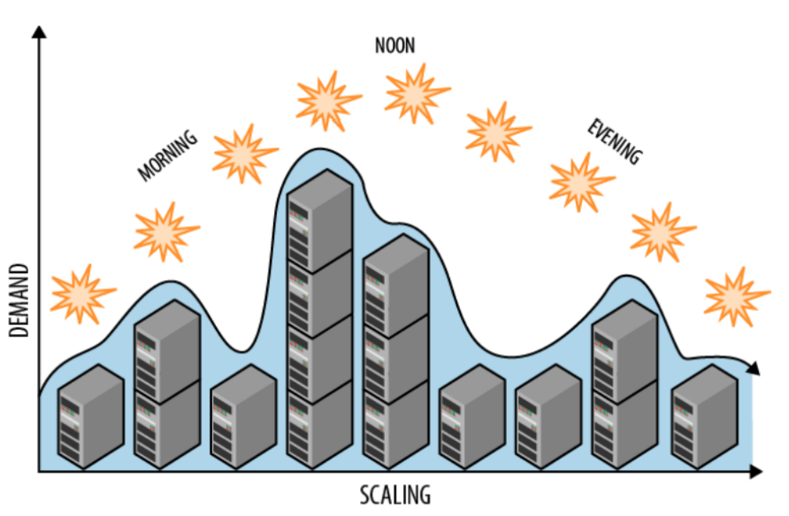

# 10 - Scaling

## Vertical Scaling

**Vertical scaling (VS)** - increase or upgrade the resources within existing node (cores, memory, disk).

VS is simple, as it does not involve architectural changes to the application. However, the node needs to be restarted - implying some **downtime** for that node. Most operating systems cannot cope with a dynamic upgrade to the number of cores or memory. The required restart makes VS risky, because the node/VM could fail on startup. Another limitation is that the application may not be able to exploit the new resources, due to a lack of parallelism for example. **Amdhal's Law** allows you to reason about the amount of parallelism that can be exploited.

### Amdhal's Law

Amdhal's law allows us to quantify the difference in execution time for a job that can run on $n$ cores as opposed to one.

- $T_n$ : execution time for a job running on $n$ cores.
- $T_1$ : execution time for a job running on a single core.
- $S_n$ : speedup due to parallelisation.

The law states that the speedup is limited by the fraction $p$ of the job's execution that can be parallelised.
$$
S_n = \frac{T_1}{T_n} \approx \frac{T_1}{(1-p)T_1 + pT_1/n} = \frac{1}{(1-p) + p/n}
$$
where $(1-p)T_1$ is the serial part, and $pT_1 / n$ is the parallel part.

## Horizontal Scaling

**Horizontal scaling (HS)** - add new nodes to the system's tiers.

Normally, HS does not result in downtime because nodes within a tier do not interact with each other, and communication between tiers is handled by load balancers and message queues that can route requests to active nodes. 

HS changes the **application topology**, which requires some time for the application to adapt. The load balancer needs to discover and start dispatching load to new nodes. The new nodes may take time to fill local caches, so performance will take some time to stabilise. During this time, the capacity needs may be fulfilled with **throttling**.

Tiers in cloud applications are often composed of **homogeneous** nodes, meaning that they all have the same amount of memory and cores. This is a helpful simplification because otherwise load balancing would be complex. Assigning load balancing weights to a set of heterogenuous nodes is a difficult problem. The number of requests queueing in each node may be very different and unknown to the load balancer.

To tackle the issue of knowing length of each node's queue, we can use **round-robin (RR)** to load balance within a tier.

- RR dispatches requests in turn to each node in the target tier.
- RR produces an equal arrival rate for each target node.
- RR makes inter-arrival times more predictable (less bursty), simplifying resource management.
- RR is stateless, so no need to monitor target nodes.

## Cloud Native Applications

Not all application architectures can suport HS. For example

- a centralised component places an upper limit ot the maximum number of concurrent requests.
- the bottleneck resources are in a tier that cannot scale, making scaling ineffective to increase performance

Applications designed for the cloud are called **cloud native**, and they typically support both HS and VS. A cloud native application relies on **stateless** autonomous compute nodes.

## Autoscaling

Scaling is needed to address

- **Over-provisioning** - which results in idle instances incurring unneccessary costs.
- **Under-provisioning** - which hurts in performance and leads to SLA violations.

However, the application workload changes over time. **Autoscaling** algorithms scale resources according to the workload demands. They are either **schedule based** or **rule based**. 

### Scheduled Based Autoscaling

Schedule based autoscaling takes into account the cyclical pattern of daily workload. Schedules are manually defined and immutable.



### Rule Based Autoscaling

Rule based autoscaling relies on conditional actions triggered by a target variable. One approach is based on **static threshold rules**. Let $V$ be the target variable (e.g. CPU utilisation)

```pseudocode
if V > V_up for T_up seconds then
	scale out by adding N_up nodes
	do nothing for S_up seconds (maybe apply throttling)
else if V < V_dn for T_dn seconds then
	scale down by removing N_dn nodes
	do nothing for S_dn seconds
end if
```

## Resource Throttling

Static thresholds are a form of **reactive scaling**. How should we handle the shortage of capacity, while we wait for scaling to happen? One approach is to use **throttling** until the scale out has completed. Throttling limits the rate at which a resource can be accessed. Throttling can be implemented using **rate limiters** that distribute permits to use resources at a bounded rate.