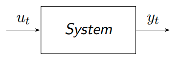
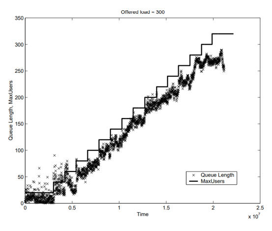
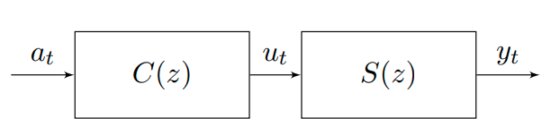
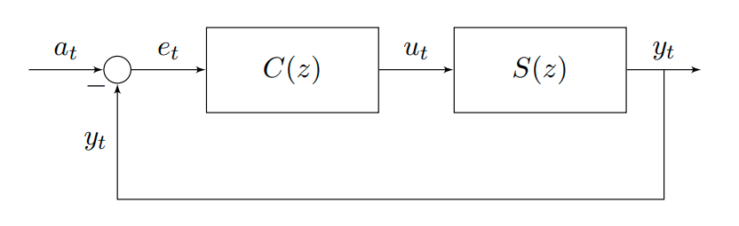

# 13 - Control

## Computer System Control

Similarly to autoregressive models, we can build I-O models to bypass system complexity. These can then be combined with classic **control theory**. This can be used to create a controller that controls I-O for the desired behaviour.

## Discrete-time Input-Output Models

- $y_t$ - output signal at time $t=1,2,...$
- $u_t$ - input signal at time $t = 1,2,...$

If $u_t$ is a **control signal**, how can we model the influence of $u_t$ on $y_t$ without knowing the internal system dynamics? We can capture the system I-O behaviour via an **autoregressive model** e.g.
$$
y_t = \phi_1 y_{t-1} + \theta_1 u_{t-1}
$$
which says: $y_t$ has some linear relation to $y_{t-1}$, plus there will be an influence from the control signal $u_{t-1}$. Note that, unlike AR(1) we assume no noise.

For example, we can vary the MaxUsers control option $u_{t-1}$ in a web server, and observe the effect on the queue length $y_t$. Then we can fit the data using linear regression.

## Compact Representation via $z$-transforms

$z$-transforms are a way to represent time-series, in a compressed mathematical object. We can represent $y_t$ as 
$$
Y(z) = \mathcal{Z}\{y_t\} = y_0 + \frac{y_1}{z} + \frac{y_2}{z^2} + ... = \sum_{k=1}^\infty \frac{y_k}{z^k}
$$
where $z \in \mathbb{C}$ with the convention that $y_j = 0$ for $j < 0$. We may image $Y(Z)$ as the "clothesline" for the $y_t$ values. You keep all your values of the sequence in one place, with $z$s acting as "separators".

### Properties

- **Scaling** - $\mathcal{Z}\{\alpha y_t\} = \alpha \mathcal{Z}\{y_t\}$
- **Linearity** - $\mathcal{Z}\{\alpha y_t + \beta u_t\} = \alpha \mathcal{Z}\{y_t\} + \beta \mathcal{Z}\{u_t\}$
- **Convolution** - $\mathcal{Z}\{y_t\}\mathcal{Z}\{u_t\} = \sum_{k=-\infty}^\infty y_k u_{t-k}$
- **Time shift** - $\mathcal{Z}\{y_{t-k}\} = z^{-k}\mathcal{Z}\{y_t\}$

### For an I-O Model

If we have an I-O model
$$
y_t = \phi_1 y_{t-1} + \theta_1 u_{t-1}
$$
Let $Y(z) = \mathcal{Z}(y_t)$ and $U(z) = \mathcal{Z}\{u_t\}$  be the $z$-transforms of $y_t$ and $u_t$. It is then possible to prove that 
$$
Y(z) = H(z) U(z) 
$$
where 
$$
H(z) = \frac{\theta_1}{z-\phi_1}
$$
$H(z)$ is called the **transfer function** and represents the effect of the input signal $u_t$ on the output signal $y_t$.

In more complex I-O models, $H(z)$ is in general a rational function
$$
H(z) = \frac{N(z)}{D(z)}
$$
where $N(z)$ is a polynomial with roots called **zeros** and $D(z)$ is a polynomial with roots called **poles**. The value $H(1)$ gives the **steady-state** game i.e the long-term ratio between output and input signals. 

Let $\lambda$ be the largest pole (in absolute value). If $\lambda > 1$, the system will be **unstable**. The close $\lambda$ is to 0, the faster the system **settling time** i.e. the time to adjust to a change in the input. The settling time may be estimated with $T=-4/\log\lambda$ (using the natural $\log$)	.

Zeros affect the transient response and the blocking outputs.

We want to change the zeros and poles so that the system does what we want. How can we change the poles of a system? We can couple the system with a **controller** to regulate its input and force the required output. The original system can be tested to obtain its transfer function $S(z)$. The controller will read the input signals and send output signals as determined by its transfer function $C(z)$. Controller design involves choosing $C(z)$ and a control architecture.

## Open-loop Control

In this control strategy, the controller *regulates the input into the system.*

- $a_t$ - input signal at time $t=1,2,...$
- $u_t$ - control signal at time $t=1,2,...$
- $y_t$ - output signal at time $t=1,2,...$

The transfer function for this serial system can be shown to be 
$$
H(z) = C(z)S(z)
$$
This is simple to build, but is unreliable since the controller cannot monitor the output.

## Closed-loop Control

- $e_t$ - error signal at time $t=1,2,...$

The transfer function for this system can be shown to be
$$
H(x) = \frac{C(z)S(z)}{1+C(z)S(z)}
$$
This form of control is common to *dampen changes*. It's more accurate than open-loop control, but can lead to oscillations if $C(z)$ is chosen incorrectly.